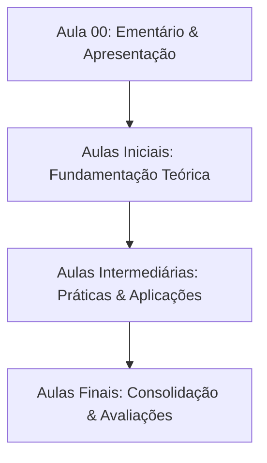

  
⬅️ <b><a href="/pt-br/resource/engenharia-de-computação/1-periodo/algebra-linear-e-geometria-analitica-i">Aula Anterior</a></b>

  
🏠 <b><a href="/pt-br/resource/engenharia-de-computação/1-periodo/algebra-linear-e-geometria-analitica-i">Anotações da Disciplina</a></b>

  
➡️ <b><a href="/pt-br/resource/engenharia-de-computação/1-periodo/algebra-linear-e-geometria-analitica-i/anotacoes/aula-01-matrizes">Próxima Aula</a></b>

> [!info] 📌 Informações Gerais do Plano de Ensino
> - **Disciplina:** Álgebra Linear e Geometria Analítica I (`CSECBJI.5`)
> - **Docente Responsável:** Docente IFF
> - **Carga Horária Total:** 60h
> - **Tópico da Sessão:** Apresentação da Matriz Curricular, Ementário e Critérios de Avaliação

> [!note] 📦 Material Didático e Recursos Institucionais
> ### 📑 Material da Aula
> - 📄 **[Plano de Ensino Oficial em PDF](/assets/disciplinas/plano-de-ensino-csecbji.5.pdf)**
> - 📄 **[Projeto Pedagógico do Curso (PPC)](/assets/disciplinas/ppc-engenharia-computacao.pdf)**

## 📋 Sumário Interativo
- [📍 1. Ementário Oficial da Disciplina](#-1-ementário-oficial-da-disciplina)
- [🎯 2. Objetivos Pedagógicos & Competências](#-2-objetivos-pedagógicos--competências)
- [📊 3. Mapa de Desenvolvimento dos Tópicos (Mermaid)](#-3-mapa-de-desenvolvimento-dos-tópicos-mermaid)
- [🧠 4. Critérios de Avaliação & Metodologia](#-4-critérios-de-avaliação--metodologia)
- [📝 5. Atividades Iniciais e Leitura Recomendada](#-5-atividades-iniciais-e-leitura-recomendada)

---

## 📌 1. Ementário Oficial da Disciplina

> [!note] 📖 Síntese Ementária Institucional
> Inversão de matrizes, Sistemas de equações lineares, Álgebra vetorial, Espaços Vetoriais e Espaços Vetoriais Euclidianos.

---

## 🎯 2. Objetivos Pedagógicos & Competências

- Introduzir e desenvolver em termos teóricos um conjunto de conceitos fundamentais da álgebra linear, que serão ferramentas essenciais para apoio às unidades curriculares mais específicas da engenharia;
- Abordar estudo de matrizes, determinantes, sistemas de equações lineares, vetores no plano e no espaço com aplicações na geometria analítica e ainda introduz conceitos básicos sobre espaços vetoriais e subespaços.

---

## 📊 3. Mapa de Desenvolvimento dos Tópicos (Mermaid)

---

## 🧠 4. Critérios de Avaliação & Metodologia

| Componente | Peso | Descrição |
| :--- | :--- | :--- |
| **Provas Escritas (P1 / P2)** | 60% | Avaliação formal dos conceitos teóricos e práticos |
| **Trabalhos & Projetos** | 30% | Implementações e relatórios técnicos em laboratório |
| **Participação & Listas** | 10% | Resolução de exercícios do quadro e frequência |

---

## 📝 5. Atividades Iniciais e Leitura Recomendada

- [ ] Ler a ementa completa e organizar o ambiente de estudos.
- [ ] Consultar a bibliografia básica no repositório da biblioteca.

  
⬅️ <b><a href="/pt-br/resource/engenharia-de-computação/1-periodo/algebra-linear-e-geometria-analitica-i">Aula Anterior</a></b>

  
🏠 <b><a href="/pt-br/resource/engenharia-de-computação/1-periodo/algebra-linear-e-geometria-analitica-i">Anotações da Disciplina</a></b>

  
➡️ <b><a href="/pt-br/resource/engenharia-de-computação/1-periodo/algebra-linear-e-geometria-analitica-i/anotacoes/aula-01-matrizes">Próxima Aula</a></b>

