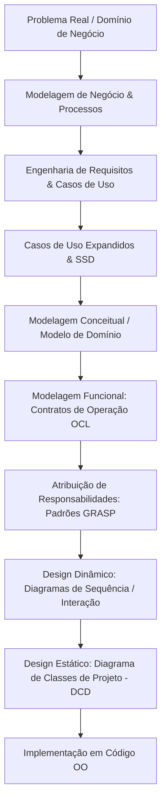
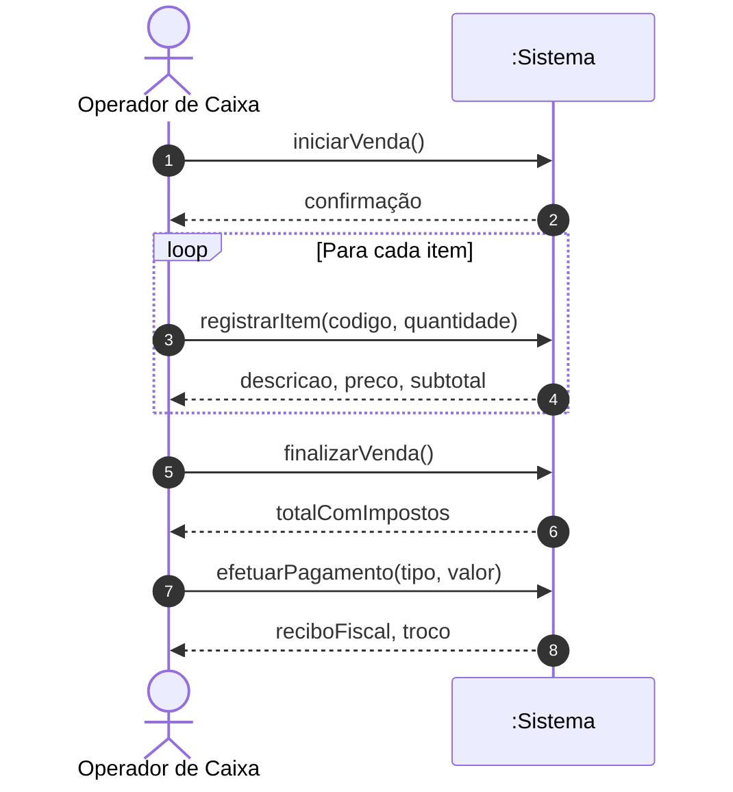
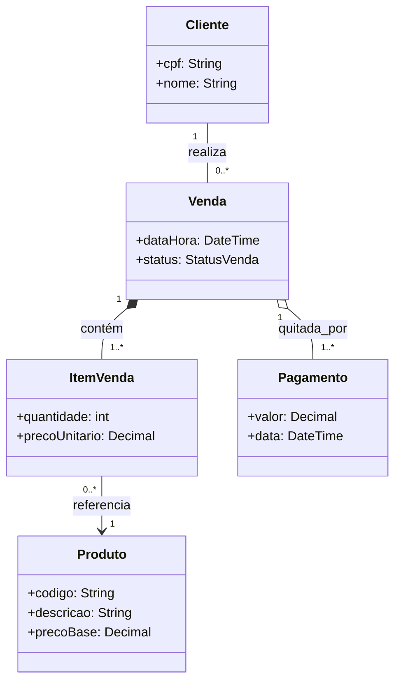
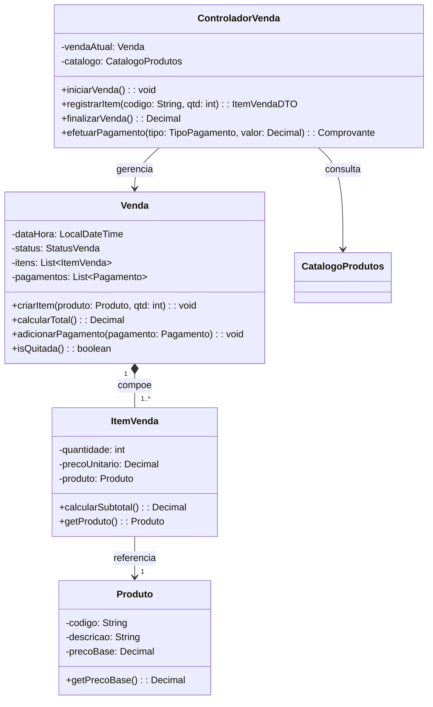

# 📐 Short Lecture — Análise de Software Orientada a Objetos

> [!abstract] 📌 Visão Geral da Disciplina
> * **Código:** `CSECBJI.42` | **Carga Horária:** 60 h/a | **Período:** 6º Período
> * **Pré-requisito:** [[02 - Áreas/Acadêmico/IFF - Engenharia de Computação/05 - Periodo/36 - Engenharia de Software/Ementa - Engenharia de Software|Engenharia de Software (CSECBJI.36)]]
> * **Tranca:** [[02 - Áreas/Acadêmico/IFF - Engenharia de Computação/07 - Periodo/50 - Projeto de Software Orientado a Objetos/Ementa - Projeto de Software Orientado a Objetos|Projeto de Software Orientado a Objetos (CSECBJI.50)]]
> * **Ementa Síntese:** Introdução ao Desenvolvimento OO; UML; Modelagem de Negócio; Análise de Requisitos; Modelagem de Casos de Uso; Modelagem Conceitual; Modelagem Funcional com Contratos; Padrões GRASP; Design da Camada de Domínio e Diagramas de Classes de Projeto.

---

## 🗺️ Mapa Conceitual da Disciplina



---

## 🏛️ Módulo 1: O Paradigma OO e o Processo Unificado (UP)

### 1.1 Do Problema ao Software: O Abismo Semântico
A Engenharia de Software busca reduzir o **abismo semântico** (*semantic gap*) entre a realidade do domínio do problema (entidades físicas, fluxos de negócios, regras organizacionais) e a solução computacional (código, estruturas de dados, fluxos de execução).

O **Desenvolvimento Orientado a Objetos (DOO)** propõe que os blocos fundamentais de construção do software reflitam os conceitos e entidades do mundo real:
- **Objeto:** Uma entidade com identidade única, estado (atributos) e comportamento (operações/métodos).
- **Abstração & Encapsulamento:** Ocultamento dos detalhes internos de implementação e exposição de interfaces contratuais bem definidas.

### 1.2 O Processo Unificado (Unified Process - UP)
O UP é um processo de desenvolvimento de software **iterativo, incremental, centrado na arquitetura e guiado por casos de uso**.

```mermaid
gantt
    title Fases e Iterações do Processo Unificado (UP)
    dateFormat  X
    axisFormat %s
    section Concepção (Inception)
    Definição de Escopo & Viabilidade : 0, 2
    section Elaboração (Elaboration)
    Arquitetura Base & Mitigação de Riscos : 2, 6
    section Construção (Construction)
    Implementação Iterativa do Sistema : 6, 12
    section Transição (Transition)
    Testes de Aceitação, Beta & Deploy : 12, 15
```



1. **Concepção (*Inception*):** Delimitação do escopo, viabilidade do negócio e estimativa inicial de esforço.
2. **Elaboração (*Elaboration*):** Especificação detalhada dos casos de uso críticos, mitigação dos principais riscos e consolidação da linha de base da arquitetura.
3. **Construção (*Construction*):** Desenvolvimento iterativo e incremental dos requisitos restantes, testes unitários e integração contínua.
4. **Transição (*Transition*):** Testes de homologação (*Beta tests*), treinamento de usuários, migração de dados e entrega em produção.

---

## 💼 Módulo 2: Modelagem de Negócio & Engenharia de Requisitos

### 2.1 Modelagem de Negócio (*Business Modeling*)
Antes de modelar o sistema de software, é vital compreender os processos de negócio da organização:
- **Atores de Negócio (*Business Actors*):** Usuários externos, clientes, órgãos reguladores ou parceiros que interagem com a organização.
- **Casos de Uso de Negócio (*Business Use Cases - BUC*):** Conjunto sequencial de ações que o negócio executa para entregar um resultado de valor observável a um ator de negócio.
- **Diagrama de Atividades:** Modela o fluxo de trabalho (*workflow*) de processos de negócios, com nós de ação, decisões, bifurcações (*fork*) e sincronizações (*join*), particionados em raias (*swimlanes*).

### 2.2 Requisitos de Alto Nível do Sistema
- **Requisitos Funcionais (RF):** Descrevem o comportamento e os serviços que o software deve fornecer (ex: "O sistema deve calcular o juro diário da fatura").
- **Requisitos Não-Funcionais (RNF):** Restrições e atributos de qualidade (desempenho, escalabilidade, segurança, portabilidade) frequentemente classificados pelo modelo **FURPS+** (*Functionality, Usability, Reliability, Performance, Supportability + design, implementation, interface, physical constraints*).

---

## 📑 Módulo 3: Casos de Uso Expandidos, Estimativa e SSD

### 3.1 Anatomia de um Caso de Uso Expandido
Um caso de uso de sistema em formato totalmente vestido (*fully dressed*) possui a seguinte estrutura formal:

```markdown
Caso de Uso: UC-01 Processar Venda
Ator Primário: Caixa (Operador)
Interessados e Interesses:
  - Caixa: Registro rápido e sem erros.
  - Cliente: Obter recibo detalhado e pagar via método escolhido.
  - Loja: Atualização precisa de inventário e lançamento contábil.
Pré-condições: Caixa autenticado e turno aberto.
Pós-condições (Garantias de Sucesso):
  - Venda gravada, estoque atualizado, imposto calculado, pagamento registrado e recibo emitido.

Fluxo Principal (Caminho Feliz):
  1. O Cliente chega ao ponto de venda com itens.
  2. O Caixa inicia uma nova venda.
  3. O Caixa insere o identificador de cada item.
  4. O Sistema registra o item, calcula subtotal e apresenta descrição e preço.
  5. O Caixa encerra a entrada de itens.
  6. O Sistema calcula o valor total com impostos.
  7. O Caixa informa a forma de pagamento e valor recebido.
  8. O Sistema processa a transação e atualiza o estoque.
  9. O Sistema emite o comprovante fiscal.

Fluxos Alternativos / Exceções:
  *a. Falha de comunicação com autorizador de cartão:
      1. O Sistema notifica o operador e solicita meio alternativo de pagamento.
  3a. Código do item não encontrado:
      1. O Sistema emite alerta sonoro/visual e permite nova digitação manual.
```

### 3.2 Diagrama de Sequência de Sistema (SSD - *System Sequence Diagram*)
O SSD trata o sistema inteiro como uma **caixa-preta** e mapeia os eventos de entrada (mensagens enviadas por atores externos) e eventos de saída gerados pelo sistema.



### 3.3 Estimativa por Pontos de Caso de Uso (UCP - *Use Case Points*)
Métrica algorítmica para estimação de esforço de software:
$$UCP = (UUCP) \times TCF \times EF$$
Onde:
- **$UUCP = UAW + UUCW$** (*Unadjusted Actor Weight* + *Unadjusted Use Case Weight* baseado no número de passos e transações).
- **$TCF$ (*Technical Complexity Factor*):** $TCF = 0.6 + 0.01 \times \sum_{i=1}^{13} (w_i \times T_i)$ (pesos técnicos como distribuição, desempenho, concorrência).
- **$EF$ (*Environmental Factor*):** $EF = 1.4 - 0.03 \times \sum_{j=1}^8 (w_j \times F_j)$ (fatores de equipe: experiência, motivação, estabilidade de requisitos).

---

## 🧩 Módulo 4: Modelagem Conceitual (Modelo de Domínio)

O **Modelo de Domínio** é a representação visual das classes conceituais do mundo real, suas associações e atributos essenciais. **Não contém métodos nem decisões de software**.



### Regras Fundamentais de Modelagem:
1. **Composição vs Agregação:**
   - **Composição (losango preenchido $\blacklozenge$):** Relação de posse forte com dependência de ciclo de vida existencial (*se `Venda` for deletada, seus `ItemVenda` deixam de existir*).
   - **Agregação (losango vazio $\lozenge$):** Relação todo-parte fraca (*o `Pagamento` pode existir no histórico contábil independentemente da sessão ativa da `Venda`*).
2. **Invariantes e Multiplicidades:** Intervalos exatos que definem limites de ocorrência (`1`, `0..1`, `1..*`, `*`).

---

## 📜 Módulo 5: Modelagem Funcional com Contratos de Operação

Contratos de Operação especificam formalmente o efeito de cada operação de sistema identificada nos SSDs, utilizando lógica de predicados e conceitos de **OCL** (*Object Constraint Language*).

```markdown
Operação: registrarItem(codigo: String, quantidade: int)
Referências Cruzadas: UC-01 (Processar Venda)
Pré-condições:
  - Existe uma Venda `v` em andamento.
  - Existe no catálogo um Produto `p` tal que `p.codigo == codigo`.
Pós-condições:
  - Uma nova instância `iv` de `ItemVenda` foi criada (`iv` é criada).
  - `iv.quantidade` tornou-se igual a `quantidade`.
  - `iv.precoUnitario` tornou-se igual a `p.precoBase`.
  - `iv` foi associada à `v` (`v.itens` inclui `iv`).
  - `iv` foi associada a `p` (`iv.produto` tornou-se `p`).
```

> [!important] Regra de Ouro dos Contratos
> As pós-condições devem ser declaradas no tempo pretérito perfeito ("foi criada", "tornou-se", "foi associada"), focando na **mudança de estado do sistema**, e não em passos procedurais algorítmicos.

---

## 🎯 Módulo 6: Padrões de Atribuição de Responsabilidade (GRASP)

Os padrões **GRASP** (*General Responsibility Assignment Software Patterns*) de Craig Larman orientam as decisões de design orientado a objetos:

| Padrão GRASP | Pergunta Central | Diretriz de Aplicação |
|---|---|---|
| **1. Information Expert** | *Quem deve assumir a responsabilidade?* | Atribua a responsabilidade à classe que possui a **informação necessária** para cumpri-la. |
| **2. Creator** | *Quem deve criar a instância de A?* | Atribua à classe `B` a criação de `A` se `B` contém `A`, agrega `A`, registra `A` ou usa `A` intensivamente. |
| **3. Low Coupling** | *Como diminuir dependências?* | Projete classes com baixo acoplamento para aumentar reutilização e facilitar testes e manutenção. |
| **4. High Cohesion** | *Como manter classes focadas?* | Mantenha as responsabilidades de uma classe estreitamente relacionadas, evitando classes multifuncionais inchadas. |
| **5. Controller** | *Quem recebe eventos do sistema da UI?* | Delegue para um objeto que represente o sistema global, um subsistema ou o caso de uso (ex: `ProcessarVendaHandler`). |
| **6. Polymorphism** | *Como tratar variações por tipo?* | Utilize operações polimórficas (interfaces/classes base) em vez de condicionais `switch/if-else`. |
| **7. Pure Fabrication** | *Como não violar Coesão/Acoplamento?* | Crie classes de serviço/artificiais não presentes no domínio conceitual (ex: `VendaRepository`, `EmailNotifier`). |
| **8. Indirection** | *Como desacoplar dois componentes?* | Introduza um componente intermediário / adaptador entre eles. |
| **9. Protected Variations** | *Como proteger o design de mudanças?* | Identifique pontos de instabilidade e envolva-os em interfaces estáveis. |

---

## 📐 Módulo 7: Design da Camada de Domínio & DCD

O **Diagrama de Classes de Projeto (DCD)** detalha a implementação computacional: métodos com tipos de parâmetros e retorno, visibilidade de membros, tipos concretos de coleções e navegabilidade direcionada.



---

## 🧪 Resumo Executivo / Cheat Sheet para Provas & Projetos

1. **Requisitos $\rightarrow$ Casos de Uso:** O que o sistema faz do ponto de vista do ator externo.
2. **SSD:** Mapeia a fronteira de comunicação ator-sistema sem revelar o interior.
3. **Modelo de Domínio:** Vocabulário conceitual do problema (sem métodos, sem código).
4. **Contratos:** Declaram o estado antes e depois da execução de cada mensagem do SSD.
5. **GRASP:** Guia como alocar cada responsabilidade identificada nos contratos para classes de software concretas.
6. **DCD:** O artefato técnico final que o desenvolvedor traduz diretamente para código Java/C++.

---

## 🔗 Referências e Conexões no Cofre
* [[02 - Áreas/Acadêmico/IFF - Engenharia de Computação/06 - Periodo/42 - Análise de Software Orientada à Objetos/Ementa - Análise de Software Orientado a Objetos|📄 Ementa Oficial de ASOO]]
* [[02 - Áreas/Acadêmico/IFF - Engenharia de Computação/00 - Documentos/PPC_EngComp_Completo_Ementario|📜 PPC & Ementário Geral]]
* Livros Base:
  * LARMAN, Craig. *Utilizando UML e Padrões*. 3ª Edição. Bookman, 2006.
  * BEZERRA, Eduardo. *Princípios de Análise e Projetos de Sistemas com UML*. 3ª Edição. Elsevier, 2014.
