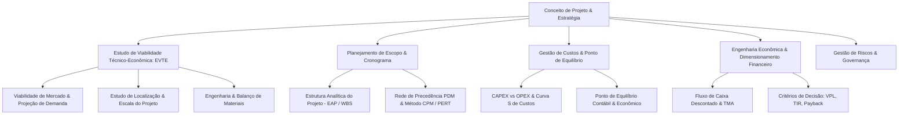
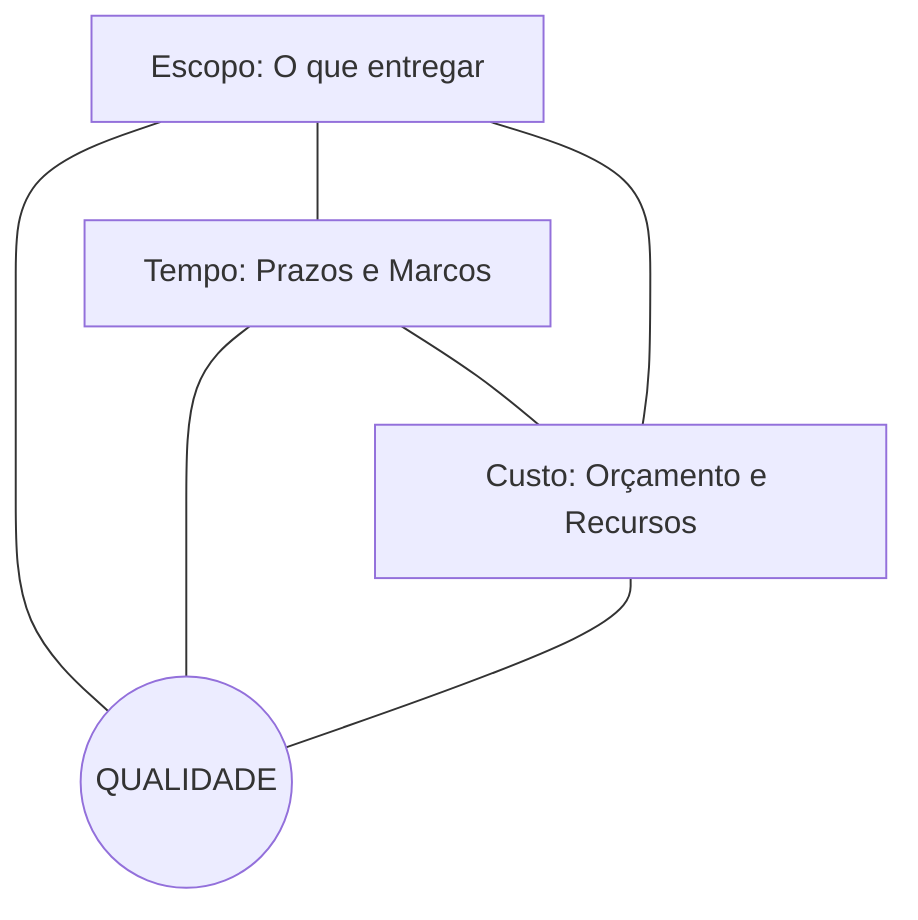
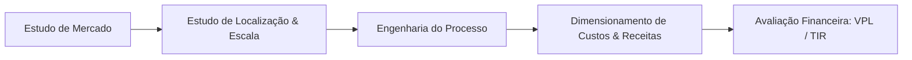
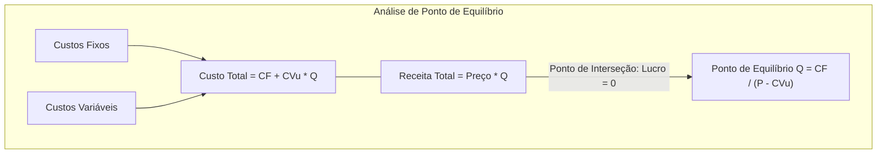

# 📊 Short Lecture — Gestão de Projetos

> [!abstract] 📌 Visão Geral da Disciplina
> * **Código:** `CSECBJI.49` | **Carga Horária:** 80 h/a | **Período:** 6º Período
> * **Pré-requisito:** [[02 - Áreas/Acadêmico/IFF - Engenharia de Computação/01 - Periodo/06 - Teoria Geral da Administração/Ementa - Teoria Geral da Administração|Teoria Geral da Administração (CSECBJI.06)]]
> * **Tranca:** Nenhuma
> * **Ementa Síntese:** Definição e Ciclo de Vida de Projetos; Metodologia de Estudos de Viabilidade Técnico-Econômica (EVTE); Estrutura Analítica do Projeto (EAP/WBS); Planejamento de Tempo e Método do Caminho Crítico (CPM/PERT); Análise de Mercado, Escala e Localização; Orçamento, Custos e Ponto de Equilíbrio; Engenharia Econômica e Avaliação de Investimentos (VPL, TIR, Payback); Gestão de Riscos.

---

## 🗺️ Mapa Conceitual da Disciplina



---

## 🎯 Módulo 1: Fundamentos e Ciclo de Vida de Projetos

### 1.1 O que é um Projeto? (Definição PMBOK)
Um **projeto** é um esforço temporário empreendido para criar um produto, serviço ou resultado **exclusivo** (único).
- **Projeto vs Operação Contínua:**
  - **Projeto:** Tem início e fim definidos, gera algo inédito, equipe multidisciplinar temporária e incerteza inerente.
  - **Operações:** Processos repetitivos e contínuos focados em manter o negócio rodando com previsibilidade e padronização.

### 1.2 O Triângulo de Restrições Tradicional e Expandido
O equilíbrio dinâmico entre **Escopo, Tempo e Custo**, delimitando a **Qualidade** da entrega final:



### 1.3 Grupos de Processos do PMBOK
1. **Iniciação:** Termo de Abertura do Projeto (*Project Charter*) e identificação dos *stakeholders*.
2. **Planejamento:** Plano de Gerenciamento Integrado (Escopo, Cronograma, Custos, Riscos, Comunicação).
3. **Execução:** Alocação de recursos, coordenação de equipes e produção das entregas.
4. **Monitoramento e Controle:** Medição de desvios via Análise de Valor Agregado (*EVM*) e controle de mudanças.
5. **Encerramento:** Termo de Aceite formal, lições aprendidas e desmobilização de recursos.

---

## 🔍 Módulo 2: Estudos de Viabilidade Técnico-Econômica (EVTE)

O EVTE avalia se o investimento de capital em uma ideia empresarial é justificável e sustentável:



1. **Estudo de Mercado:** Análise da demanda histórica e projetada, estudo da concorrência (*benchmarking*), segmentação de público-alvo e estratégia de preços (*Pricing*).
2. **Estudo de Localização:** Escolha do sítio industrial/tecnológico considerando proximidade de matérias-primas/clientes, logística de transporte, disponibilidade de mão de obra qualificada e incentivos fiscais (Método do Centro de Gravidade e Método de Ponderação Qualitativa).
3. **Escala e Tamanho:** Definição da capacidade nominal de produção baseada em economias de escala, balanço de massa/dados e curvas de aprendizado.

---

## 📅 Módulo 3: Planejamento de Escopo, EAP e Cronograma (CPM / PERT)

### 3.1 Estrutura Analítica do Projeto (EAP / WBS)
Decomposição hierárquica orientada a entregas (*deliverables*) de todo o trabalho do projeto:
- **Regra dos 100%:** A EAP deve conter exatamente 100% do trabalho definido no escopo — nada a mais, nada a menos.
- **Pacote de Trabalho (*Work Package*):** O nível mais baixo da EAP, atribuível a um único responsável e mensurável em tempo e custo.

### 3.2 Método do Caminho Crítico (CPM) e PERT
- **Caminho Crítico (*Critical Path*):** A sequência de atividades dependentes que determina a **duração total mínima** do projeto. Qualquer atraso em uma atividade crítica atrasa o projeto inteiro (Folga Total = 0).
- **Cálculo de Tempos (Early / Late Dates):**
  - **Primeira Data de Início/Término ($PDI, PDT$):** Percorre a rede para frente (*Forward Pass*).
  - **Última Data de Início/Término ($UDI, UDT$):** Percorre a rede para trás (*Backward Pass*).
  - **Folga Total ($FT$):** $FT = UDI - PDI = UDT - PDT$.
- **Estimativa Probabilística PERT (Média Ponderada Beta):**
  $$\mu = \frac{o + 4m + p}{6}, \quad \sigma = \frac{p - o}{6}$$
  Onde $o = \text{tempo otimista}$, $m = \text{tempo mais provável}$, $p = \text{tempo pessimista}$.

---

## 💰 Módulo 4: Custos, Orçamentação e Ponto de Equilíbrio

### 4.1 Estrutura de Custos
- **CAPEX (*Capital Expenditure*):** Investimento inicial em bens de capital (máquinas, infraestrutura de servidores, patentes).
- **OPEX (*Operational Expenditure*):** Despesas operacionais recorrentes (salários, nuvem AWS/GCP, energia, manutenção).
- **Custos Fixos ($CF$):** Não variam com o volume produzido (aluguel, licenças anuais).
- **Custos Variáveis Unitários ($CV_u$):** Variam diretamente com cada unidade produzida/atendida.

### 4.2 Análise do Ponto de Equilíbrio (*Break-Even Point*)
O volume de produção $Q_{eq}$ onde a Receita Total empata exatamente com o Custo Total (Lucro = 0):
$$RT = CT \implies P \cdot Q = CF + CV_u \cdot Q$$
$$Q_{eq} = \frac{CF}{P - CV_u} = \frac{CF}{MCU}$$
Onde $MCU = P - CV_u$ é a **Margem de Contribuição Unitária**.



---

## 📈 Módulo 5: Engenharia Econômica e Avaliação de Investimentos

### 5.1 O Valor do Dinheiro no Tempo e Fluxo de Caixa Descontado
O dinheiro disponível no presente vale mais do que a mesma quantia no futuro devido ao custo de oportunidade e à inflação.
- **Taxa Mínima de Atratividade (TMA):** A taxa mínima de juros que remunera o risco do projeto (custo de capital / WACC).

### 5.2 Critérios Rigorosos de Decisão de Investimento

| Indicador Financeiro | Fórmula Matemática | Critério de Aceitação / Decisão |
|---|---|---|
| **Valor Presente Líquido (VPL / NPV)** | $$VPL = -I_0 + \sum_{t=1}^{n} \frac{FC_t}{(1 + TMA)^t}$$ | **$VPL > 0$:** Projeto agrega valor econômico real e deve ser aceito. |
| **Taxa Interna de Retorno (TIR / IRR)** | $$\sum_{t=0}^{n} \frac{FC_t}{(1 + TIR)^t} = 0$$ | **$TIR > TMA$:** O rendimento percentual do projeto supera o custo de oportunidade. |
| **Payback Descontado** | Período $t$ onde $\sum_{k=1}^t \frac{FC_k}{(1+TMA)^k} = I_0$ | Quanto menor o tempo de retorno do investimento inicial, menor o risco de liquidez. |
| **Índice de Lucratividade (IL)** | $$IL = \frac{\sum_{t=1}^n \frac{FC_t}{(1+TMA)^t}}{I_0}$$ | **$IL > 1.0$:** Retorno em valor presente superior a cada real investido. |

---

## 🛡️ Módulo 6: Gestão de Riscos do Projeto

### 6.1 Matriz de Probabilidade e Impacto ($5 \times 5$)
A severidade do risco é quantificada por:
$$\text{Severidade} = \text{Probabilidade} \times \text{Impacto}$$

```text
                  IMPACTO
         Muito Baixo  Baixo  Médio  Alto  Muito Alto
P  Muito Alta [ Médio  Médio  Alto   Alto  Crítico   ]
R  Alta       [ Baixo  Médio  Médio  Alto  Alto      ]
O  Média      [ Baixo  Baixo  Médio  Médio Alto      ]
B  Baixa      [ Baixo  Baixo  Baixo  Médio Médio     ]
   Muito Baixa[ Baixo  Baixo  Baixo  Baixo Baixo     ]
```

### 6.2 Estratégias de Resposta a Riscos:
- **Para Ameaças (Negativos):** Evitar (*Mitigate*), Transferir (Seguros/Contratos), Mitigar (Reduzir probabilidade/impacto) ou Aceitar passiva/ativamente (Reserva de Contingência).
- **Para Oportunidades (Positivos):** Explorar, Compartilhar, Melhorar ou Aceitar.

---

## 🧪 Resumo Executivo / Cheat Sheet para Provas & Avaliações

1. **EAP / WBS:** Decomposição visual 100% orientada a produtos/entregas, não a cronograma linear.
2. **Caminho Crítico (CPM):** Sequência com maior duração de atividades e folga total zero ($FT = 0$).
3. **Ponto de Equilíbrio:** $Q = \frac{CF}{P - CV_u}$.
4. **VPL vs TIR:** O VPL é o critério financeiramente superior e mais seguro para seleção de projetos mutuamente exclusivos.
5. **Decisão:** Aceitar projeto se $VPL > 0$ e $TIR > TMA$.

---

## 🔗 Referências e Conexões no Cofre
* [[02 - Áreas/Acadêmico/IFF - Engenharia de Computação/06 - Periodo/49 - Gestão de Projetos/Ementa - Gestão de Projetos|📄 Ementa Oficial de Gestão de Projetos]]
* [[02 - Áreas/Acadêmico/IFF - Engenharia de Computação/01 - Periodo/06 - Teoria Geral da Administração/Ementa - Teoria Geral da Administração|TGA (CSECBJI.06)]]
* [[02 - Áreas/Acadêmico/IFF - Engenharia de Computação/00 - Documentos/PPC_EngComp_Completo_Ementario|📜 PPC & Ementário Geral]]
* Livros Base:
  * KERZNER, Harold. *Gestão de Projetos: Melhores Práticas*. 3ª Edição. Bookman, 2016.
  * MAXIMIANO, Antonio Cesar Amaru. *Administração de Projetos: Como Transformar Ideias em Resultados*. 4ª Edição. Atlas, 2014.
  * PROJECT MANAGEMENT INSTITUTE (PMI). *Um Guia do Conhecimento em Gerenciamento de Projetos (Guia PMBOK)*. 6ª/7ª Edição.
