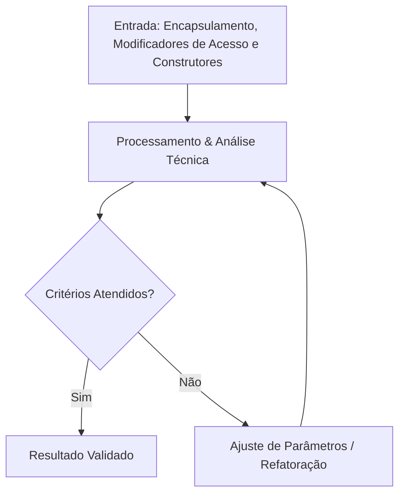

  
⬅️ <b><a href="/pt-br/resource/engenharia-de-computação/6-periodo/programacao-orientada-a-objetos-i/anotacoes/aula-01-classes-instanciacao-e-tipos-por-referencia-vs-valor">Aula Anterior</a></b>

  
🏠 <b><a href="/pt-br/resource/engenharia-de-computação/6-periodo/programacao-orientada-a-objetos-i">Hub da Disciplina</a></b>

  
➡️ <b><a href="/pt-br/resource/engenharia-de-computação/6-periodo/programacao-orientada-a-objetos-i/anotacoes/aula-03-relacionamentos-de-associacao-agregacao-e-composicao">Próxima Aula</a></b>

> [!info] 📌 Informações da Aula & Contexto do Quadro
> - **Disciplina:** Programação Orientada a Objetos I (`CSECBJI.45`)
> - **Docente Responsável:** Sérgio / Bruno
> - **Data & Horário:** 09/09/2026 (Quarta-feira) · `16:40–19:20 (3 tempos)`
> - **Tópico Central:** Encapsulamento, Modificadores de Acesso e Construtores
> - **Status das Anotações:** 🟢 Planejada & Estruturada

> [!note] 📦 Material Didático e Recursos da Aula
> ### 📑 Material de Apoio
> - 📄 **[Slides da Aula (PDF)](/assets/disciplinas/6-periodo/programacao-orientada-a-objetos-i/slides-aula-02.pdf)** — *Apresentação e notas do docente.*
> - 📖 **[Short Lecture — Programação Orientada a Objetos I](/pt-br/resource/engenharia-de-computação/6-periodo/programacao-orientada-a-objetos-i/short-lecture)** — *Compêndio teórico completo.*

## 📋 Sumário Interativo
- [📍 1. Anotações do Quadro: Encapsulamento, Modificadores de Acesso e Construtores](#-1-anotações-do-quadro-encapsulamento-modificadores-de-acesso-e-construtores)
- [🧮 2. Formulação & Exemplo Prático Resolvido](#-2-formulação--exemplo-prático-resolvido)
- [📊 3. Esquema Visual & Fluxograma (Mermaid)](#-3-esquema-visual--fluxograma-mermaid)
- [🧠 4. Resumo Pessoal & Macetes do Professor](#-4-resumo-pessoal--macetes-do-professor)
- [📝 5. Dúvidas & Exercícios Recomendados para Casa](#-5-dúvidas--exercícios-recomendados-para-casa)

---

## 📌 1. Anotações do Quadro: Encapsulamento, Modificadores de Acesso e Construtores

### 📐 Fundamentação Teórica
Modificadores public, private, protected e package-private; getters/setters, construtores sobrecarregados e this.

No contexto de **Programação Orientada a Objetos I**, os princípios formais estabelecem o seguinte comportamento analítico:

$$\mathcal{F}_{\text{programacao-orientada-a-objetos-i}}(t) = \sum_{k=1}^{n} \alpha_k \cdot \phi_k(t) + \int_{0}^{\infty} \lambda(\tau) \, d\tau$$

---

## 🧮 2. Formulação & Exemplo Prático Resolvido

### ✏️ Exercício / Aplicação do Quadro
Desenvolva a solução para a aplicação prática de **Encapsulamento, Modificadores de Acesso e Construtores**:

1. **Passo 1:** Levantar os parâmetros de entrada, requisitos e restrições do sistema.
2. **Passo 2:** Aplicar as formulações e algoritmos estabelecidos na ementa.
3. **Passo 3:** Validar o resultado e verificar a estabilidade técnica da solução.

> [!tip] 💡 Macete do Professor (Dica de Prova)
> Sempre revise as premissas iniciais e condições de contorno de **Encapsulamento, Modificadores de Acesso e Construtores** antes de simplificar as equações na prova!

> [!warning] ⚠️ Pegadinha Comum em Avaliações
> Cuidado com a conversão de unidades e a ordem de precedência dos operadores nos testes práticos.

---

## 📊 3. Esquema Visual & Fluxograma (Mermaid)

---

## 🧠 4. Resumo Pessoal & Macetes do Professor

| Tópico do Quadro | Princípio Central | Atenção Especial |
| :--- | :--- | :--- |
| **Encapsulamento, Modificadores de Acesso e Construtores** | Aplicação direta de Programação Orientada a Objetos I | Verificar restrições de contorno |

---

## 📝 5. Dúvidas & Exercícios Recomendados para Casa

- [ ] Exercício 01: Resolver as questões do quadro sobre **Encapsulamento, Modificadores de Acesso e Construtores**.
- [ ] Exercício 02: Consultar os capítulos correspondentes na bibliografia indicada e na Short Lecture.

  
⬅️ <b><a href="/pt-br/resource/engenharia-de-computação/6-periodo/programacao-orientada-a-objetos-i/anotacoes/aula-01-classes-instanciacao-e-tipos-por-referencia-vs-valor">Aula Anterior</a></b>

  
🏠 <b><a href="/pt-br/resource/engenharia-de-computação/6-periodo/programacao-orientada-a-objetos-i">Hub da Disciplina</a></b>

  
➡️ <b><a href="/pt-br/resource/engenharia-de-computação/6-periodo/programacao-orientada-a-objetos-i/anotacoes/aula-03-relacionamentos-de-associacao-agregacao-e-composicao">Próxima Aula</a></b>

