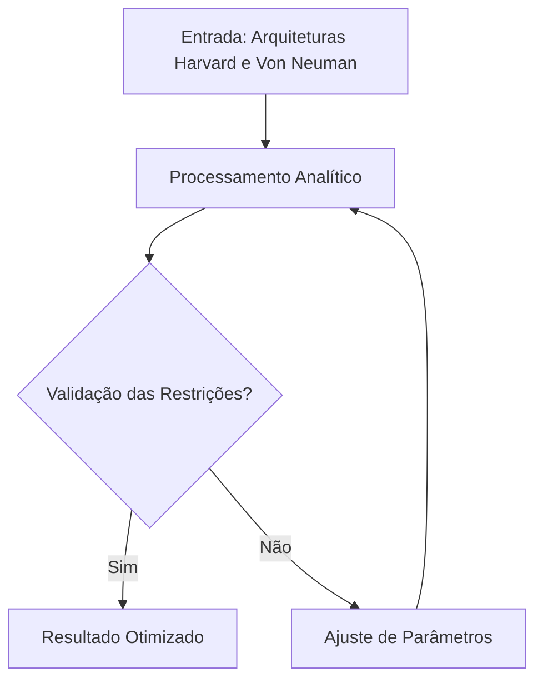

  
⬅️ <b><a href="/pt-br/resource/engenharia-de-computação/8-periodo/microcontroladores/anotacoes/aula-04-tipos-de-arquiteturas">Aula Anterior</a></b>

  
🏠 <b><a href="/pt-br/resource/engenharia-de-computação/8-periodo/microcontroladores">Anotações da Disciplina</a></b>

  
➡️ <b><a href="/pt-br/resource/engenharia-de-computação/8-periodo/microcontroladores/anotacoes/aula-06-estrutura-interna-de-uma-cpu">Próxima Aula</a></b>

> [!info] 📌 Informações da Aula & Contexto do Quadro
> - **Disciplina:** Microcontroladores
> - **Tópico do Quadro:** Arquiteturas Harvard e Von Neuman
> - **Status das Anotações:** 🟢 Completo (Copiado do Quadro + Revisão Pessoal)

> [!note] 📦 Material Didático e Recursos da Aula
> ### 📑 Material da Aula
> - 📄 **[Slides da Aula — Modelo Branco (PDF)](/assets/biblioteca/engenharia/slides-aula-05-branco.pdf)**
> - 📄 **[Slides da Aula — Modelo Preto (PDF)](/assets/biblioteca/engenharia/slides-aula-05-preto.pdf)**
> - 📝 **[Notas de Aula em PDF](/assets/biblioteca/engenharia/notes-aula-05.pdf)**

## 📋 Sumário Interativo
- [📍 1. Anotações do Quadro: Definições & Teoremas](#-1-anotações-do-quadro-definições--teoremas)
- [🧮 2. Exemplo do Quadro Resolvido Passo a Passo](#-2-exemplo-do-quadro-resolvido-passo-a-passo)
- [📊 3. Esquema Visual & Fluxograma (Mermaid)](#-3-esquema-visual--fluxograma-mermaid)
- [🧠 4. Resumo Pessoal & Macetes do Professor](#-4-resumo-pessoal--macetes-do-professor)
- [📝 5. Dúvidas & Exercícios Recomendados para Casa](#-5-dúvidas--exercícios-recomendados-para-casa)

---

## 📌 1. Anotações do Quadro: Definições & Teoremas

### 📐 Definição Fundamental: Arquiteturas Harvard e Von Neuman
No contexto de **Microcontroladores**, o tópico de **Arquiteturas Harvard e Von Neuman** estabelece as seguintes formulações fundamentais:

$$\mathcal{F}(x) = \sum_{k=1}^{n} \alpha_k \cdot \phi_k(x) + \int_{0}^{\infty} \lambda(t) \, dt$$

---

## 🧮 2. Exemplo do Quadro Resolvido Passo a Passo

### ✏️ Exercício do Quadro
Desenvolva a solução analítica para a aplicação de **Arquiteturas Harvard e Von Neuman**:

1. **Passo 1:** Identificar os parâmetros de entrada e restrições do sistema.
2. **Passo 2:** Aplicar as equações características da ementa.
3. **Passo 3:** Obter o resultado e validar a estabilidade técnica.

> [!tip] 💡 Macete do Professor (Dica de Prova)
> Sempre verifique os limites de validade de **Arquiteturas Harvard e Von Neuman** antes de simplificar as equações na prova!

> [!warning] ⚠️ Erro Comum em Provas (Pegadinha)
> Cuidado com a conversão de unidades e a ordem de prioridade das operações no quadro.

---

## 📊 3. Esquema Visual & Fluxograma (Mermaid)

---

## 🧠 4. Resumo Pessoal & Macetes do Professor

| Tópico do Quadro | Princípio Ativo | Atenção Especial |
| :--- | :--- | :--- |
| **Arquiteturas Harvard e Von Neuman** | Formulação direta de Microcontroladores | Verificar condições de contorno |

---

## 📝 5. Dúvidas & Exercícios Recomendados para Casa

- [ ] Exercício 01: Resolver a lista do quadro sobre **Arquiteturas Harvard e Von Neuman**.
- [ ] Exercício 02: Revisar os conceitos da bibliografia básica recomendada.

  
⬅️ <b><a href="/pt-br/resource/engenharia-de-computação/8-periodo/microcontroladores/anotacoes/aula-04-tipos-de-arquiteturas">Aula Anterior</a></b>

  
🏠 <b><a href="/pt-br/resource/engenharia-de-computação/8-periodo/microcontroladores">Anotações da Disciplina</a></b>

  
➡️ <b><a href="/pt-br/resource/engenharia-de-computação/8-periodo/microcontroladores/anotacoes/aula-06-estrutura-interna-de-uma-cpu">Próxima Aula</a></b>

