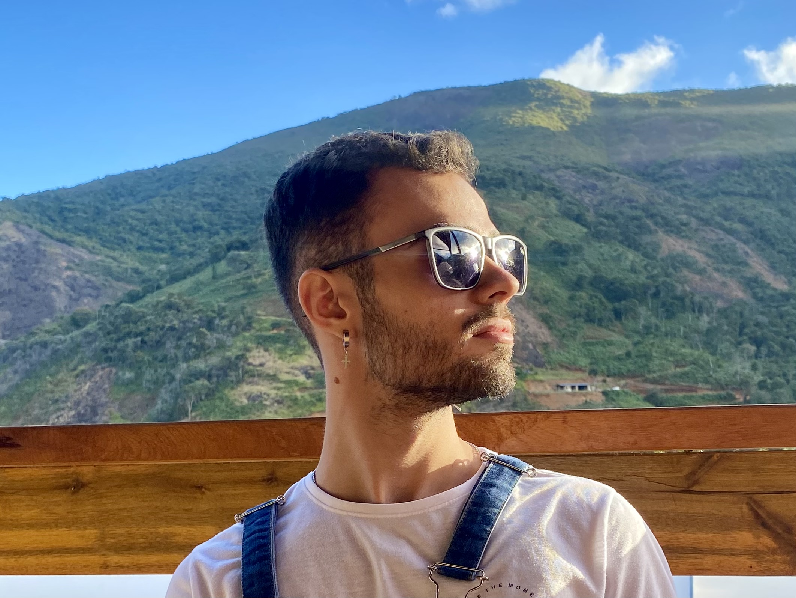

> [!info] Welcome!
> This is your starting page! Here you will find everything you need to know about my journey, research, and work. Read in the suggested order to have the best possible experience. 😊

## 📚 Where to start?

### 1️⃣ First step: About me

I am Pedro Henrique, an undergraduate Computer Engineering student at the [Fluminense Federal Institute](https://portal1.iff.edu.br/), in Rio de Janeiro, Brazil. Since 2022, I have been building a bridge between **computer science** and **astronomy**, working on research projects that explore stellar populations and the structure of the Milky Way.

My passion lies at the intersection of **computational methods** and **astrophysical problems**. I believe that open-source tools and reproducible workflows are essential to advancing science and making it more accessible to everyone.

### 🌐 Social Media

- 💻 [GitHub](https://github.com/pedroiff0)
- 💼 [LinkedIn](https://www.linkedin.com/in/pedroiff0/)
- 📸 [Instagram](https://instagram.com/fckpeeh)
- 🔬 [ORCID](https://orcid.org/0009-0003-6724-4640)
- ✉️ [Email](mailto:pedroiff0@gmail.com)

### 2️⃣ Second step: Areas of Interest

- **Astrophysics**: Galactic archaeology, stellar populations, Milky Way structure and chemical evolution, large-scale astronomical data analysis.
- **Computer Science**: Scientific computing, data pipelines, machine learning applications in astronomy, open-source development.

### 3️⃣ Third step: Explore the content

To navigate my work, explore the sections of this site:

  <a href="/en/research" class="carousel-slide">
    
    
Research

  </a>
  <a href="/en/resource" class="carousel-slide">
    
    
Resources

  </a>
  <a href="/en/media" class="carousel-slide">
    
    
Media

  </a>
  <a href="/en/projects" class="carousel-slide">
    
    
Projects

  </a>
  <a href="/en/publications" class="carousel-slide">
    
    
Publications

  </a>

- [Research](en/research/) — Learn about my current projects and publications.
- [Resources](en/resource/) — Materials, scripts, and useful tools I've developed or use.
- [Media](en/media/) — Participations in events, fairs, and presentations.
- [Projects](en/projects/) — Tools and applications I build outside of academic research.
- [Publications](en/publications/) — My published papers and preprints.

This site is written in two languages: all content is first written in **Portuguese (Brazil)** and translated to English as time allows — so not every page has an English version yet. If you noticed something missing or outdated in translation, feel free to open an [issue in the repository](https://github.com/pedroiff0/page/issues), or [click here to open one pre-filled from the translation template](https://github.com/pedroiff0/page/issues/new?template=traducao.yml).
