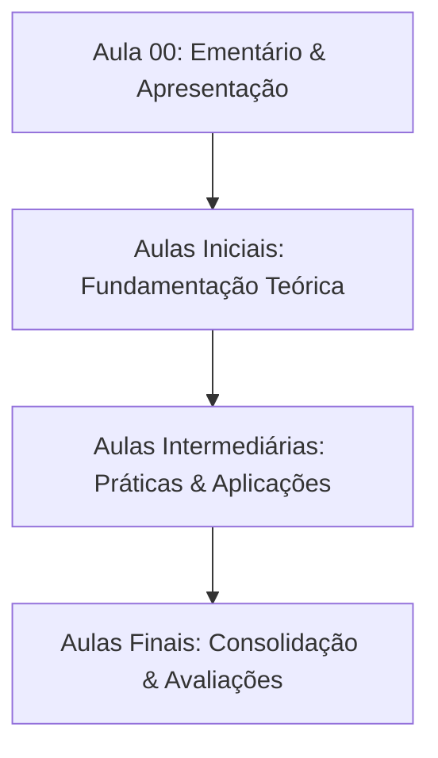

  
⬅️ <b><a href="/pt-br/resource/engenharia-de-computação/2-periodo/quimica-experimental">Aula Anterior</a></b>

  
🏠 <b><a href="/pt-br/resource/engenharia-de-computação/2-periodo/quimica-experimental">Anotações da Disciplina</a></b>

  
➡️ <b><a href="/pt-br/resource/engenharia-de-computação/2-periodo/quimica-experimental/anotacoes/aula-01-estrutura-funcionamento-e-noções-básicas">Próxima Aula</a></b>

> [!info] 📌 Informações Gerais do Plano de Ensino
> - **Disciplina:** Química Experimental (`CSECBJI.16`)
> - **Docente Responsável:** Érica/Marcione
> - **Carga Horária Total:** 40
> - **Tópico da Sessão:** Apresentação da Matriz Curricular, Ementário e Critérios de Avaliação

> [!note] 📦 Material Didático e Recursos Institucionais
> ### 📑 Material da Aula
> - 📄 **[Plano de Ensino Oficial em PDF](/assets/disciplinas/plano-de-ensino-csecbji.16.pdf)**
> - 📄 **[Projeto Pedagógico do Curso (PPC)](/assets/disciplinas/ppc-engenharia-computacao.pdf)**

## 📋 Sumário Interativo
- [📍 1. Ementário Oficial da Disciplina](#-1-ementário-oficial-da-disciplina)
- [🎯 2. Objetivos Pedagógicos & Competências](#-2-objetivos-pedagógicos--competências)
- [📊 3. Mapa de Desenvolvimento dos Tópicos (Mermaid)](#-3-mapa-de-desenvolvimento-dos-tópicos-mermaid)
- [🧠 4. Critérios de Avaliação & Metodologia](#-4-critérios-de-avaliação--metodologia)
- [📝 5. Atividades Iniciais e Leitura Recomendada](#-5-atividades-iniciais-e-leitura-recomendada)

---

## 📌 1. Ementário Oficial da Disciplina

> [!note] 📖 Síntese Ementária Institucional
> Normas de conduta e procedimentos de segurança em laboratórios de análise química. Incerteza dos resultados experimentais. Ferramentas profissionais na área de química experimental. Teste de chama. Medidas de massa e de volume. Soluções. Reações químicas. Estequiometria. Titulação ácido-base. Termoquímica. Equilíbrio Químico. Cinética Química. Eletroquímica. Grupos funcionais orgânicos.

---

## 🎯 2. Objetivos Pedagógicos & Competências

- Relacionar as práticas envolvidas nesta disciplina com a teoria abordada na disciplina de Química, de tal forma a contribuir para a aquisição do aprendizado teórico. Somado a isso, adquirir o conhecimento básico sobre as principais ferramentas profissionais utilizadas em um laboratório de química e compreender como a metodologia científica está envolvida desde o planejamento do experimento até a interpretação dos resultados.

---

## 📊 3. Mapa de Desenvolvimento dos Tópicos (Mermaid)

---

## 🧠 4. Critérios de Avaliação & Metodologia

| Componente | Peso | Descrição |
| :--- | :--- | :--- |
| **Provas Escritas (P1 / P2)** | 60% | Avaliação formal dos conceitos teóricos e práticos |
| **Trabalhos & Projetos** | 30% | Implementações e relatórios técnicos em laboratório |
| **Participação & Listas** | 10% | Resolução de exercícios do quadro e frequência |

---

## 📝 5. Atividades Iniciais e Leitura Recomendada

- [ ] Ler a ementa completa e organizar o ambiente de estudos.
- [ ] Consultar a bibliografia básica no repositório da biblioteca.

  
⬅️ <b><a href="/pt-br/resource/engenharia-de-computação/2-periodo/quimica-experimental">Aula Anterior</a></b>

  
🏠 <b><a href="/pt-br/resource/engenharia-de-computação/2-periodo/quimica-experimental">Anotações da Disciplina</a></b>

  
➡️ <b><a href="/pt-br/resource/engenharia-de-computação/2-periodo/quimica-experimental/anotacoes/aula-01-estrutura-funcionamento-e-noções-básicas">Próxima Aula</a></b>

