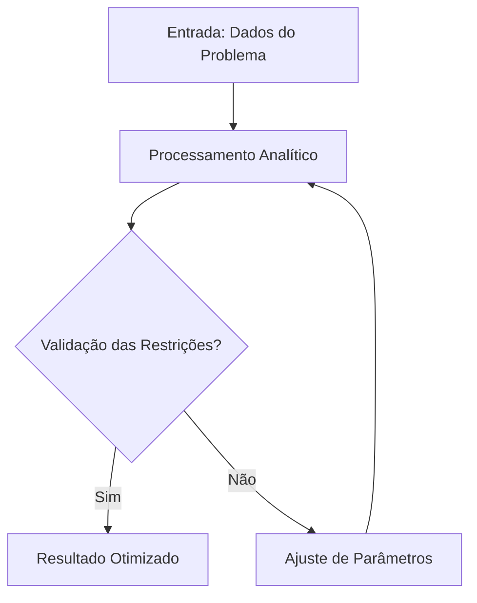

<div style="display: flex; justify-content: space-between; align-items: center; padding: 10px 16px; background: var(--light, #f8fafc); border: 1px solid var(--lightgray, #e2e8f0); border-radius: 10px; margin: 1.5rem 0;">
  <div>⬅️ <b><a href="#">Aula Anterior</a></b></div>
  <div>🏠 <b><a href="../">Hub da Disciplina</a></b></div>
  <div>➡️ <b><a href="#">Próxima Aula</a></b></div>
</div>

```dataviewjs
const currentPath = dv.current()?.file?.path || "";
const parts = currentPath.split("/");
const periodIndex = parts.findIndex(p => p.toLowerCase().includes("periodo") || p.toLowerCase().includes("período"));
const disciplineFolder = periodIndex !== -1 && parts.length > periodIndex + 1 ? parts[periodIndex + 1] : "";

const allPages = dv.pages();
const completedAulas = allPages.filter(p => {
    const path = (p.file?.path || "").toLowerCase();
    const name = (p.file?.name || "").toLowerCase();
    
    const isInDiscipline = disciplineFolder ? path.includes(disciplineFolder.toLowerCase()) : true;
    const isEsboco = path.includes("esboço") || path.includes("esboco") || path.includes("draft");
    const isAula = /^aula[\s_-]+\d+/i.test(name);
    
    return isInDiscipline && isAula && !isEsboco;
});

const totalAulas = 20;
const completedCount = completedAulas.length;
const percentage = Math.min(100, Math.round((completedCount / totalAulas) * 100));

dv.container.innerHTML = `
<div style="margin: 1.5rem 0; padding: 1.2rem; background: var(--background-secondary, #f4f4f5); border-radius: 8px; border: 1px solid var(--border-color, #e4e4e7); box-shadow: 0 1px 3px rgba(0,0,0,0.05);">
  <div style="display: flex; justify-content: space-between; align-items: center; margin-bottom: 0.6rem;">
    <span style="font-weight: 700; font-size: 0.95rem; color: var(--text-normal, #18181b); display: inline-flex; align-items: center; gap: 6px;">
      📖 Progresso da Disciplina
    </span>
    <span style="font-size: 0.85rem; font-weight: 700; color: var(--text-muted, #71717a);">
      ${completedCount} / ${totalAulas} Aulas (${percentage}%)
    </span>
  </div>
  <div style="width: 100%; height: 12px; background-color: var(--background-modifier-border, #e4e4e7); border-radius: 6px; overflow: hidden;">
    <div style="width: ${percentage}%; height: 100%; background: linear-gradient(90deg, #10b981, #059669); border-radius: 6px; transition: width 0.3s ease;"></div>
  </div>
</div>`;
```

> [!info] 📌 Informações da Aula & Contexto do Quadro
> - **Disciplina:** [Nome da Disciplina]
> - **Docente Responsável:** [Nome do Docente]
> - **Tópico Central:** [Tópico Principal da Ementa]
> - **Status das Anotações:** 🟢 Completo

> [!note] 📦 Material Didático & Recursos da Aula
> - 📄 **[Slides da Aula (PDF)](/assets/disciplinas/)**
> - 📖 **[Short Lecture da Disciplina](../short-lecture)**

## 📋 Sumário Interativo
- [📍 1. Anotações do Quadro & Fundamentação Teórica](#-1-anotações-do-quadro--fundamentação-teórica)
- [🧮 2. Exemplos do Quadro Resolvidos Passo a Passo](#-2-exemplos-do-quadro-resolvidos-passo-a-passo)
- [📊 3. Esquema Visual & Fluxograma (Mermaid)](#-3-esquema-visual--fluxograma-mermaid)
- [🧠 4. Resumo Pessoal & Macetes de Prova](#-4-resumo-pessoal--macetes-de-prova)
- [📝 5. Dúvidas & Exercícios Recomendados](#-5-dúvidas--exercícios-recomendados)

---

## 📅 Sessão 1: [Subtópico Teórico Inicial]

### 📝 Atividades / Cronograma
- [ ] 

### 📐 Definição Fundamental: [Conceito]
No contexto de **[Nome da Disciplina]**, a formulação analítica estabelece que:

$$\mathcal{F}(x) = \sum_{k=1}^{n} \alpha_k \cdot \phi_k(x) + \int_{0}^{\infty} \lambda(t) \, dt$$

---

## 📅 Sessão 2: [Aplicações Práticas & Laboratório]

### 📝 Atividades / Cronograma
- [ ] 

### ✏️ Exemplo Resolvido do Quadro
Desenvolva a solução passo a passo:

1. **Passo 1:** Identificar os parâmetros de entrada e restrições do sistema.
2. **Passo 2:** Aplicar as equações características da ementa.
3. **Passo 3:** Obter o resultado e validar a estabilidade técnica.

---

## 📊 3. Esquema Visual & Fluxograma (Mermaid)



---

## 🧠 4. Resumo Pessoal & Macetes de Prova

| Tópico | Princípio Central | Atenção Especial / Pegadinha |
| :--- | :--- | :--- |
| **[Conceito 1]** | Formulação direta da ementa | Verificar condições de contorno |
| **[Conceito 2]** | Otimização paramétrica | Atenção às unidades do SI |

> [!tip] 💡 Dica de Prova do Professor
> Sempre verifique os limites de validade das simplificações antes de aplicar as fórmulas finais.

---

## 📝 5. Dúvidas & Exercícios Recomendados

- [ ] Exercício 01: Resolver a lista do quadro sobre o tópico.
- [ ] Exercício 02: Revisar a bibliografia básica indicada no Hub da Disciplina.

<div style="display: flex; justify-content: space-between; align-items: center; padding: 10px 16px; background: var(--light, #f8fafc); border: 1px solid var(--lightgray, #e2e8f0); border-radius: 10px; margin: 1.5rem 0;">
  <div>⬅️ <b><a href="#">Aula Anterior</a></b></div>
  <div>🏠 <b><a href="../">Hub da Disciplina</a></b></div>
  <div>➡️ <b><a href="#">Próxima Aula</a></b></div>
</div>
