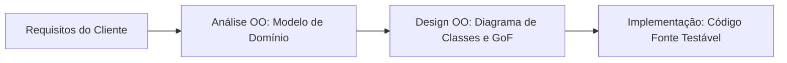

<div style="display: flex; justify-content: space-between; align-items: center; padding: 10px 16px; background: var(--light, #f8fafc); border: 1px solid var(--lightgray, #e2e8f0); border-radius: 10px; margin: 1.5rem 0;">
  <div>⬅️ <span style="color: gray;">Primeira Aula</span></div>
  <div>🏠 <b><a href="/pt-br/resource/engenharia-de-computação/6-periodo/analise-de-software-orientada-a-objetos">Hub da Disciplina</a></b></div>
  <div>➡️ <b><a href="/pt-br/resource/engenharia-de-computação/6-periodo/analise-de-software-orientada-a-objetos/anotacoes/aula-01-o-paradigma-orientado-a-objetos-e-o-processo-unificado">Próxima Aula</a></b></div>
</div>

> [!info] 📅 Informações da Aula
> - **Disciplina:** Análise de Software Orientada a Objetos (CSECBJI.42)
> - **Professor:** Bruno
> - **Data Realizada:** 26/08/2026
> - **Tópico Principal:** Apresentação da Disciplina, Metodologia e Ementário
> - **Status:** Concluída e Revisada

> [!note] 📂 Material Complementar & Slides
> - 📄 **Slides Oficiais:** [[slide-00-analise-de-software-orientada-a-objetos|Acessar Apresentação em PDF]]
> - 🎥 **Short Lecture / Gravação:** [[video-00-analise-de-software-orientada-a-objetos|Assistir Síntese da Aula (Vídeo)]]

---

### 📑 Resumo das Seções
- [📌 1. Anotações do Quadro: Apresentação da Disciplina, Metodologia e Ementário](#-anotações-do-quadro-apresentação-da-disciplina,-metodologia-e-ementário)
- [🧮 2. Formulação & Exemplo Prático Resolvido](#-formulação--exemplo-prático-resolvido)
- [📊 3. Esquema Visual & Fluxograma (Mermaid)](#-esquema-visual--fluxograma-mermaid)
- [🧠 4. Resumo Pessoal & Macetes do Professor](#-resumo-pessoal--macetes-do-professor)
- [📝 5. Dúvidas & Exercícios Recomendados para Casa](#-dúvidas--exercícios-recomendados-para-casa)

---

## 📌 Anotações do Quadro: Apresentação da Disciplina, Metodologia e Ementário

### 1.1 Objetivos da Análise e Design Orientados a Objetos (OOAD)
A disciplina de Análise e Design OO estabelece a ponte formal entre as necessidades do negócio do cliente e a implementação do código:
- **Análise OO:** Concentra-se em compreender **O QUE** o sistema deve fazer, modelando o domínio do problema sem decisões prematuras de tecnologia.
- **Design OO:** Concentra-se em definir **COMO** o sistema resolverá o problema, projetando classes de software, arquitetura em camadas e padrões de projeto.

### 1.2 O Papel da Unified Modeling Language (UML)
A UML (padronizada pela OMG) é a linguagem visual padrão para especificação, modelagem e documentação de artefatos de software:
1. **Diagramas Estruturais:** Diagrama de Classes, Diagrama de Pacotes, Diagrama de Componentes, Diagrama de Implantação.
2. **Diagramas Comportamentais:** Diagrama de Casos de Uso, Diagrama de Sequência, Diagrama de Atividades, Diagrama de Máquinas de Estados.

### 1.3 Ciclos de Vida de Desenvolvimento de Software
- Modelo em Cascata (*Waterfall*): Sequencial e rígido.
- Modelos Ágeis e Iterativos: Entregas contínuas em sprints curtas, com feedback frequente do cliente.

---

## 🧮 Formulação & Exemplo Prático Resolvido

### ✏️ A Transição Conceitual: Da Análise ao Código

```text
1. Análise de Domínio:
   Identifica conceitos do mundo real: Cliente, Pedido, Item, Produto.

2. Design de Software:
   Define classes de solução: PedidoController, RepositorioPedido, ValidadorDesconto.

3. Implementação:
   Codificação orientada a objetos com testes unitários em Java/C#.
```

---

## 📊 Esquema Visual & Fluxograma (Mermaid)



---

## 🧠 Resumo Pessoal & Macetes do Professor

| Conceito-Chave | *Takeaway* do Professor | Dicas de Prova / Atenção |
| :--- | :--- | :--- |
| **Análise vs Design** | Análise investiga o problema do mundo real; Design projeta a solução lógica de software. | Não projete tabelas de banco de dados ou botões de UI durante a fase de análise de domínio! |
| **UML não é Metodologia** | UML é apenas uma notação visual; o Processo Unificado ou Scrum são os métodos de trabalho. | Aplicação prática direta |

---

## 📝 Dúvidas & Exercícios Recomendados para Casa

1. Diferencie detalhadamente a fase de Análise OO da fase de Design OO.
2. Classifique os 14 diagramas da UML 2.5 em Estruturais e Comportamentais.

---

<div style="display: flex; justify-content: space-between; align-items: center; padding: 10px 16px; background: var(--light, #f8fafc); border: 1px solid var(--lightgray, #e2e8f0); border-radius: 10px; margin: 1.5rem 0;">
  <div>⬅️ <span style="color: gray;">Primeira Aula</span></div>
  <div>🏠 <b><a href="/pt-br/resource/engenharia-de-computação/6-periodo/analise-de-software-orientada-a-objetos">Hub da Disciplina</a></b></div>
  <div>➡️ <b><a href="/pt-br/resource/engenharia-de-computação/6-periodo/analise-de-software-orientada-a-objetos/anotacoes/aula-01-o-paradigma-orientado-a-objetos-e-o-processo-unificado">Próxima Aula</a></b></div>
</div>
