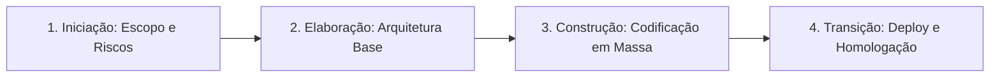

<div style="display: flex; justify-content: space-between; align-items: center; padding: 10px 16px; background: var(--light, #f8fafc); border: 1px solid var(--lightgray, #e2e8f0); border-radius: 10px; margin: 1.5rem 0;">
  <div>⬅️ <b><a href="/pt-br/resource/engenharia-de-computação/6-periodo/analise-de-software-orientada-a-objetos/anotacoes/aula-00-apresentacao-da-disciplina-metodologia-e-ementario">Aula Anterior</a></b></div>
  <div>🏠 <b><a href="/pt-br/resource/engenharia-de-computação/6-periodo/analise-de-software-orientada-a-objetos">Hub da Disciplina</a></b></div>
  <div>➡️ <b><a href="/pt-br/resource/engenharia-de-computação/6-periodo/analise-de-software-orientada-a-objetos/anotacoes/aula-02-engenharia-de-requisitos-e-modelagem-de-negocio">Próxima Aula</a></b></div>
</div>

> [!info] 📅 Informações da Aula
> - **Disciplina:** Análise de Software Orientada a Objetos (CSECBJI.42)
> - **Professor:** Bruno
> - **Data Realizada:** 02/09/2026
> - **Tópico Principal:** O Paradigma Orientado a Objetos e o Processo Unificado
> - **Status:** Concluída e Revisada

> [!note] 📂 Material Complementar & Slides
> - 📄 **Slides Oficiais:** [[slide-01-analise-de-software-orientada-a-objetos|Acessar Apresentação em PDF]]
> - 🎥 **Short Lecture / Gravação:** [[video-01-analise-de-software-orientada-a-objetos|Assistir Síntese da Aula (Vídeo)]]

---

### 📑 Resumo das Seções
- [📌 1. Anotações do Quadro: O Paradigma Orientado a Objetos e o Processo Unificado](#-anotações-do-quadro-o-paradigma-orientado-a-objetos-e-o-processo-unificado)
- [🧮 2. Formulação & Exemplo Prático Resolvido](#-formulação--exemplo-prático-resolvido)
- [📊 3. Esquema Visual & Fluxograma (Mermaid)](#-esquema-visual--fluxograma-mermaid)
- [🧠 4. Resumo Pessoal & Macetes do Professor](#-resumo-pessoal--macetes-do-professor)
- [📝 5. Dúvidas & Exercícios Recomendados para Casa](#-dúvidas--exercícios-recomendados-para-casa)

---

## Palavras Chaves
(Pesquisar significado e contexto de uso.)
* SCRUM
* 

## Data: 22/08 

Tópico: tal
1. dfjkasjkd
> [!PDF|red] [[Modelagem_Conceitual___Parte_I (1).pdf#page=15&selection=16,0,18,55&color=red|Modelagem_Conceitual___Parte_I (1), p.11]]
> > Esses objetos estarão sendo percebidos como elementos individualizados mas, ao mesmo tempo, poderão ser enquadrados em um conjunto ou categoria em função de suas semelhanças.


## 📌 Anotações do Quadro: O Paradigma Orientado a Objetos e o Processo Unificado

### 1.1 O Paradigma Orientado a Objetos (Pilares Fundamentais)
1. **Abstração:** Foco nos aspectos essenciais de uma entidade para um dado contexto, ignorando detalhes irrelevantes.
2. **Encapsulamento:** Agrupamento de dados e métodos em uma unidade coesa, ocultando a representação interna.
3. **Modularidade:** Decomposição do sistema em componentes fracamente acoplados e altamente coesos.
4. **Hierarquia:** Organização em níveis de abstração (Herança e Agregação).

### 1.2 O Processo Unificado (Unified Process - UP / RUP)
O UP é um processo de engenharia de software moderno caracterizado por ser:
- **Dirigido por Casos de Uso (*Use-Case Driven*):** Os casos de uso orientam o planejamento, design e testes.
- **Centrado na Arquitetura (*Architecture-Centric*):** A estrutura arquitetural é definida e validada logo no início.
- **Iterativo e Incremental:** O projeto avança através de uma série de mini-projetos curtos (iterações).

### 1.3 As Quatro Fases do Processo Unificado
1. **Iniciação (*Inception*):** Delimitação do escopo, visão do produto, estudo de viabilidade e estimativa grosseira de custos.
2. **Elaboração (*Elaboration*):** Especificação detalhada da maioria dos casos de uso, mitigação dos principais riscos técnicos e criação da **Arquitetura Executável Linha-Base**.
3. **Construção (*Construction*):** Codificação em massa, implementação dos módulos restantes e testes integrados.
4. **Transição (*Transition*):** Homologação, testes beta, implantação em produção e treinamento dos usuários.

---

## 🧮 Formulação & Exemplo Prático Resolvido

### ✏️ Distribuição de Disciplinas pelas Fases do RUP

```text
Fases  ──▶   Iniciação │    Elaboração    │       Construção       │ Transição
Disciplinas:
Requisitos   █████████ │ ████████████████ │ ████                   │ █
Análise/Design  ██     │ ████████████████ │ ████████████           │ █
Implementação          │ ████             │ ██████████████████████ │ ████
Testes                 │ ████             │ ████████████████       │ ████████
```

A fase de **Elaboração** é a mais crítica para a engenharia de software: nela define-se o núcleo arquitetural que garantirá a estabilidade do sistema!

---

## 📊 Esquema Visual & Fluxograma (Mermaid)



---

## 🧠 Resumo Pessoal & Macetes do Professor

| Conceito-Chave                   | *Takeaway* do Professor                                                                                                                                                       | Dicas de Prova / Atenção                              |
| :------------------------------- | :---------------------------------------------------------------------------------------------------------------------------------------------------------------------------- | :---------------------------------------------------- |
| **A Meta da Fase de Elaboração** | A Elaboração NÃO serve para produzir apenas documentos de texto; seu objetivo é produzir uma **Arquitetura Executável** com código real testando os cenários mais arriscados. | Sem código validado, a Elaboração não está concluída. |
| **Iteração Típica**              | Cada iteração no RUP dura tipicamente de 2 a 6 semanas e resulta em uma versão executável interna testada.                                                                    | Aplicação prática direta                              |

---

## 📝 Dúvidas & Exercícios Recomendados para Casa

1. Descreva os principais artefatos gerados ao final da fase de Iniciação e da fase de Elaboração no Processo Unificado.
2. Explique por que o desenvolvimento iterativo reduz os riscos do projeto em relação ao modelo em cascata.

---

<div style="display: flex; justify-content: space-between; align-items: center; padding: 10px 16px; background: var(--light, #f8fafc); border: 1px solid var(--lightgray, #e2e8f0); border-radius: 10px; margin: 1.5rem 0;">
  <div>⬅️ <b><a href="/pt-br/resource/engenharia-de-computação/6-periodo/analise-de-software-orientada-a-objetos/anotacoes/aula-00-apresentacao-da-disciplina-metodologia-e-ementario">Aula Anterior</a></b></div>
  <div>🏠 <b><a href="/pt-br/resource/engenharia-de-computação/6-periodo/analise-de-software-orientada-a-objetos">Hub da Disciplina</a></b></div>
  <div>➡️ <b><a href="/pt-br/resource/engenharia-de-computação/6-periodo/analise-de-software-orientada-a-objetos/anotacoes/aula-02-engenharia-de-requisitos-e-modelagem-de-negocio">Próxima Aula</a></b></div>
</div>
