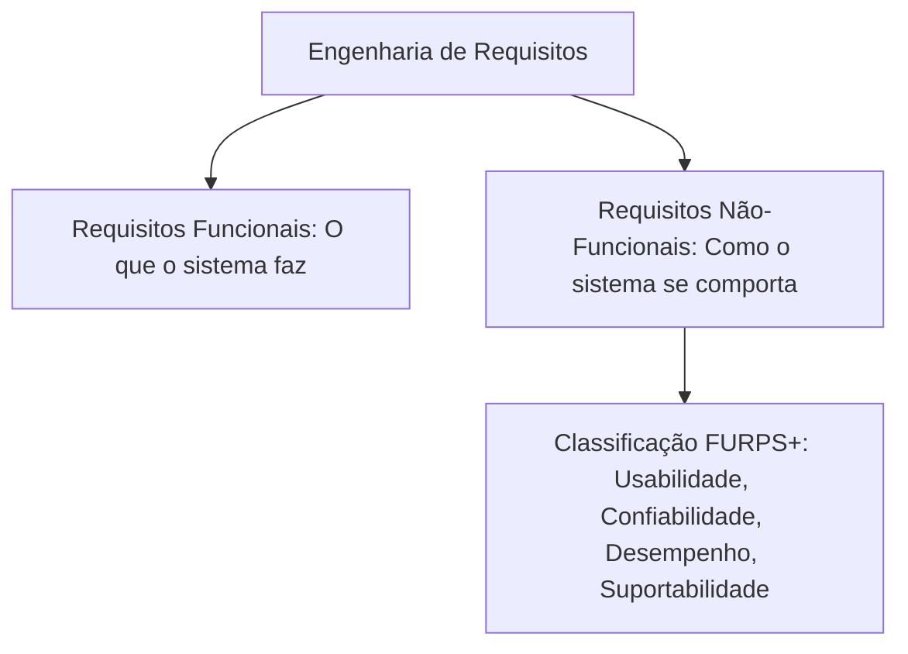

  
⬅️ <b><a href="/pt-br/resource/engenharia-de-computação/6-periodo/analise-de-software-orientada-a-objetos/anotacoes/aula-01-o-paradigma-orientado-a-objetos-e-o-processo-unificado">Aula Anterior</a></b>

  
🏠 <b><a href="/pt-br/resource/engenharia-de-computação/6-periodo/analise-de-software-orientada-a-objetos">Hub da Disciplina</a></b>

  
➡️ <b><a href="/pt-br/resource/engenharia-de-computação/6-periodo/analise-de-software-orientada-a-objetos/anotacoes/aula-03-diagrama-de-casos-de-uso-e-especificacoes-textuais">Próxima Aula</a></b>

> [!info] 📅 Informações da Aula
> - **Disciplina:** Análise de Software Orientada a Objetos (CSECBJI.42)
> - **Professor:** Bruno
> - **Data Realizada:** 09/09/2026
> - **Tópico Principal:** Engenharia de Requisitos e Modelagem de Negócio
> - **Status:** Concluída e Revisada

> [!note] 📂 Material Complementar & Slides
> - 📄 **Slides Oficiais:** [[slide-02-analise-de-software-orientada-a-objetos|Acessar Apresentação em PDF]]
> - 🎥 **Short Lecture / Gravação:** [[video-02-analise-de-software-orientada-a-objetos|Assistir Síntese da Aula (Vídeo)]]

---

### 📑 Resumo das Seções
- [📌 1. Anotações do Quadro: Engenharia de Requisitos e Modelagem de Negócio](#-anotações-do-quadro-engenharia-de-requisitos-e-modelagem-de-negócio)
- [🧮 2. Formulação & Exemplo Prático Resolvido](#-formulação--exemplo-prático-resolvido)
- [📊 3. Esquema Visual & Fluxograma (Mermaid)](#-esquema-visual--fluxograma-mermaid)
- [🧠 4. Resumo Pessoal & Macetes do Professor](#-resumo-pessoal--macetes-do-professor)
- [📝 5. Dúvidas & Exercícios Recomendados para Casa](#-dúvidas--exercícios-recomendados-para-casa)

---

## 📌 Anotações do Quadro: Engenharia de Requisitos e Modelagem de Negócio

### 2.1 Engenharia de Requisitos
Processo de descoberta, análise, negociação, especificação e validação dos serviços fornecidos pelo sistema e suas restrições operacionais.

### 2.2 Classificação FURPS+ de Requisitos
- **F (Functionality):** Requisitos Funcionais (conjunto de recursos, capacidades, segurança de dados).
- **U (Usability):** Usabilidade (fatores humanos, ergonomia, consistência de interface, tempo de aprendizado).
- **R (Reliability):** Confiabilidade (frequência de falhas, tempo médio entre falhas MTBF, recuperabilidade).
- **P (Performance):** Desempenho (tempo de resposta, taxa de transferência, consumo de CPU/RAM).
- **S (Supportability):** Suportabilidade (manutenibilidade, testabilidade, configurabilidade, internacionalização).
- **+ (Restrições Adicionais):** Requisitos de design, restrições de implementação, requisitos de interface e requisitos físicos.

### 2.3 Modelagem de Negócio (*Business Modeling*)
Antes de modelar o software, modela-se o ambiente de negócio do cliente:
- **Atores de Negócio (*Business Actors*):** Entidades externas que interagem com o negócio (clientes, fornecedores, bancos).
- **Casos de Uso de Negócio (*Business Use Cases*):** Processos de negócio que geram valor direto para um ator de negócio (ex: "Conceder Empréstimo Imobiliário").

---

## 🧮 Formulação & Exemplo Prático Resolvido

### ✏️ Matriz de Requisitos FURPS+ para um Sistema de Pagamento Instantâneo

| Categoria | Tipo | Especificação do Requisito |
| :--- | :--- | :--- |
| **Funcionalidade** | RF | O sistema deve processar transferências Pix com liquidação em até 10 segundos. |
| **Usabilidade** | RNF | A confirmação do pagamento deve exigir no máximo 2 toques na tela do aplicativo móvel. |
| **Confiabilidade** | RNF | A disponibilidade do sistema deve ser de $99.99\%$ (máximo de 52 minutos de indisponibilidade por ano). |
| **Desempenho** | RNF | O gateway deve suportar um pico de $10.000\text{ transações por segundo}$ com latência inferior a $200\text{ ms}$. |
| **Suportabilidade** | RNF | O backend deve ser conteinerizado em Docker com orquestração Kubernetes. |

---

## 📊 Esquema Visual & Fluxograma (Mermaid)

---

## 🧠 Resumo Pessoal & Macetes do Professor

| Conceito-Chave | *Takeaway* do Professor | Dicas de Prova / Atenção |
| :--- | :--- | :--- |
| **Requisitos Não-Funcionais Devem Ser Mensuráveis!** | Nunca escreva requisitos vagos como 'o sistema deve ser rápido' ou 'a tela deve ser bonita'. Escreva métricas quantificáveis: 'tempo de resposta $< 500	ext{ ms}$ para $95\%$ das requisições'. | Requisitos não-mensuráveis são impossíveis de testar. |
| **Modelagem de Negócio vs de Software** | Casos de uso de negócio tratam do processo da empresa humana; Casos de uso de sistema tratam da interação do usuário com o aplicativo. | Aplicação prática direta |

---

## 📝 Dúvidas & Exercícios Recomendados para Casa

1. Elabore uma lista de 5 requisitos funcionais e 5 requisitos não-funcionais (utilizando o modelo FURPS+) para um sistema de prontuário eletrônico hospitalar.
2. Desenhe o diagrama de casos de uso de negócio para o processo de atendimento de um restaurante à la carte.

---

  
⬅️ <b><a href="/pt-br/resource/engenharia-de-computação/6-periodo/analise-de-software-orientada-a-objetos/anotacoes/aula-01-o-paradigma-orientado-a-objetos-e-o-processo-unificado">Aula Anterior</a></b>

  
🏠 <b><a href="/pt-br/resource/engenharia-de-computação/6-periodo/analise-de-software-orientada-a-objetos">Hub da Disciplina</a></b>

  
➡️ <b><a href="/pt-br/resource/engenharia-de-computação/6-periodo/analise-de-software-orientada-a-objetos/anotacoes/aula-03-diagrama-de-casos-de-uso-e-especificacoes-textuais">Próxima Aula</a></b>

