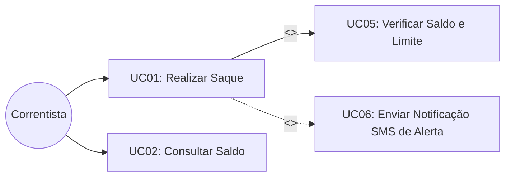

  
⬅️ <b><a href="/pt-br/resource/engenharia-de-computação/6-periodo/analise-de-software-orientada-a-objetos/anotacoes/aula-02-engenharia-de-requisitos-e-modelagem-de-negocio">Aula Anterior</a></b>

  
🏠 <b><a href="/pt-br/resource/engenharia-de-computação/6-periodo/analise-de-software-orientada-a-objetos">Hub da Disciplina</a></b>

  
➡️ <b><a href="/pt-br/resource/engenharia-de-computação/6-periodo/analise-de-software-orientada-a-objetos/anotacoes/aula-04-modelagem-estrutural-diagramas-de-classes-e-pacotes">Próxima Aula</a></b>

> [!info] 📅 Informações da Aula
> - **Disciplina:** Análise de Software Orientada a Objetos (CSECBJI.42)
> - **Professor:** Bruno
> - **Data Realizada:** 16/09/2026
> - **Tópico Principal:** Diagrama de Casos de Uso e Especificações Textuais
> - **Status:** Concluída e Revisada

> [!note] 📂 Material Complementar & Slides
> - 📄 **Slides Oficiais:** [[slide-03-analise-de-software-orientada-a-objetos|Acessar Apresentação em PDF]]
> - 🎥 **Short Lecture / Gravação:** [[video-03-analise-de-software-orientada-a-objetos|Assistir Síntese da Aula (Vídeo)]]

---

### 📑 Resumo das Seções
- [📌 1. Anotações do Quadro: Diagrama de Casos de Uso e Especificações Textuais](#-anotações-do-quadro-diagrama-de-casos-de-uso-e-especificações-textuais)
- [🧮 2. Formulação & Exemplo Prático Resolvido](#-formulação--exemplo-prático-resolvido)
- [📊 3. Esquema Visual & Fluxograma (Mermaid)](#-esquema-visual--fluxograma-mermaid)
- [🧠 4. Resumo Pessoal & Macetes do Professor](#-resumo-pessoal--macetes-do-professor)
- [📝 5. Dúvidas & Exercícios Recomendados para Casa](#-dúvidas--exercícios-recomendados-para-casa)

---

## 📌 Anotações do Quadro: Diagrama de Casos de Uso e Especificações Textuais

### 3.1 Diagramas de Casos de Uso (UML)
O Diagrama de Casos de Uso modela as funcionalidades do sistema sob a perspectiva dos atores externos:
- **Ator:** Papel desempenhado por um usuário humano, dispositivo de hardware ou sistema externo que interage com o sistema.
- **Caso de Uso:** Sequência completa de ações executadas pelo sistema que produz um resultado observável de valor para o ator.
- **Fronteira do Sistema (*System Boundary*):** Caixa retangular delimitando o escopo automatizado do software.

### 3.2 Relacionamentos entre Casos de Uso
1. **Inclusão (`<<include>>`):** Comportamento compartilhado e obrigatório extraído de múltiplos casos de uso (o caso de uso base **sempre executa** o caso incluído). A seta aponta do caso base para o incluído.
2. **Extensão (`<<extend>>`):** Comportamento opcional ou condicional que é inserido no caso base em pontos de extensão específicos (*Extension Points*). A seta aponta do caso estendido para o caso base.
3. **Generalização / Especialização:** Herança de comportamento entre atores ou entre casos de uso.

---

## 🧮 Formulação & Exemplo Prático Resolvido

### ✏️ Especificação Textual Expandida do Caso de Uso: "Realizar Saque Bancário"

- **Caso de Uso:** UC01 - Realizar Saque Bancário
- **Ator Principal:** Correntista
- **Precondições:** O correntista deve estar autenticado com cartão e senha válidos.
- **Garantia de Sucesso (Pós-condições):** Dinheiro entregue, saldo da conta debitado e transação registrada em log de auditoria.

**Fluxo Principal (Cenário Feliz):**
1. O correntista seleciona a opção "Saque" e informa o valor desejado.
2. O sistema verifica se o valor é múltiplo das cédulas disponíveis no dispensador.
3. O sistema inclui o caso de uso `<<include>>` UC05 - "Verificar Saldo e Limite da Conta".
4. O sistema debita o valor do saldo da conta corrente.
5. O sistema comanda a liberação das cédulas físicas no dispensador.
6. O sistema emite o comprovante impresso da operação e finaliza a sessão.

**Fluxos Alternativos e Exceções:**
- **3a. Saldo Insuficiente:** O sistema informa mensagem de saldo insuficiente e retorna ao menu inicial sem debitar valores.
- **5a. Falha Mecânica no Dispensador:** O sistema reverte o débito na conta (*Rollback*), registra a ocorrência e encerra com mensagem de erro mecânico.

---

## 📊 Esquema Visual & Fluxograma (Mermaid)

---

## 🧠 Resumo Pessoal & Macetes do Professor

| Conceito-Chave | *Takeaway* do Professor | Dicas de Prova / Atenção |
| :--- | :--- | :--- |
| **Direção das Setas de Include e Extend** | No `<<include>>`, a seta aponta do Pai para o Filho (o pai chama o filho); No `<<extend>>`, a seta aponta do Filho para o Pai (o filho estende o pai!). | A pegadinha de UML mais frequente em provas. |
| **Casos de Uso NÃO São Passos de Algoritmo** | Não crie casos de uso atômicos inúteis como 'Digitar Senha' ou 'Clicar no Botão'. Um caso de uso deve representar uma meta completa de negócio do ator. | Aplicação prática direta |

---

## 📝 Dúvidas & Exercícios Recomendados para Casa

1. Modele o Diagrama de Casos de Uso completo para um sistema de biblioteca universitária (empréstimos, devoluções, reservas, multas e autenticação).
2. Escreva a especificação textual expandida completa para o caso de uso 'Realizar Empréstimo de Livro' incluindo fluxos alternativos.

---

  
⬅️ <b><a href="/pt-br/resource/engenharia-de-computação/6-periodo/analise-de-software-orientada-a-objetos/anotacoes/aula-02-engenharia-de-requisitos-e-modelagem-de-negocio">Aula Anterior</a></b>

  
🏠 <b><a href="/pt-br/resource/engenharia-de-computação/6-periodo/analise-de-software-orientada-a-objetos">Hub da Disciplina</a></b>

  
➡️ <b><a href="/pt-br/resource/engenharia-de-computação/6-periodo/analise-de-software-orientada-a-objetos/anotacoes/aula-04-modelagem-estrutural-diagramas-de-classes-e-pacotes">Próxima Aula</a></b>

