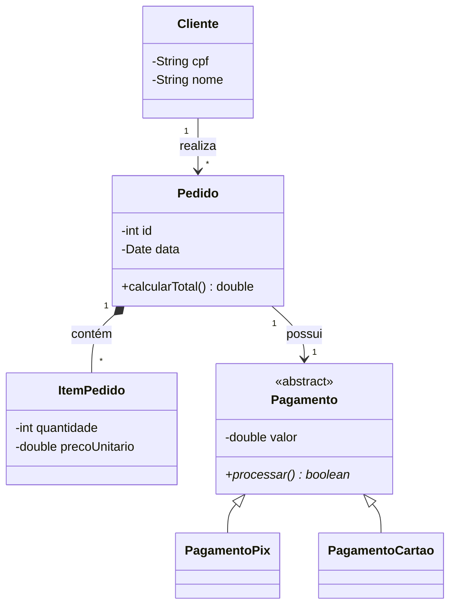

<div style="display: flex; justify-content: space-between; align-items: center; padding: 10px 16px; background: var(--light, #f8fafc); border: 1px solid var(--lightgray, #e2e8f0); border-radius: 10px; margin: 1.5rem 0;">
  <div>⬅️ <b><a href="/pt-br/resource/engenharia-de-computação/6-periodo/analise-de-software-orientada-a-objetos/anotacoes/aula-03-diagrama-de-casos-de-uso-e-especificacoes-textuais">Aula Anterior</a></b></div>
  <div>🏠 <b><a href="/pt-br/resource/engenharia-de-computação/6-periodo/analise-de-software-orientada-a-objetos">Hub da Disciplina</a></b></div>
  <div>➡️ <b><a href="/pt-br/resource/engenharia-de-computação/6-periodo/analise-de-software-orientada-a-objetos/anotacoes/aula-05-modelagem-comportamental-diagramas-de-sequencia">Próxima Aula</a></b></div>
</div>

> [!info] 📅 Informações da Aula
> - **Disciplina:** Análise de Software Orientada a Objetos (CSECBJI.42)
> - **Professor:** Bruno
> - **Data Realizada:** 23/09/2026
> - **Tópico Principal:** Modelagem Estrutural: Diagramas de Classes e Pacotes
> - **Status:** Concluída e Revisada

> [!note] 📂 Material Complementar & Slides
> - 📄 **Slides Oficiais:** [[slide-04-analise-de-software-orientada-a-objetos|Acessar Apresentação em PDF]]
> - 🎥 **Short Lecture / Gravação:** [[video-04-analise-de-software-orientada-a-objetos|Assistir Síntese da Aula (Vídeo)]]

---

### 📑 Resumo das Seções
- [📌 1. Anotações do Quadro: Modelagem Estrutural: Diagramas de Classes e Pacotes](#-anotações-do-quadro-modelagem-estrutural-diagramas-de-classes-e-pacotes)
- [🧮 2. Formulação & Exemplo Prático Resolvido](#-formulação--exemplo-prático-resolvido)
- [📊 3. Esquema Visual & Fluxograma (Mermaid)](#-esquema-visual--fluxograma-mermaid)
- [🧠 4. Resumo Pessoal & Macetes do Professor](#-resumo-pessoal--macetes-do-professor)
- [📝 5. Dúvidas & Exercícios Recomendados para Casa](#-dúvidas--exercícios-recomendados-para-casa)

---

## 📌 Anotações do Quadro: Modelagem Estrutural: Diagramas de Classes e Pacotes

### 4.1 Diagrama de Classes Estrutural (UML)
O Diagrama de Classes é o principal artefato estático da modelagem OO, representando classes, atributos, operações e relacionamentos.

### 4.2 Anatomia da Classe e Notação de Visibilidade
```text
┌─────────────────────────────────────────────────┐
│ ContaBancaria                                   │ ◄── Nome da Classe
├─────────────────────────────────────────────────┤
│ - numero: String                                │ ◄── Atributos: Visibilidade (- private)
│ # titular: String                               │                (# protected, ~ package)
│ + saldo: double = 0.0                           │                (+ public, / derivado)
├─────────────────────────────────────────────────┤
│ + depositar(valor: double): void                │ ◄── Operações / Métodos
│ + sacar(valor: double): boolean                 │
│ + getSaldo(): double                            │
└─────────────────────────────────────────────────┘
```

### 4.3 Relacionamentos Estruturais
1. **Associação:** Linha contínua com multiplicidades nas extremidades (`1`, `0..1`, `*`, `1..*`).
2. **Agregação:** Losango branco na ponta do Todo (relação fraca).
3. **Composição:** Losango preto na ponta do Todo (relação forte com morte conjunta).
4. **Generalização (Herança):** Seta com triângulo vazado apontando para a Superclasse.
5. **Realização (Interface):** Linha tracejada com triângulo vazado apontando para a Interface.
6. **Dependência:** Linha tracejada simples com seta aberta (`uses`).

---

## 🧮 Formulação & Exemplo Prático Resolvido

### ✏️ Diagrama de Classes: Módulo de Pedidos e Pagamentos

```text
┌──────────────┐ 1        * ┌──────────────┐ 1        1 ┌──────────────┐
│ Cliente      │───────────│ Pedido       │*───────────│ Pagamento    │
├──────────────┤            ├──────────────┤            ├──────────────┤
│ - cpf: String│            │ - id: int    │            │ - valor: dou │
│ - nome: Str  │            │ - data: Date │            │ - pago: bool │
└──────────────┘            └──────────────┘            └──────────────┘
                                   │ 1
                                   │ * (Composição)
                            ┌──────────────┐
                            │ ItemPedido   │
                            ├──────────────┤
                            │ - qtd: int   │
                            │ - preco: dou │
                            └──────────────┘
```

---

## 📊 Esquema Visual & Fluxograma (Mermaid)



---

## 🧠 Resumo Pessoal & Macetes do Professor

| Conceito-Chave | *Takeaway* do Professor | Dicas de Prova / Atenção |
| :--- | :--- | :--- |
| **Atributos Derivados (`/`)** | Atributos calculados em tempo de execução a partir de outros campos (como `/total` ou `/idade`) são antecedidos por uma barra `/`. | Evita redundância de armazenamento desnecessária. |
| **Multiplicidades** | Preste atenção à leitura: `Cliente 1 ─── * Pedido` lê-se 'Um cliente realiza zero ou muitos pedidos; Cada pedido pertence a exatamente um cliente'. | Aplicação prática direta |

---

## 📝 Dúvidas & Exercícios Recomendados para Casa

1. Modele o Diagrama de Classes completo para um sistema de gestão hospitalar com Médicos, Pacientes, Consultas, Receitas e Medicamentos.
2. Diferencie com diagramas de classes a relação entre `Turma` e `Aluno` (Agregação) e `Turma` e `HorarioAula` (Composição).

---

<div style="display: flex; justify-content: space-between; align-items: center; padding: 10px 16px; background: var(--light, #f8fafc); border: 1px solid var(--lightgray, #e2e8f0); border-radius: 10px; margin: 1.5rem 0;">
  <div>⬅️ <b><a href="/pt-br/resource/engenharia-de-computação/6-periodo/analise-de-software-orientada-a-objetos/anotacoes/aula-03-diagrama-de-casos-de-uso-e-especificacoes-textuais">Aula Anterior</a></b></div>
  <div>🏠 <b><a href="/pt-br/resource/engenharia-de-computação/6-periodo/analise-de-software-orientada-a-objetos">Hub da Disciplina</a></b></div>
  <div>➡️ <b><a href="/pt-br/resource/engenharia-de-computação/6-periodo/analise-de-software-orientada-a-objetos/anotacoes/aula-05-modelagem-comportamental-diagramas-de-sequencia">Próxima Aula</a></b></div>
</div>
