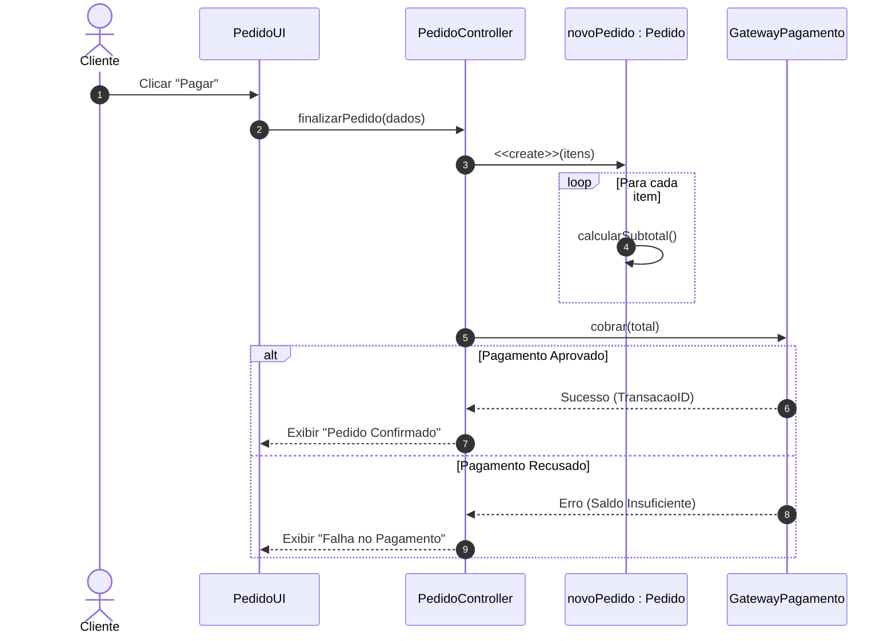

  
⬅️ <b><a href="/pt-br/resource/engenharia-de-computação/6-periodo/analise-de-software-orientada-a-objetos/anotacoes/aula-04-modelagem-estrutural-diagramas-de-classes-e-pacotes">Aula Anterior</a></b>

  
🏠 <b><a href="/pt-br/resource/engenharia-de-computação/6-periodo/analise-de-software-orientada-a-objetos">Hub da Disciplina</a></b>

  
➡️ <b><a href="/pt-br/resource/engenharia-de-computação/6-periodo/analise-de-software-orientada-a-objetos/anotacoes/aula-06-diagramas-de-atividades-e-maquinas-de-estados">Próxima Aula</a></b>

> [!info] 📅 Informações da Aula
> - **Disciplina:** Análise de Software Orientada a Objetos (CSECBJI.42)
> - **Professor:** Bruno
> - **Data Realizada:** 30/09/2026
> - **Tópico Principal:** Modelagem Comportamental: Diagramas de Sequência
> - **Status:** Concluída e Revisada

> [!note] 📂 Material Complementar & Slides
> - 📄 **Slides Oficiais:** [[slide-05-analise-de-software-orientada-a-objetos|Acessar Apresentação em PDF]]
> - 🎥 **Short Lecture / Gravação:** [[video-05-analise-de-software-orientada-a-objetos|Assistir Síntese da Aula (Vídeo)]]

---

### 📑 Resumo das Seções
- [📌 1. Anotações do Quadro: Modelagem Comportamental: Diagramas de Sequência](#-anotações-do-quadro-modelagem-comportamental-diagramas-de-sequência)
- [🧮 2. Formulação & Exemplo Prático Resolvido](#-formulação--exemplo-prático-resolvido)
- [📊 3. Esquema Visual & Fluxograma (Mermaid)](#-esquema-visual--fluxograma-mermaid)
- [🧠 4. Resumo Pessoal & Macetes do Professor](#-resumo-pessoal--macetes-do-professor)
- [📝 5. Dúvidas & Exercícios Recomendados para Casa](#-dúvidas--exercícios-recomendados-para-casa)

---

## 📌 Anotações do Quadro: Modelagem Comportamental: Diagramas de Sequência

### 5.1 Diagramas de Sequência (UML)
O Diagrama de Sequência é um modelo comportamental dinâmico que descreve a troca ordenada de mensagens entre objetos ao longo do tempo para realizar um caso de uso específico.

### 5.2 Elementos Fundamentais
- **Linha de Vida (*Lifeline*):** Linha vertical tracejada representando a existência temporal do objeto.
- **Barra de Ativação (*Focus of Control*):** Retângulo sobre a linha de vida indicando quando o objeto está processando uma operação.
- **Mensagem Síncrona:** Seta com ponta preenchida ($\longrightarrow$). O emissor bloqueia aguardando o retorno.
- **Mensagem Assíncrona:** Seta com ponta aberta ($\longrightarrow$). O emissor continua a execução sem esperar.
- **Mensagem de Retorno:** Linha tracejada com seta aberta ($\dashrightarrow$).
- **Criação e Destruição de Objetos:** Mensagem `<<create>>` apontando para a caixa do objeto e 'X' no final da linha de vida para destruição.

### 5.3 Fragmentos Combinados de Controle
- `alt` (Alternativa): Representa blocos `if-then-else` mutuamente exclusivos.
- `opt` (Opcional): Representa um bloco condicional simples `if` sem `else`.
- `loop`: Representa uma repetição `for` / `while` sobre uma coleção.
- `par`: Execução paralela simultânea de mensagens.

---

## 🧮 Formulação & Exemplo Prático Resolvido

### ✏️ Diagrama de Sequência: Realização do Processamento de Pedido

1. O `ClienteUI` envia `finalizarPedido(itens)` para o `PedidoController`.
2. O `PedidoController` cria uma nova instância de `Pedido`.
3. O `Pedido` itera em um `loop` sobre os itens calculando o total.
4. O `PedidoController` invoca `processar(total)` no `GatewayPagamento`.
5. Em fragmento `alt`:
   - Se aprovado: O `PedidoController` chama `salvar(pedido)` no `Repositorio` e retorna confirmação.
   - Se recusado: Retorna mensagem de erro de pagamento.

---

## 📊 Esquema Visual & Fluxograma (Mermaid)

---

## 🧠 Resumo Pessoal & Macetes do Professor

| Conceito-Chave | *Takeaway* do Professor | Dicas de Prova / Atenção |
| :--- | :--- | :--- |
| **Diagrama de Sequência de Sistema (DSS) vs de Projeto** | O DSS trata o sistema inteiro como uma **caixa preta única** interagindo com o ator; o Diagrama de Sequência de Projeto detalha as chamadas internas entre as classes Controller, Model e Repositorio. | Não confunda os dois níveis de abstração! |
| **Ordem Top-to-Bottom** | O tempo flui estritamente de cima para baixo no diagrama de sequência. | Aplicação prática direta |

---

## 📝 Dúvidas & Exercícios Recomendados para Casa

1. Desenhe o Diagrama de Sequência de Projeto para o caso de uso de autenticação de usuário com verificação de senha criptografada e token JWT.
2. Modele um fragmento `par` representando a emissão simultânea de nota fiscal e envio de e-mail de confirmação.

---

  
⬅️ <b><a href="/pt-br/resource/engenharia-de-computação/6-periodo/analise-de-software-orientada-a-objetos/anotacoes/aula-04-modelagem-estrutural-diagramas-de-classes-e-pacotes">Aula Anterior</a></b>

  
🏠 <b><a href="/pt-br/resource/engenharia-de-computação/6-periodo/analise-de-software-orientada-a-objetos">Hub da Disciplina</a></b>

  
➡️ <b><a href="/pt-br/resource/engenharia-de-computação/6-periodo/analise-de-software-orientada-a-objetos/anotacoes/aula-06-diagramas-de-atividades-e-maquinas-de-estados">Próxima Aula</a></b>

