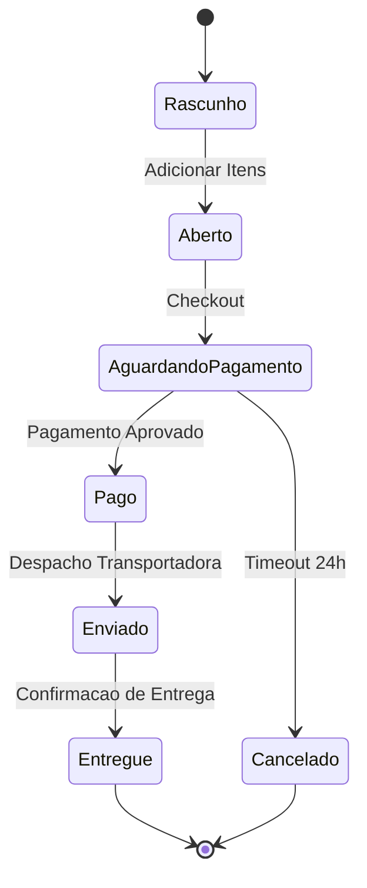

<div style="display: flex; justify-content: space-between; align-items: center; padding: 10px 16px; background: var(--light, #f8fafc); border: 1px solid var(--lightgray, #e2e8f0); border-radius: 10px; margin: 1.5rem 0;">
  <div>⬅️ <b><a href="/pt-br/resource/engenharia-de-computação/6-periodo/analise-de-software-orientada-a-objetos/anotacoes/aula-05-modelagem-comportamental-diagramas-de-sequencia">Aula Anterior</a></b></div>
  <div>🏠 <b><a href="/pt-br/resource/engenharia-de-computação/6-periodo/analise-de-software-orientada-a-objetos">Hub da Disciplina</a></b></div>
  <div>➡️ <b><a href="/pt-br/resource/engenharia-de-computação/6-periodo/analise-de-software-orientada-a-objetos/anotacoes/aula-07-revisao-de-conteudo-e-avaliacao-parcial-p1">Próxima Aula</a></b></div>
</div>

> [!info] 📅 Informações da Aula
> - **Disciplina:** Análise de Software Orientada a Objetos (CSECBJI.42)
> - **Professor:** Bruno
> - **Data Realizada:** 07/10/2026
> - **Tópico Principal:** Diagramas de Atividades e Máquinas de Estados
> - **Status:** Concluída e Revisada

> [!note] 📂 Material Complementar & Slides
> - 📄 **Slides Oficiais:** [[slide-06-analise-de-software-orientada-a-objetos|Acessar Apresentação em PDF]]
> - 🎥 **Short Lecture / Gravação:** [[video-06-analise-de-software-orientada-a-objetos|Assistir Síntese da Aula (Vídeo)]]

---

### 📑 Resumo das Seções
- [📌 1. Anotações do Quadro: Diagramas de Atividades e Máquinas de Estados](#-anotações-do-quadro-diagramas-de-atividades-e-máquinas-de-estados)
- [🧮 2. Formulação & Exemplo Prático Resolvido](#-formulação--exemplo-prático-resolvido)
- [📊 3. Esquema Visual & Fluxograma (Mermaid)](#-esquema-visual--fluxograma-mermaid)
- [🧠 4. Resumo Pessoal & Macetes do Professor](#-resumo-pessoal--macetes-do-professor)
- [📝 5. Dúvidas & Exercícios Recomendados para Casa](#-dúvidas--exercícios-recomendados-para-casa)

---

## 📌 Anotações do Quadro: Diagramas de Atividades e Máquinas de Estados

### 6.1 Diagrama de Atividades (UML)
Modela o fluxo de controle procedural e paralelismo entre atividades de um processo de negócio ou algoritmo:
- **Nó Inicial:** Círculo preto preenchido.
- **Ação / Atividade:** Retângulo com cantos arredondados.
- **Nó de Decisão e Fusão (*Decision / Merge*):** Losango com condições de guarda entre colchetes (`[saldo >= total]`).
- **Bifurcação e Junção Paralela (*Fork / Join*):** Barra sólida preta horizontal/vertical representando divisão e sincronização de fluxos paralelos concorrentes.
- **Raias de Natação (*Swimlanes / Partições*):** Colunas que dividem as ações de acordo com o setor, ator ou sistema responsável.
- **Nó Final:** Círculo preto envolvido por uma borda circular.

### 6.2 Diagrama de Máquinas de Estados (State Machine)
Modela o ciclo de vida dependente de estados de um único objeto reativo complexo:
- **Estado:** Condição contínua na vida do objeto onde ele aguarda eventos (ex: `Criado`, `AguardandoPagamento`, `Enviado`, `Cancelado`).
- **Transição:** Mudança de estado disparada por um evento com condição de guarda e ação associada:
  $$\text{Evento}(\text{parâmetros}) \; [\text{Condição de Guarda}] \; / \; \text{Ação}()$$

---

## 🧮 Formulação & Exemplo Prático Resolvido

### ✏️ Máquina de Estados do Objeto `Pedido`

```text
[*] ──▶ [ Rascunho ] ──(adicionarItens)──▶ [ Aberto ]
                             │
                      (confirmarPedido)
                             │
                             ▼
                    [ Aguardando Pagamento ]
                     /                    \
     (pagamentoConfirmado)             (timeout 24h / cancelar)
                   /                        \
                  ▼                          ▼
            [ Pago ]                   [ Cancelado ] ──▶ [*]
               │
          (despachar)
               │
               ▼
           [ Enviado ] ──(confirmarEntrega)──▶ [ Concluído ] ──▶ [*]
```

---

## 📊 Esquema Visual & Fluxograma (Mermaid)



---

## 🧠 Resumo Pessoal & Macetes do Professor

| Conceito-Chave | *Takeaway* do Professor | Dicas de Prova / Atenção |
| :--- | :--- | :--- |
| **Fork vs Decisão** | Barra de Fork divide o fluxo em dois caminhos executados SIMULTANEAMENTE (paralelos); Losango de Decisão escolhe APENAS UM dos caminhos baseado na guarda. | Erro de modelagem clássico. |
| **Quando Usar Máquina de Estados?** | Use para entidades com comportamento complexo que muda dependendo do estado atual (ex: conexões TCP, pedidos de compra, documentos com fluxo de aprovação). | Aplicação prática direta |

---

## 📝 Dúvidas & Exercícios Recomendados para Casa

1. Desenhe o Diagrama de Atividades com 3 raias de natação (Cliente, Financeiro, Logística) para o processo completo de devolução de produtos com reembolso.
2. Modele a Máquina de Estados completa de uma `MatriculaUniversitaria` (Pré-Matriculado, Ativo, Trancado, Cancelado, Formado).

---

<div style="display: flex; justify-content: space-between; align-items: center; padding: 10px 16px; background: var(--light, #f8fafc); border: 1px solid var(--lightgray, #e2e8f0); border-radius: 10px; margin: 1.5rem 0;">
  <div>⬅️ <b><a href="/pt-br/resource/engenharia-de-computação/6-periodo/analise-de-software-orientada-a-objetos/anotacoes/aula-05-modelagem-comportamental-diagramas-de-sequencia">Aula Anterior</a></b></div>
  <div>🏠 <b><a href="/pt-br/resource/engenharia-de-computação/6-periodo/analise-de-software-orientada-a-objetos">Hub da Disciplina</a></b></div>
  <div>➡️ <b><a href="/pt-br/resource/engenharia-de-computação/6-periodo/analise-de-software-orientada-a-objetos/anotacoes/aula-07-revisao-de-conteudo-e-avaliacao-parcial-p1">Próxima Aula</a></b></div>
</div>
