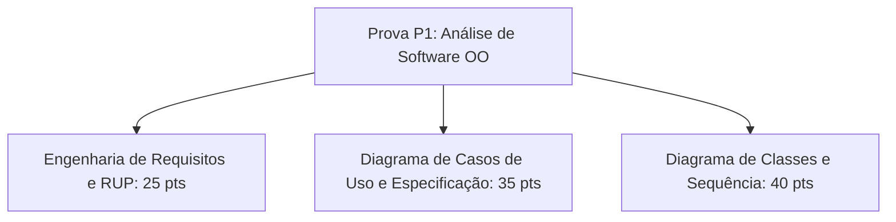

  
⬅️ <b><a href="/pt-br/resource/engenharia-de-computação/6-periodo/analise-de-software-orientada-a-objetos/anotacoes/aula-06-diagramas-de-atividades-e-maquinas-de-estados">Aula Anterior</a></b>

  
🏠 <b><a href="/pt-br/resource/engenharia-de-computação/6-periodo/analise-de-software-orientada-a-objetos">Hub da Disciplina</a></b>

  
➡️ <b><a href="/pt-br/resource/engenharia-de-computação/6-periodo/analise-de-software-orientada-a-objetos/anotacoes/aula-08-principios-de-atribuicao-de-responsabilidades-grasp">Próxima Aula</a></b>

> [!info] 📅 Informações da Aula
> - **Disciplina:** Análise de Software Orientada a Objetos (CSECBJI.42)
> - **Professor:** Bruno
> - **Data Realizada:** 14/10/2026
> - **Tópico Principal:** Revisão de Conteúdo e Avaliação Parcial P1
> - **Status:** Concluída e Revisada

> [!note] 📂 Material Complementar & Slides
> - 📄 **Slides Oficiais:** 
> - 🎥 **Short Lecture / Gravação:** [[video-07-analise-de-software-orientada-a-objetos|Assistir Síntese da Aula (Vídeo)]]

---

### 📑 Resumo das Seções
- [📌 1. Anotações do Quadro: Revisão de Conteúdo e Avaliação Parcial P1](#-anotações-do-quadro-revisão-de-conteúdo-e-avaliação-parcial-p1)
- [🧮 2. Formulação & Exemplo Prático Resolvido](#-formulação--exemplo-prático-resolvido)
- [📊 3. Esquema Visual & Fluxograma (Mermaid)](#-esquema-visual--fluxograma-mermaid)
- [🧠 4. Resumo Pessoal & Macetes do Professor](#-resumo-pessoal--macetes-do-professor)
- [📝 5. Dúvidas & Exercícios Recomendados para Casa](#-dúvidas--exercícios-recomendados-para-casa)

---

## 📌 Anotações do Quadro: Revisão de Conteúdo e Avaliação Parcial P1

### 7.1 Síntese Conceitual para Avaliação Parcial P1
Revisão da Modelagem de Análise e Requisitos com UML:
1. **Engenharia de Requisitos:** Classificação FURPS+ e requisitos não-funcionais mensuráveis.
2. **Processo Unificado:** Fases (Iniciação, Elaboração, Construção, Transição) e características iterativas.
3. **Diagramas de Casos de Uso:** Atores, casos de uso, `<<include>>`, `<<extend>>` e especificações textuais expandidas.
4. **Diagramas Estruturais de Classes:** Visibilidade, multiplicidade, herança, agregação e composição.
5. **Modelagem Comportamental:** Diagramas de Sequência (mensagens, alt, loop) e Diagramas de Atividades com partições.

---

## 🧮 Formulação & Exemplo Prático Resolvido

### ✏️ Resolução de Estudo de Caso de Prova P1: Sistema de Locadora de Veículos

**Enunciado de Prova:**
Modele o caso de uso 'Locar Veículo', apresentando:
1. O Diagrama de Casos de Uso com `<<include>>` para 'Verificar CNH do Cliente' e `<<extend>>` para 'Contratar Seguro Adicional'.
2. O Diagrama de Classes de Domínio com `Locacao`, `Cliente`, `Veiculo` e `Seguro`.
3. O Diagrama de Sequência de Sistema para o fluxo principal de locação.

---

## 📊 Esquema Visual & Fluxograma (Mermaid)

---

## 🧠 Resumo Pessoal & Macetes do Professor

| Conceito-Chave | *Takeaway* do Professor | Dicas de Prova / Atenção |
| :--- | :--- | :--- |
| **Checklist de Prova P1** | 1. Não misture classes de interface visual no modelo de domínio; 2. Confira as setas de include e extend; 3. Especifique os tipos de retorno e parâmetros nas operações das classes. | Apresente diagramas limpos e legíveis. |
| **Composição vs Agregação** | Se a destruição do objeto Pai destruir os filhos, use losango preto! | Aplicação prática direta |

---

## 📝 Dúvidas & Exercícios Recomendados para Casa

1. Revise todos os estudos de caso das listas 1 a 6.
2. Refaça a modelagem completa de um sistema de streaming de música (playlists, faixas, artistas e assinaturas).

---

  
⬅️ <b><a href="/pt-br/resource/engenharia-de-computação/6-periodo/analise-de-software-orientada-a-objetos/anotacoes/aula-06-diagramas-de-atividades-e-maquinas-de-estados">Aula Anterior</a></b>

  
🏠 <b><a href="/pt-br/resource/engenharia-de-computação/6-periodo/analise-de-software-orientada-a-objetos">Hub da Disciplina</a></b>

  
➡️ <b><a href="/pt-br/resource/engenharia-de-computação/6-periodo/analise-de-software-orientada-a-objetos/anotacoes/aula-08-principios-de-atribuicao-de-responsabilidades-grasp">Próxima Aula</a></b>

