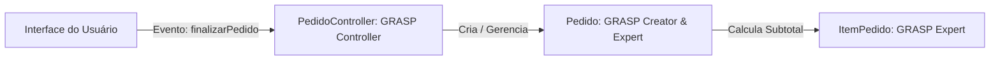

  
⬅️ <b><a href="/pt-br/resource/engenharia-de-computação/6-periodo/analise-de-software-orientada-a-objetos/anotacoes/aula-07-revisao-de-conteudo-e-avaliacao-parcial-p1">Aula Anterior</a></b>

  
🏠 <b><a href="/pt-br/resource/engenharia-de-computação/6-periodo/analise-de-software-orientada-a-objetos">Hub da Disciplina</a></b>

  
➡️ <b><a href="/pt-br/resource/engenharia-de-computação/6-periodo/analise-de-software-orientada-a-objetos/anotacoes/aula-09-padroes-de-projeto-gof-de-criacao">Próxima Aula</a></b>

> [!info] 📅 Informações da Aula
> - **Disciplina:** Análise de Software Orientada a Objetos (CSECBJI.42)
> - **Professor:** Bruno
> - **Data Realizada:** 21/10/2026
> - **Tópico Principal:** Princípios de Atribuição de Responsabilidades (GRASP)
> - **Status:** Concluída e Revisada

> [!note] 📂 Material Complementar & Slides
> - 📄 **Slides Oficiais:** [[slide-08-analise-de-software-orientada-a-objetos|Acessar Apresentação em PDF]]
> - 🎥 **Short Lecture / Gravação:** [[video-08-analise-de-software-orientada-a-objetos|Assistir Síntese da Aula (Vídeo)]]

---

### 📑 Resumo das Seções
- [📌 1. Anotações do Quadro: Princípios de Atribuição de Responsabilidades (GRASP)](#-anotações-do-quadro-princípios-de-atribuição-de-responsabilidades-grasp)
- [🧮 2. Formulação & Exemplo Prático Resolvido](#-formulação--exemplo-prático-resolvido)
- [📊 3. Esquema Visual & Fluxograma (Mermaid)](#-esquema-visual--fluxograma-mermaid)
- [🧠 4. Resumo Pessoal & Macetes do Professor](#-resumo-pessoal--macetes-do-professor)
- [📝 5. Dúvidas & Exercícios Recomendados para Casa](#-dúvidas--exercícios-recomendados-para-casa)

---

## 📌 Anotações do Quadro: Princípios de Atribuição de Responsabilidades (GRASP)

### 8.1 Padrões GRASP (Craig Larman)
Os padrões **GRASP (*General Responsibility Assignment Software Patterns*)** orientam a atribuição de responsabilidades a classes de software durante o design:

1. **Information Expert (Especialista na Informação):** Atribua uma responsabilidade à classe que possui a informação necessária para cumpri-la (ex: quem calcula o total do pedido é a classe `Pedido`, pois ela possui a lista de `ItemPedido`).
2. **Creator (Criador):** A classe $A$ deve ser responsável por instanciar a classe $B$ se:
   - $A$ contém ou agrega $B$;
   - $A$ grava instâncias de $B$;
   - $A$ utiliza intensivamente $B$;
   - $A$ possui os dados de inicialização de $B$.
3. **Low Coupling (Baixo Acoplamento):** Mantenha dependências mínimas entre classes para facilitar a manutenção e reuso.
4. **High Cohesion (Alta Coesão):** Mantenha as responsabilidades de uma classe focadas em um único propósito bem definido.
5. **Controller (Controlador):** Atribua a responsabilidade de receber e coordenar operações do sistema a uma classe não-UI que represente o sistema global ou um caso de uso específico (`PedidoController`).

---

## 🧮 Formulação & Exemplo Prático Resolvido

### ✏️ Aplicação Prática dos Padrões GRASP no Design

**Problema:** Onde colocar o método `calcularValorTotal()` e quem deve instanciar `ItemPedido`?

- **Pelo padrão Creator:** A classe `Pedido` compõe `ItemPedido`, logo `Pedido` deve conter o método `criarItem(produto, qtd)`.
- **Pelo padrão Information Expert:** A classe `ItemPedido` calcula seu subtotal (`qtd * preco`). A classe `Pedido` calcula a soma dos subtotais de seus itens. A interface UI apenas exibe o resultado!

---

## 📊 Esquema Visual & Fluxograma (Mermaid)

---

## 🧠 Resumo Pessoal & Macetes do Professor

| Conceito-Chave | *Takeaway* do Professor | Dicas de Prova / Atenção |
| :--- | :--- | :--- |
| **Anti-Pattern: Fat Controller** | O Controller deve apenas coordenar o fluxo, delegando o trabalho real para os objetos de domínio especialistas. Nunca coloque regras de cálculo dentro do Controller! | Controllers inchados destroem a coesão do sistema. |
| **Coesão vs Acoplamento** | Alta coesão interna caminha lado a lado com baixo acoplamento externo. | Aplicação prática direta |

---

## 📝 Dúvidas & Exercícios Recomendados para Casa

1. Identifique as violações de GRASP em um trecho de código onde a classe de interface visual faz consultas diretas ao banco de dados e calcula descontos.
2. Refatore o código aplicando os princípios Information Expert e Controller.

---

  
⬅️ <b><a href="/pt-br/resource/engenharia-de-computação/6-periodo/analise-de-software-orientada-a-objetos/anotacoes/aula-07-revisao-de-conteudo-e-avaliacao-parcial-p1">Aula Anterior</a></b>

  
🏠 <b><a href="/pt-br/resource/engenharia-de-computação/6-periodo/analise-de-software-orientada-a-objetos">Hub da Disciplina</a></b>

  
➡️ <b><a href="/pt-br/resource/engenharia-de-computação/6-periodo/analise-de-software-orientada-a-objetos/anotacoes/aula-09-padroes-de-projeto-gof-de-criacao">Próxima Aula</a></b>

