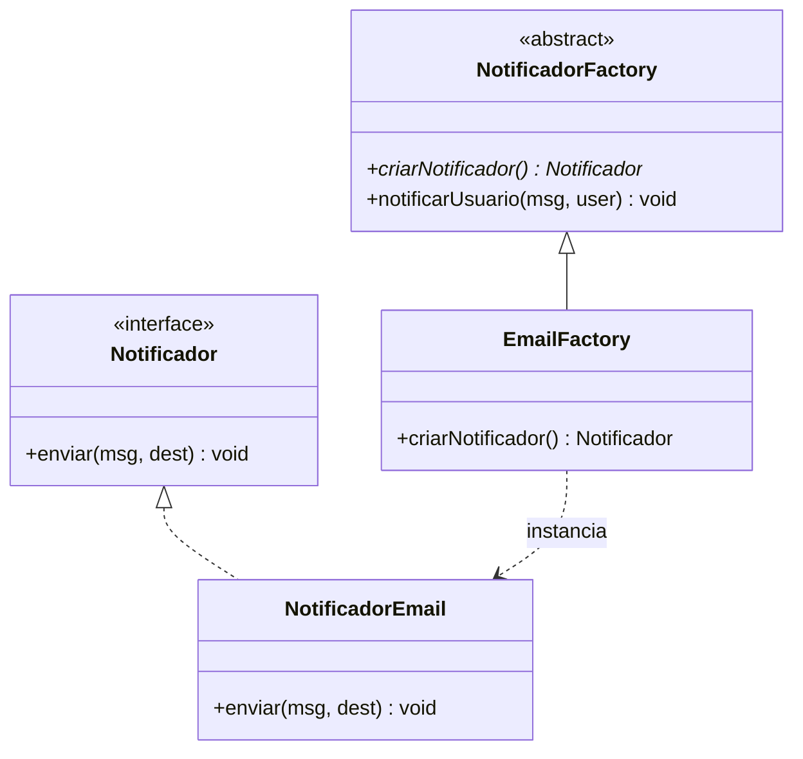

<div style="display: flex; justify-content: space-between; align-items: center; padding: 10px 16px; background: var(--light, #f8fafc); border: 1px solid var(--lightgray, #e2e8f0); border-radius: 10px; margin: 1.5rem 0;">
  <div>⬅️ <b><a href="/pt-br/resource/engenharia-de-computação/6-periodo/analise-de-software-orientada-a-objetos/anotacoes/aula-08-principios-de-atribuicao-de-responsabilidades-grasp">Aula Anterior</a></b></div>
  <div>🏠 <b><a href="/pt-br/resource/engenharia-de-computação/6-periodo/analise-de-software-orientada-a-objetos">Hub da Disciplina</a></b></div>
  <div>➡️ <b><a href="/pt-br/resource/engenharia-de-computação/6-periodo/analise-de-software-orientada-a-objetos/anotacoes/aula-10-padroes-de-projeto-gof-estruturais">Próxima Aula</a></b></div>
</div>

> [!info] 📅 Informações da Aula
> - **Disciplina:** Análise de Software Orientada a Objetos (CSECBJI.42)
> - **Professor:** Bruno
> - **Data Realizada:** 28/10/2026
> - **Tópico Principal:** Padrões de Projeto GoF de Criação
> - **Status:** Concluída e Revisada

> [!note] 📂 Material Complementar & Slides
> - 📄 **Slides Oficiais:** [[slide-09-analise-de-software-orientada-a-objetos|Acessar Apresentação em PDF]]
> - 🎥 **Short Lecture / Gravação:** [[video-09-analise-de-software-orientada-a-objetos|Assistir Síntese da Aula (Vídeo)]]

---

### 📑 Resumo das Seções
- [📌 1. Anotações do Quadro: Padrões de Projeto GoF de Criação](#-anotações-do-quadro-padrões-de-projeto-gof-de-criação)
- [🧮 2. Formulação & Exemplo Prático Resolvido](#-formulação--exemplo-prático-resolvido)
- [📊 3. Esquema Visual & Fluxograma (Mermaid)](#-esquema-visual--fluxograma-mermaid)
- [🧠 4. Resumo Pessoal & Macetes do Professor](#-resumo-pessoal--macetes-do-professor)
- [📝 5. Dúvidas & Exercícios Recomendados para Casa](#-dúvidas--exercícios-recomendados-para-casa)

---

## 📌 Anotações do Quadro: Padrões de Projeto GoF de Criação

### 9.1 Padrões de Criação GoF (Gang of Four)
Os padrões de criação abstraem o processo de instanciação de objetos, tornando o sistema independente de como seus objetos são criados, compostos e representados:

1. **Singleton:** Garante que uma classe tenha apenas **uma única instância** em toda a aplicação e fornece um ponto de acesso global a ela (ex: Gerenciador de Configurações, Pool de Conexões).
2. **Factory Method:** Define uma interface para criar um objeto, mas deixa as subclasses decidirem qual classe concreta instanciar.
3. **Abstract Factory:** Fornece uma interface para criar **famílias de objetos relacionados ou dependentes** sem especificar suas classes concretas (ex: Fábrica de componentes UI Dark/Light).
4. **Builder:** Separa a construção de um objeto complexo da sua representação, permitindo criar diferentes representações com o mesmo processo passo a passo.
5. **Prototype:** Cria novos objetos clonando uma instância existente.

---

## 🧮 Formulação & Exemplo Prático Resolvido

### ✏️ Implementação do Padrão Factory Method em Java

```java
// Produto Abstrato
public interface Notificador {
    void enviar(String msg, String destinatario);
}

// Produtos Concretos
public class NotificadorEmail implements Notificador {
    public void enviar(String msg, String dest) { System.out.println("E-mail para " + dest + ": " + msg); }
}
public class NotificadorSMS implements Notificador {
    public void enviar(String msg, String dest) { System.out.println("SMS para " + dest + ": " + msg); }
}

// Criador Abstrato (Factory Method)
public abstract class NotificadorFactory {
    public abstract Notificador criarNotificador(); // Factory Method

    public void notificarUsuario(String mensagem, String usuario) {
        Notificador notificador = criarNotificador();
        notificador.enviar(mensagem, usuario);
    }
}

// Criador Concreto
public class EmailFactory extends NotificadorFactory {
    public Notificador criarNotificador() { return new NotificadorEmail(); }
}
```

---

## 📊 Esquema Visual & Fluxograma (Mermaid)



---

## 🧠 Resumo Pessoal & Macetes do Professor

| Conceito-Chave | *Takeaway* do Professor | Dicas de Prova / Atenção |
| :--- | :--- | :--- |
| **Singleton Thread-Safe (Bill Pugh)** | Em Java, utilize uma classe estática interna (*Static Inner Helper*) para criar Singletons preguiçosos (*Lazy*) 100% thread-safe sem necessidade de blocos `synchronized` custosos. | Padrão recomendado no Effective Java. |
| **Builder para Construtores com Muitos Parâmetros** | Se uma classe tiver mais de 4 ou 5 parâmetros (especialmente do mesmo tipo), use o padrão Builder para evitar a armadilha de construtores telescópicos. | Aplicação prática direta |

---

## 📝 Dúvidas & Exercícios Recomendados para Casa

1. Implemente o padrão Singleton com inicialização preguiçosa thread-safe para uma classe `GerenciadorLogs`.
2. Projete o padrão Abstract Factory para criação de interfaces gráficas multiplataforma (Windows e MacOS).

---

<div style="display: flex; justify-content: space-between; align-items: center; padding: 10px 16px; background: var(--light, #f8fafc); border: 1px solid var(--lightgray, #e2e8f0); border-radius: 10px; margin: 1.5rem 0;">
  <div>⬅️ <b><a href="/pt-br/resource/engenharia-de-computação/6-periodo/analise-de-software-orientada-a-objetos/anotacoes/aula-08-principios-de-atribuicao-de-responsabilidades-grasp">Aula Anterior</a></b></div>
  <div>🏠 <b><a href="/pt-br/resource/engenharia-de-computação/6-periodo/analise-de-software-orientada-a-objetos">Hub da Disciplina</a></b></div>
  <div>➡️ <b><a href="/pt-br/resource/engenharia-de-computação/6-periodo/analise-de-software-orientada-a-objetos/anotacoes/aula-10-padroes-de-projeto-gof-estruturais">Próxima Aula</a></b></div>
</div>
