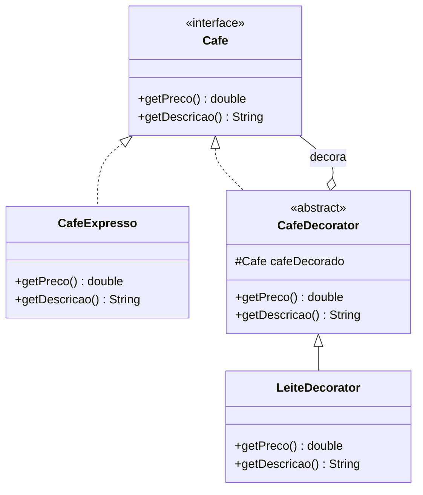

<div style="display: flex; justify-content: space-between; align-items: center; padding: 10px 16px; background: var(--light, #f8fafc); border: 1px solid var(--lightgray, #e2e8f0); border-radius: 10px; margin: 1.5rem 0;">
  <div>⬅️ <b><a href="/pt-br/resource/engenharia-de-computação/6-periodo/analise-de-software-orientada-a-objetos/anotacoes/aula-09-padroes-de-projeto-gof-de-criacao">Aula Anterior</a></b></div>
  <div>🏠 <b><a href="/pt-br/resource/engenharia-de-computação/6-periodo/analise-de-software-orientada-a-objetos">Hub da Disciplina</a></b></div>
  <div>➡️ <b><a href="/pt-br/resource/engenharia-de-computação/6-periodo/analise-de-software-orientada-a-objetos/anotacoes/aula-11-padroes-de-projeto-gof-comportamentais">Próxima Aula</a></b></div>
</div>

> [!info] 📅 Informações da Aula
> - **Disciplina:** Análise de Software Orientada a Objetos (CSECBJI.42)
> - **Professor:** Bruno
> - **Data Realizada:** 04/11/2026
> - **Tópico Principal:** Padrões de Projeto GoF Estruturais
> - **Status:** Concluída e Revisada

> [!note] 📂 Material Complementar & Slides
> - 📄 **Slides Oficiais:** [[slide-10-analise-de-software-orientada-a-objetos|Acessar Apresentação em PDF]]
> - 🎥 **Short Lecture / Gravação:** [[video-10-analise-de-software-orientada-a-objetos|Assistir Síntese da Aula (Vídeo)]]

---

### 📑 Resumo das Seções
- [📌 1. Anotações do Quadro: Padrões de Projeto GoF Estruturais](#-anotações-do-quadro-padrões-de-projeto-gof-estruturais)
- [🧮 2. Formulação & Exemplo Prático Resolvido](#-formulação--exemplo-prático-resolvido)
- [📊 3. Esquema Visual & Fluxograma (Mermaid)](#-esquema-visual--fluxograma-mermaid)
- [🧠 4. Resumo Pessoal & Macetes do Professor](#-resumo-pessoal--macetes-do-professor)
- [📝 5. Dúvidas & Exercícios Recomendados para Casa](#-dúvidas--exercícios-recomendados-para-casa)

---

## 📌 Anotações do Quadro: Padrões de Projeto GoF Estruturais

### 10.1 Padrões Estruturais GoF
Os padrões estruturais tratam de como classes e objetos são compostos para formar estruturas maiores e mais flexíveis:

1. **Adapter:** Converte a interface de uma classe em outra interface esperada pelos clientes, permitindo que classes com interfaces incompatíveis trabalhem juntas (ex: integrar biblioteca legada).
2. **Facade:** Fornece uma interface unificada e simplificada para um subsistema complexo com dezenas de classes internas (ex: Facade de Compra que coordena Estoque, Pagamento, Frete e Nota Fiscal).
3. **Decorator:** Agrega dinamicamente novas responsabilidades a um objeto sem recorrer à herança de classes (ex: `BufferedReader(new FileReader(...))` no Java I/O).
4. **Composite:** Agrupa objetos em estruturas de árvore para representar hierarquias todo-parte, permitindo tratar objetos individuais e composições de maneira uniforme.
5. **Proxy:** Fornece um substituto ou intermediário para controlar o acesso a outro objeto (Lazy Loading, Segurança, Cache remoto).

---

## 🧮 Formulação & Exemplo Prático Resolvido

### ✏️ Implementação do Padrão Decorator: Adicionais de Café

```java
// Componente Base
public interface Cafe {
    double getPreco();
    String getDescricao();
}

public class CafeExpresso implements Cafe {
    public double getPreco() { return 5.0; }
    public String getDescricao() { return "Café Expresso"; }
}

// Decorator Abstrato
public abstract class CafeDecorator implements Cafe {
    protected final Cafe cafeDecorado;
    public CafeDecorator(Cafe cafe) { this.cafeDecorado = cafe; }
    public double getPreco() { return cafeDecorado.getPreco(); }
    public String getDescricao() { return cafeDecorado.getDescricao(); }
}

// Decorators Concretos
public class LeiteDecorator extends CafeDecorator {
    public LeiteDecorator(Cafe cafe) { super(cafe); }
    @Override public double getPreco() { return super.getPreco() + 2.0; }
    @Override public String getDescricao() { return super.getDescricao() + " + Leite"; }
}

// Uso: Composição Dinâmica em Cascata
Cafe meuCafe = new LeiteDecorator(new LeiteDecorator(new CafeExpresso()));
// Preço: 5.0 + 2.0 + 2.0 = 9.0!
```

---

## 📊 Esquema Visual & Fluxograma (Mermaid)



---

## 🧠 Resumo Pessoal & Macetes do Professor

| Conceito-Chave | *Takeaway* do Professor | Dicas de Prova / Atenção |
| :--- | :--- | :--- |
| **Decorator vs Herança** | O Decorator evita a explosão combinatória de subclasses (ex: `CafeComLeite`, `CafeComLeiteEAcucar`, `CafeComCanela...`), permitindo combinar adicionais livremente em tempo de execução. | Flexibilidade total de composição. |
| **Adapter vs Facade** | O Adapter adapta UMA interface incompatível para outra; a Facade simplifica UMA INTERFACE COMPLEXA de dezenas de classes para uma API limpa. | Aplicação prática direta |

---

## 📝 Dúvidas & Exercícios Recomendados para Casa

1. Implemente o padrão Adapter para integrar um serviço legado de cobrança com método `pagarBoletoAntigo()` à interface moderna `ProcessadorPagamento`.
2. Projete o padrão Composite para representar o sistema de arquivos do computador com `Arquivo` e `Pasta`.

---

<div style="display: flex; justify-content: space-between; align-items: center; padding: 10px 16px; background: var(--light, #f8fafc); border: 1px solid var(--lightgray, #e2e8f0); border-radius: 10px; margin: 1.5rem 0;">
  <div>⬅️ <b><a href="/pt-br/resource/engenharia-de-computação/6-periodo/analise-de-software-orientada-a-objetos/anotacoes/aula-09-padroes-de-projeto-gof-de-criacao">Aula Anterior</a></b></div>
  <div>🏠 <b><a href="/pt-br/resource/engenharia-de-computação/6-periodo/analise-de-software-orientada-a-objetos">Hub da Disciplina</a></b></div>
  <div>➡️ <b><a href="/pt-br/resource/engenharia-de-computação/6-periodo/analise-de-software-orientada-a-objetos/anotacoes/aula-11-padroes-de-projeto-gof-comportamentais">Próxima Aula</a></b></div>
</div>
