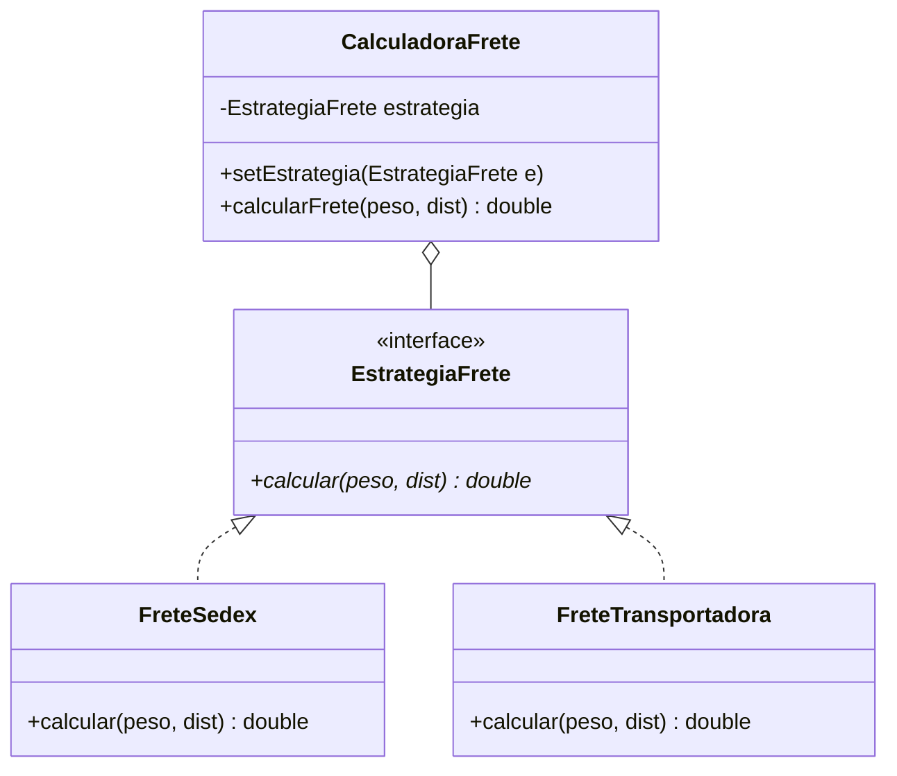

<div style="display: flex; justify-content: space-between; align-items: center; padding: 10px 16px; background: var(--light, #f8fafc); border: 1px solid var(--lightgray, #e2e8f0); border-radius: 10px; margin: 1.5rem 0;">
  <div>⬅️ <b><a href="/pt-br/resource/engenharia-de-computação/6-periodo/analise-de-software-orientada-a-objetos/anotacoes/aula-10-padroes-de-projeto-gof-estruturais">Aula Anterior</a></b></div>
  <div>🏠 <b><a href="/pt-br/resource/engenharia-de-computação/6-periodo/analise-de-software-orientada-a-objetos">Hub da Disciplina</a></b></div>
  <div>➡️ <b><a href="/pt-br/resource/engenharia-de-computação/6-periodo/analise-de-software-orientada-a-objetos/anotacoes/aula-12-arquitetura-de-software-em-camadas-e-mvc">Próxima Aula</a></b></div>
</div>

> [!info] 📅 Informações da Aula
> - **Disciplina:** Análise de Software Orientada a Objetos (CSECBJI.42)
> - **Professor:** Bruno
> - **Data Realizada:** 11/11/2026
> - **Tópico Principal:** Padrões de Projeto GoF Comportamentais
> - **Status:** Concluída e Revisada

> [!note] 📂 Material Complementar & Slides
> - 📄 **Slides Oficiais:** [[slide-11-analise-de-software-orientada-a-objetos|Acessar Apresentação em PDF]]
> - 🎥 **Short Lecture / Gravação:** [[video-11-analise-de-software-orientada-a-objetos|Assistir Síntese da Aula (Vídeo)]]

---

### 📑 Resumo das Seções
- [📌 1. Anotações do Quadro: Padrões de Projeto GoF Comportamentais](#-anotações-do-quadro-padrões-de-projeto-gof-comportamentais)
- [🧮 2. Formulação & Exemplo Prático Resolvido](#-formulação--exemplo-prático-resolvido)
- [📊 3. Esquema Visual & Fluxograma (Mermaid)](#-esquema-visual--fluxograma-mermaid)
- [🧠 4. Resumo Pessoal & Macetes do Professor](#-resumo-pessoal--macetes-do-professor)
- [📝 5. Dúvidas & Exercícios Recomendados para Casa](#-dúvidas--exercícios-recomendados-para-casa)

---

## 📌 Anotações do Quadro: Padrões de Projeto GoF Comportamentais

### 11.1 Padrões Comportamentais GoF
Os padrões comportamentais concentram-se nos algoritmos e na atribuição de responsabilidades e fluxos de comunicação entre objetos:

1. **Strategy:** Define uma família de algoritmos, encapsula cada um deles em classes separadas e os torna intercambiáveis em tempo de execução (elimina longos blocos `switch/case`).
2. **Observer:** Define uma dependência um-para-muitos entre objetos, de modo que quando um objeto muda de estado, todos os seus dependentes são **notificados e atualizados automaticamente** (padrão Publish/Subscribe).
3. **Command:** Encapsula uma requisição como um objeto independente, permitindo parametrizar clientes com diferentes requisições, enfileirar operações e implementar **Desfazer/Refazer (*Undo/Redo*)**.
4. **State:** Permite que um objeto altere seu comportamento quando seu estado interno muda, parecendo ter mudado de classe.
5. **Template Method:** Define o esqueleto de um algoritmo na superclasse, delegando passos específicos para as subclasses sem alterar a estrutura global.

---

## 🧮 Formulação & Exemplo Prático Resolvido

### ✏️ Implementação do Padrão Strategy: Cálculo de Frete

```java
// Interface da Estratégia
public interface EstrategiaFrete {
    double calcular(double pesoKg, double distanciaKm);
}

// Estratégias Concretas
public class FreteSedex implements EstrategiaFrete {
    public double calcular(double p, double d) { return p * 1.5 + d * 0.5 + 20.0; }
}
public class FreteTransportadora implements EstrategiaFrete {
    public double calcular(double p, double d) { return p * 0.8 + d * 0.2 + 10.0; }
}

// Contexto
public class CalculadoraFrete {
    private EstrategiaFrete estrategia;

    public void setEstrategia(EstrategiaFrete estrategia) {
        this.estrategia = estrategia;
    }

    public double calcularFrete(double peso, double distancia) {
        if (estrategia == null) throw new IllegalStateException("Estratégia não definida!");
        return estrategia.calcular(peso, distancia);
    }
}
```

---

## 📊 Esquema Visual & Fluxograma (Mermaid)



---

## 🧠 Resumo Pessoal & Macetes do Professor

| Conceito-Chave | *Takeaway* do Professor | Dicas de Prova / Atenção |
| :--- | :--- | :--- |
| **Strategy vs State** | Estruturalmente idênticos na UML, mas com intenções opostas: no **Strategy**, o cliente escolhe a estratégia externamente de forma independente; no **State**, o próprio objeto transita de estado internamente conforme eventos ocorrem. | Diferença conceitual essencial. |
| **Observer no Frontend e Backend** | O padrão Observer é a base dos frameworks modernos reativos (RxJS, Vue, React Hooks, Event Listeners). | Aplicação prática direta |

---

## 📝 Dúvidas & Exercícios Recomendados para Casa

1. Implemente o padrão Observer onde uma `EstacaoMeteorologica` notifica múltiplos displays (`DisplayTemperatura`, `DisplayPressao`) quando os sensores atualizam.
2. Projete o padrão Command com suporte a operação `undo()` para um editor de texto com comandos `Digitar` e `Apagar`.

---

<div style="display: flex; justify-content: space-between; align-items: center; padding: 10px 16px; background: var(--light, #f8fafc); border: 1px solid var(--lightgray, #e2e8f0); border-radius: 10px; margin: 1.5rem 0;">
  <div>⬅️ <b><a href="/pt-br/resource/engenharia-de-computação/6-periodo/analise-de-software-orientada-a-objetos/anotacoes/aula-10-padroes-de-projeto-gof-estruturais">Aula Anterior</a></b></div>
  <div>🏠 <b><a href="/pt-br/resource/engenharia-de-computação/6-periodo/analise-de-software-orientada-a-objetos">Hub da Disciplina</a></b></div>
  <div>➡️ <b><a href="/pt-br/resource/engenharia-de-computação/6-periodo/analise-de-software-orientada-a-objetos/anotacoes/aula-12-arquitetura-de-software-em-camadas-e-mvc">Próxima Aula</a></b></div>
</div>
