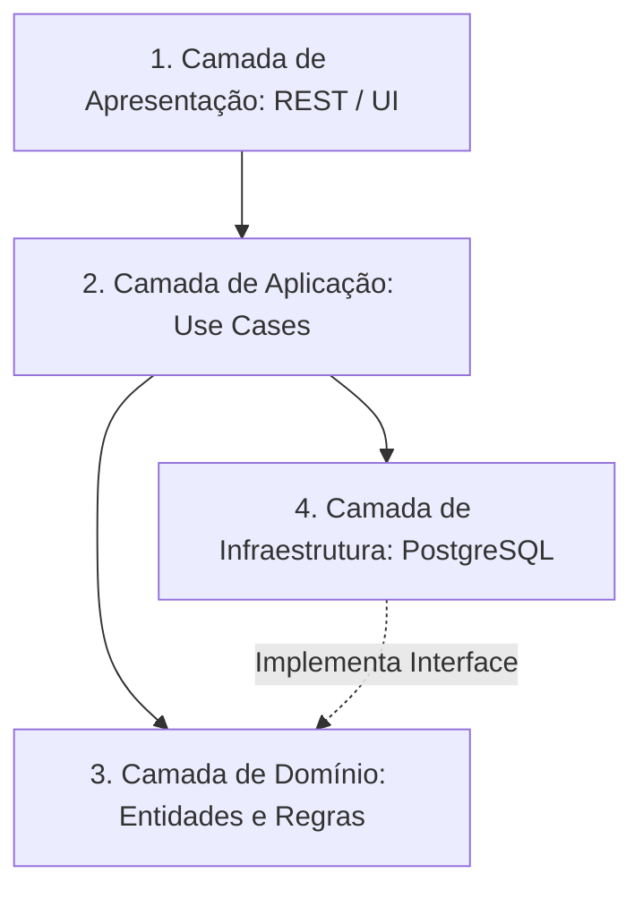

<div style="display: flex; justify-content: space-between; align-items: center; padding: 10px 16px; background: var(--light, #f8fafc); border: 1px solid var(--lightgray, #e2e8f0); border-radius: 10px; margin: 1.5rem 0;">
  <div>⬅️ <b><a href="/pt-br/resource/engenharia-de-computação/6-periodo/analise-de-software-orientada-a-objetos/anotacoes/aula-11-padroes-de-projeto-gof-comportamentais">Aula Anterior</a></b></div>
  <div>🏠 <b><a href="/pt-br/resource/engenharia-de-computação/6-periodo/analise-de-software-orientada-a-objetos">Hub da Disciplina</a></b></div>
  <div>➡️ <b><a href="/pt-br/resource/engenharia-de-computação/6-periodo/analise-de-software-orientada-a-objetos/anotacoes/aula-13-engenharia-reversa-refatoracao-e-code-smells">Próxima Aula</a></b></div>
</div>

> [!info] 📅 Informações da Aula
> - **Disciplina:** Análise de Software Orientada a Objetos (CSECBJI.42)
> - **Professor:** Bruno
> - **Data Realizada:** 18/11/2026
> - **Tópico Principal:** Arquitetura de Software em Camadas e MVC
> - **Status:** Concluída e Revisada

> [!note] 📂 Material Complementar & Slides
> - 📄 **Slides Oficiais:** [[slide-12-analise-de-software-orientada-a-objetos|Acessar Apresentação em PDF]]
> - 🎥 **Short Lecture / Gravação:** [[video-12-analise-de-software-orientada-a-objetos|Assistir Síntese da Aula (Vídeo)]]

---

### 📑 Resumo das Seções
- [📌 1. Anotações do Quadro: Arquitetura de Software em Camadas e MVC](#-anotações-do-quadro-arquitetura-de-software-em-camadas-e-mvc)
- [🧮 2. Formulação & Exemplo Prático Resolvido](#-formulação--exemplo-prático-resolvido)
- [📊 3. Esquema Visual & Fluxograma (Mermaid)](#-esquema-visual--fluxograma-mermaid)
- [🧠 4. Resumo Pessoal & Macetes do Professor](#-resumo-pessoal--macetes-do-professor)
- [📝 5. Dúvidas & Exercícios Recomendados para Casa](#-dúvidas--exercícios-recomendados-para-casa)

---

## 📌 Anotações do Quadro: Arquitetura de Software em Camadas e MVC

### 12.1 Arquitetura de Software em Camadas (*Layered Architecture*)
A separação em camadas lógicas isola responsabilidades técnicas e de negócio, garantindo que alterações em uma camada não propaguem efeitos colaterais indesejados nas demais:

1. **Camada de Apresentação / View:** Gerencia a interface gráfica (HTML, React, JavaFX, CLI), capturando entradas e exibindo dados.
2. **Camada de Aplicação / Controladores:** Orquestra os casos de uso do sistema, gerencia transações e segurança.
3. **Camada de Domínio / Negócio:** Contém as entidades ricas, regras de negócio puras, cálculos e invariantes (isenta de dependências de banco ou frameworks de tela).
4. **Camada de Infraestrutura / Persistência:** Acesso a bancos de dados relacionais (JDBC, Hibernate, Repositórios), APIs externas e sistemas de arquivos.

### 12.2 A Regra de Dependência
As dependências devem apontar estritamente de fora para dentro: a camada de Domínio NUNCA deve depender de detalhes da camada de Apresentação ou de Banco de Dados.

---

## 🧮 Formulação & Exemplo Prático Resolvido

### ✏️ Estrutura de Pacotes de uma Aplicação em Camadas

```text
src/main/java/br/edu/iff/sistema/
├── apresentacao/          # View & DTOs
│   ├── PedidoController.java
│   └── PedidoRequestDTO.java
├── aplicacao/             # Casos de Uso
│   └── ProcessarPedidoUseCase.java
├── dominio/               # Entidades e Regras de Negócio Puras
│   ├── Pedido.java
│   ├── ItemPedido.java
│   └── RepositorioPedidoInterface.java
└── infraestrutura/        # Implementação de Banco de Dados
    └── RepositorioPedidoPostgres.java
```

---

## 📊 Esquema Visual & Fluxograma (Mermaid)



---

## 🧠 Resumo Pessoal & Macetes do Professor

| Conceito-Chave | *Takeaway* do Professor | Dicas de Prova / Atenção |
| :--- | :--- | :--- |
| **Inversão de Dependência (DIP)** | O Domínio declara a interface `RepositorioPedidoInterface`, e a Infraestrutura implementa a classe concreta `RepositorioPedidoPostgres`. A camada de negócio não sabe se os dados vêm do PostgreSQL, Oracle ou de um arquivo JSON! | Permite trocar de banco sem alterar uma única linha do domínio. |
| **DTOs (*Data Transfer Objects*)** | Nunca exponha entidades de domínio diretamente na View; utilize DTOs para trafegar dados com a interface. | Aplicação prática direta |

---

## 📝 Dúvidas & Exercícios Recomendados para Casa

1. Projete o diagrama de pacotes em camadas para um sistema bancário respeitando a regra de dependência.
2. Explique a diferença entre uma Arquitetura em Camadas Tradicional e a Arquitetura Hexagonal (Ports and Adapters).

---

<div style="display: flex; justify-content: space-between; align-items: center; padding: 10px 16px; background: var(--light, #f8fafc); border: 1px solid var(--lightgray, #e2e8f0); border-radius: 10px; margin: 1.5rem 0;">
  <div>⬅️ <b><a href="/pt-br/resource/engenharia-de-computação/6-periodo/analise-de-software-orientada-a-objetos/anotacoes/aula-11-padroes-de-projeto-gof-comportamentais">Aula Anterior</a></b></div>
  <div>🏠 <b><a href="/pt-br/resource/engenharia-de-computação/6-periodo/analise-de-software-orientada-a-objetos">Hub da Disciplina</a></b></div>
  <div>➡️ <b><a href="/pt-br/resource/engenharia-de-computação/6-periodo/analise-de-software-orientada-a-objetos/anotacoes/aula-13-engenharia-reversa-refatoracao-e-code-smells">Próxima Aula</a></b></div>
</div>
