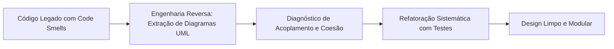

<div style="display: flex; justify-content: space-between; align-items: center; padding: 10px 16px; background: var(--light, #f8fafc); border: 1px solid var(--lightgray, #e2e8f0); border-radius: 10px; margin: 1.5rem 0;">
  <div>⬅️ <b><a href="/pt-br/resource/engenharia-de-computação/6-periodo/analise-de-software-orientada-a-objetos/anotacoes/aula-12-arquitetura-de-software-em-camadas-e-mvc">Aula Anterior</a></b></div>
  <div>🏠 <b><a href="/pt-br/resource/engenharia-de-computação/6-periodo/analise-de-software-orientada-a-objetos">Hub da Disciplina</a></b></div>
  <div>➡️ <b><a href="/pt-br/resource/engenharia-de-computação/6-periodo/analise-de-software-orientada-a-objetos/anotacoes/aula-14-metricas-oo-e-qualidade-de-software">Próxima Aula</a></b></div>
</div>

> [!info] 📅 Informações da Aula
> - **Disciplina:** Análise de Software Orientada a Objetos (CSECBJI.42)
> - **Professor:** Bruno
> - **Data Realizada:** 25/11/2026
> - **Tópico Principal:** Engenharia Reversa, Refatoração e Code Smells
> - **Status:** Concluída e Revisada

> [!note] 📂 Material Complementar & Slides
> - 📄 **Slides Oficiais:** [[slide-13-analise-de-software-orientada-a-objetos|Acessar Apresentação em PDF]]
> - 🎥 **Short Lecture / Gravação:** [[video-13-analise-de-software-orientada-a-objetos|Assistir Síntese da Aula (Vídeo)]]

---

### 📑 Resumo das Seções
- [📌 1. Anotações do Quadro: Engenharia Reversa, Refatoração e Code Smells](#-anotações-do-quadro-engenharia-reversa,-refatoração-e-code-smells)
- [🧮 2. Formulação & Exemplo Prático Resolvido](#-formulação--exemplo-prático-resolvido)
- [📊 3. Esquema Visual & Fluxograma (Mermaid)](#-esquema-visual--fluxograma-mermaid)
- [🧠 4. Resumo Pessoal & Macetes do Professor](#-resumo-pessoal--macetes-do-professor)
- [📝 5. Dúvidas & Exercícios Recomendados para Casa](#-dúvidas--exercícios-recomendados-para-casa)

---

## 📌 Anotações do Quadro: Engenharia Reversa, Refatoração e Code Smells

### 13.1 Engenharia Reversa de Software
Processo de análise de um sistema de software existente para identificar seus componentes, relacionamentos e criar representações de alto nível (diagramas de classes, fluxo de dados), facilitando a compreensão e manutenção de sistemas legados.

### 13.2 Maus Cheiros de Código (*Code Smells* - Martin Fowler)
Sintomas na estrutura do código que indicam problemas profundos de design:
1. **God Class / Large Class:** Classe gigantesca com centenas de atributos e milhares de linhas que faz tudo no sistema (violação grave do SRP e alta coesão).
2. **Long Method:** Método longo com dezenas de responsabilidades misturadas.
3. **Feature Envy (Inveja de Recursos):** Método de uma classe que faz chamadas excessivas a getters de outra classe para executar seus cálculos.
4. **Shotgun Surgery (Cirurgia por Espingarda):** Quando uma pequena alteração de regra exige dezenas de pequenas modificações espalhadas por múltiplas classes diferentes.

### 13.3 Técnicas Clássicas de Refatoração
- **Extract Method:** Decompor método longo em funções menores e coesas.
- **Move Method / Field:** Mover método para a classe especialista nos dados.
- **Replace Conditional with Polymorphism:** Substituir longos blocos `switch/case` por subclasses polimórficas ou padrão Strategy.

---

## 🧮 Formulação & Exemplo Prático Resolvido

### ✏️ Exemplo de Refatoração: De `switch/case` para Polimorfismo

**Antes da Refatoração (Code Smell - Long Method & Switch):**
```java
public double calcularDesconto(String tipoCliente, double valor) {
    switch (tipoCliente) {
        case "VIP": return valor * 0.20;
        case "PADRAO": return valor * 0.05;
        case "ESTUDANTE": return valor * 0.15;
        default: return 0.0;
    }
}
```

**Depois da Refatoração (Padrão Strategy / Polimorfismo):**
Cada tipo de cliente é uma classe que implementa `RegraDesconto`. Para adicionar o tipo "FUNCIONARIO", basta criar uma nova classe sem tocar nas classes existentes (Princípio Aberto/Fechado)!

---

## 📊 Esquema Visual & Fluxograma (Mermaid)



---

## 🧠 Resumo Pessoal & Macetes do Professor

| Conceito-Chave | *Takeaway* do Professor | Dicas de Prova / Atenção |
| :--- | :--- | :--- |
| **Refatoração Exige Testes Unitários!** | Nunca refatore código sem antes ter uma suite de testes unitários automatizados cobrindo o comportamento original. Sem testes, refatoração vira inserção de novos bugs! | Regra de ouro de Martin Fowler. |
| **Pequenos Passos** | Faça refatorações atômicas seguidas de execução da suite de testes. | Aplicação prática direta |

---

## 📝 Dúvidas & Exercícios Recomendados para Casa

1. Identifique os code smells presentes em uma classe com 2000 linhas fornecida pelo docente.
2. Aplique a técnica Extract Class para separar as responsabilidades de autenticação de uma classe de usuário sobrecarregada.

---

<div style="display: flex; justify-content: space-between; align-items: center; padding: 10px 16px; background: var(--light, #f8fafc); border: 1px solid var(--lightgray, #e2e8f0); border-radius: 10px; margin: 1.5rem 0;">
  <div>⬅️ <b><a href="/pt-br/resource/engenharia-de-computação/6-periodo/analise-de-software-orientada-a-objetos/anotacoes/aula-12-arquitetura-de-software-em-camadas-e-mvc">Aula Anterior</a></b></div>
  <div>🏠 <b><a href="/pt-br/resource/engenharia-de-computação/6-periodo/analise-de-software-orientada-a-objetos">Hub da Disciplina</a></b></div>
  <div>➡️ <b><a href="/pt-br/resource/engenharia-de-computação/6-periodo/analise-de-software-orientada-a-objetos/anotacoes/aula-14-metricas-oo-e-qualidade-de-software">Próxima Aula</a></b></div>
</div>
