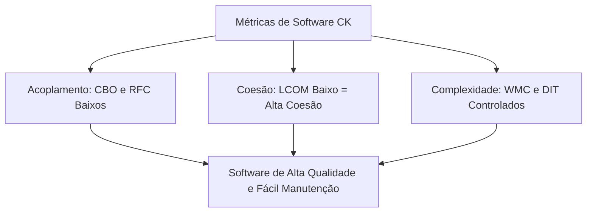

<div style="display: flex; justify-content: space-between; align-items: center; padding: 10px 16px; background: var(--light, #f8fafc); border: 1px solid var(--lightgray, #e2e8f0); border-radius: 10px; margin: 1.5rem 0;">
  <div>⬅️ <b><a href="/pt-br/resource/engenharia-de-computação/6-periodo/analise-de-software-orientada-a-objetos/anotacoes/aula-13-engenharia-reversa-refatoracao-e-code-smells">Aula Anterior</a></b></div>
  <div>🏠 <b><a href="/pt-br/resource/engenharia-de-computação/6-periodo/analise-de-software-orientada-a-objetos">Hub da Disciplina</a></b></div>
  <div>➡️ <b><a href="/pt-br/resource/engenharia-de-computação/6-periodo/analise-de-software-orientada-a-objetos/anotacoes/aula-15-avaliacao-parcial-p2-e-apresentacao-de-projetos">Próxima Aula</a></b></div>
</div>

> [!info] 📅 Informações da Aula
> - **Disciplina:** Análise de Software Orientada a Objetos (CSECBJI.42)
> - **Professor:** Bruno
> - **Data Realizada:** 02/12/2026
> - **Tópico Principal:** Métricas OO e Qualidade de Software
> - **Status:** Concluída e Revisada

> [!note] 📂 Material Complementar & Slides
> - 📄 **Slides Oficiais:** [[slide-14-analise-de-software-orientada-a-objetos|Acessar Apresentação em PDF]]
> - 🎥 **Short Lecture / Gravação:** [[video-14-analise-de-software-orientada-a-objetos|Assistir Síntese da Aula (Vídeo)]]

---

### 📑 Resumo das Seções
- [📌 1. Anotações do Quadro: Métricas OO e Qualidade de Software](#-anotações-do-quadro-métricas-oo-e-qualidade-de-software)
- [🧮 2. Formulação & Exemplo Prático Resolvido](#-formulação--exemplo-prático-resolvido)
- [📊 3. Esquema Visual & Fluxograma (Mermaid)](#-esquema-visual--fluxograma-mermaid)
- [🧠 4. Resumo Pessoal & Macetes do Professor](#-resumo-pessoal--macetes-do-professor)
- [📝 5. Dúvidas & Exercícios Recomendados para Casa](#-dúvidas--exercícios-recomendados-para-casa)

---

## 📌 Anotações do Quadro: Métricas OO e Qualidade de Software

### 14.1 Métricas Orientadas a Objetos (Conjunto CK - Chidamber & Kemerer)
Métricas formais para quantificação da complexidade, acoplamento e manutenibilidade de projetos de software orientados a objetos:

1. **WMC (Weighted Methods per Class):** Soma da complexidade ciclomática de todos os métodos da classe. Valores altos indicam classes difíceis de testar e manter.
2. **DIT (Depth of Inheritance Tree):** Profundidade máxima na árvore de herança. Árvores muito profundas ($DIT > 5$) aumentam a complexidade de rastreamento de comportamento.
3. **NOC (Number of Children):** Número de subclasses imediatas derivadas da classe.
4. **CBO (Coupling Between Object Classes):** Quantidade de outras classes às quais uma classe está acoplada. Deve ser minimizado ($CBO < 10$).
5. **RFC (Response for a Class):** Número de métodos locais mais os métodos de outras classes invocados por ela.
6. **LCOM (Lack of Cohesion in Methods):** Grau de desarticulação entre métodos da classe (mede se os métodos compartilham os mesmos atributos de instância). Alto LCOM indica que a classe deve ser decomposta em classes menores.

---

## 🧮 Formulação & Exemplo Prático Resolvido

### ✏️ Cálculo Prático de Métricas CK para uma Classe

```java
public class ServicoEmail {
    private String smtpHost;
    private int porta;

    public void conectar() { /* usa smtpHost, porta */ }
    public void enviar(String msg) { /* usa smtpHost, porta */ }
    public void desconectar() { /* usa smtpHost */ }
}
```

- **DIT:** $1$ (herda apenas de `Object`).
- **NOC:** $0$ (nenhuma subclasse).
- **CBO:** Baixo (depende apenas de tipos básicos).
- **LCOM:** $0$ (Baixa falta de coesão $\implies$ **Alta Coesão**, pois todos os métodos acessam `smtpHost`).
- **Diagnóstico:** Classe exemplar com excelente qualidade arquitetural!

---

## 📊 Esquema Visual & Fluxograma (Mermaid)



---

## 🧠 Resumo Pessoal & Macetes do Professor

| Conceito-Chave | *Takeaway* do Professor | Dicas de Prova / Atenção |
| :--- | :--- | :--- |
| **LCOM Alto é Alarme de God Class** | Se o LCOM for alto, significa que os métodos da classe estão operando sobre conjuntos disjuntos de variáveis (a classe está executando papéis não relacionados). | Sinal imediato para aplicar Extract Class. |
| **Ferramentas de Análise Estática** | Utilize ferramentas como SonarQube, SpotBugs e JaCoCo no pipeline de CI/CD para monitorar métricas CK automaticamente. | Aplicação prática direta |

---

## 📝 Dúvidas & Exercícios Recomendados para Casa

1. Calcule o CBO e o WMC de uma classe de controle de estoque com 4 métodos e dependência de 5 repositórios.
2. Explique a relação entre a métrica DIT e a fragilidade da superclasse (*Fragile Base Class Problem*).

---

<div style="display: flex; justify-content: space-between; align-items: center; padding: 10px 16px; background: var(--light, #f8fafc); border: 1px solid var(--lightgray, #e2e8f0); border-radius: 10px; margin: 1.5rem 0;">
  <div>⬅️ <b><a href="/pt-br/resource/engenharia-de-computação/6-periodo/analise-de-software-orientada-a-objetos/anotacoes/aula-13-engenharia-reversa-refatoracao-e-code-smells">Aula Anterior</a></b></div>
  <div>🏠 <b><a href="/pt-br/resource/engenharia-de-computação/6-periodo/analise-de-software-orientada-a-objetos">Hub da Disciplina</a></b></div>
  <div>➡️ <b><a href="/pt-br/resource/engenharia-de-computação/6-periodo/analise-de-software-orientada-a-objetos/anotacoes/aula-15-avaliacao-parcial-p2-e-apresentacao-de-projetos">Próxima Aula</a></b></div>
</div>
