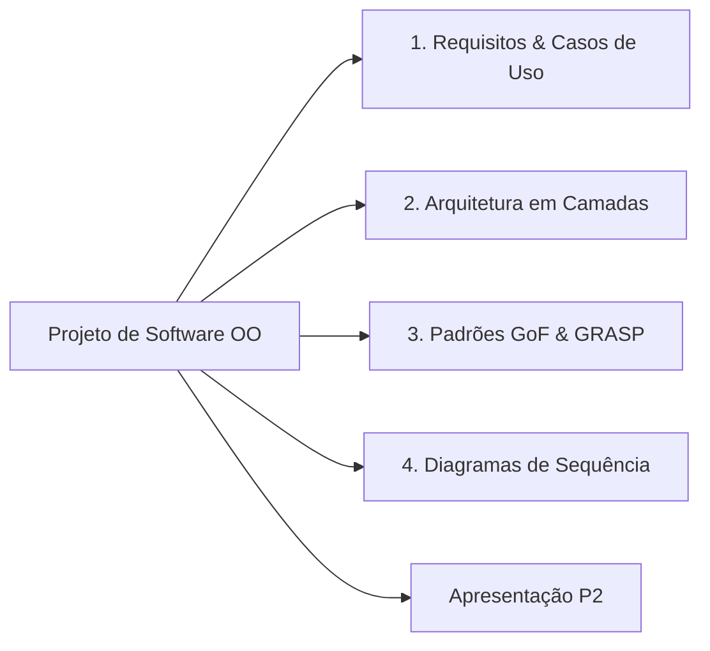

  
⬅️ <b><a href="/pt-br/resource/engenharia-de-computação/6-periodo/analise-de-software-orientada-a-objetos/anotacoes/aula-14-metricas-oo-e-qualidade-de-software">Aula Anterior</a></b>

  
🏠 <b><a href="/pt-br/resource/engenharia-de-computação/6-periodo/analise-de-software-orientada-a-objetos">Hub da Disciplina</a></b>

  
➡️ <b><a href="/pt-br/resource/engenharia-de-computação/6-periodo/analise-de-software-orientada-a-objetos/anotacoes/aula-16-prova-final-encerramento-e-feedback-do-semestre">Próxima Aula</a></b>

> [!info] 📅 Informações da Aula
> - **Disciplina:** Análise de Software Orientada a Objetos (CSECBJI.42)
> - **Professor:** Bruno
> - **Data Realizada:** 09/12/2026
> - **Tópico Principal:** Avaliação Parcial P2 e Apresentação de Projetos
> - **Status:** Concluída e Revisada

> [!note] 📂 Material Complementar & Slides
> - 📄 **Slides Oficiais:** [[slide-15-analise-de-software-orientada-a-objetos|Acessar Apresentação em PDF]]
> - 🎥 **Short Lecture / Gravação:** [[video-15-analise-de-software-orientada-a-objetos|Assistir Síntese da Aula (Vídeo)]]

---

### 📑 Resumo das Seções
- [📌 1. Anotações do Quadro: Avaliação Parcial P2 e Apresentação de Projetos](#-anotações-do-quadro-avaliação-parcial-p2-e-apresentação-de-projetos)
- [🧮 2. Formulação & Exemplo Prático Resolvido](#-formulação--exemplo-prático-resolvido)
- [📊 3. Esquema Visual & Fluxograma (Mermaid)](#-esquema-visual--fluxograma-mermaid)
- [🧠 4. Resumo Pessoal & Macetes do Professor](#-resumo-pessoal--macetes-do-professor)
- [📝 5. Dúvidas & Exercícios Recomendados para Casa](#-dúvidas--exercícios-recomendados-para-casa)

---

## 📌 Anotações do Quadro: Avaliação Parcial P2 e Apresentação de Projetos

### 15.1 Critérios de Avaliação e Defesa do Projeto de Software
A avaliação P2 consiste na entrega e apresentação do Modelo de Análise e Design Orientado a Objetos completo de um sistema de software corporativo:
1. Documento de Visão e Matriz de Requisitos FURPS+.
2. Diagrama de Casos de Uso com especificações textuais expandidas dos casos mais críticos.
3. Diagrama de Classes de Domínio e de Projeto com aplicação justificada de Padrões GoF (Criacional, Estrutural e Comportamental).
4. Diagramas de Sequência de Projeto detalhando a colaboração entre as classes e controladores GRASP.
5. Diagrama de Atividades e Máquinas de Estados para processos complexos.
6. Relatório de Métricas de Qualidade OO.

---

## 🧮 Formulação & Exemplo Prático Resolvido

### ✏️ Roteiro de Apresentação Técnica para a Banca

1. **Apresentação do Problema de Negócio:** Justificativa da solução e valor gerado.
2. **Demonstração do Diagrama de Classes de Projeto:** Destaque para os padrões GoF adotados (ex: Factory Method para gateways de pagamento, Strategy para taxas, Observer para notificações).
3. **Validação Dinâmica com Diagrama de Sequência:** Rastreamento de ponta a ponta do caso de uso mais complexo.
4. **Defesa das Decisões Arquiteturais:** Justificativa da separação em camadas e desacoplamento de banco.

---

## 📊 Esquema Visual & Fluxograma (Mermaid)

---

## 🧠 Resumo Pessoal & Macetes do Professor

| Conceito-Chave | *Takeaway* do Professor | Dicas de Prova / Atenção |
| :--- | :--- | :--- |
| **Dica de Defesa de Padrões de Projeto** | Nunca diga que usou um padrão GoF 'porque achou bonito'. Justifique sempre o **problema arquitetural que ele resolveu** (ex: 'Usamos Strategy para permitir adicionar novas transportadoras sem modificar o código do Pedido'). | É isso que a banca avalia. |
| **Consistência entre Diagramas** | Os nomes de métodos nos Diagramas de Sequência DEVEM coincidir perfeitamente com os métodos declarados no Diagrama de Classes. | Aplicação prática direta |

---

## 📝 Dúvidas & Exercícios Recomendados para Casa

1. Conclua a documentação completa dos artefatos UML do projeto semestral.
2. Realize uma sessão de revisão por pares (*Peer Review*) entre grupos para verificar a coerência dos diagramas.

---

  
⬅️ <b><a href="/pt-br/resource/engenharia-de-computação/6-periodo/analise-de-software-orientada-a-objetos/anotacoes/aula-14-metricas-oo-e-qualidade-de-software">Aula Anterior</a></b>

  
🏠 <b><a href="/pt-br/resource/engenharia-de-computação/6-periodo/analise-de-software-orientada-a-objetos">Hub da Disciplina</a></b>

  
➡️ <b><a href="/pt-br/resource/engenharia-de-computação/6-periodo/analise-de-software-orientada-a-objetos/anotacoes/aula-16-prova-final-encerramento-e-feedback-do-semestre">Próxima Aula</a></b>

