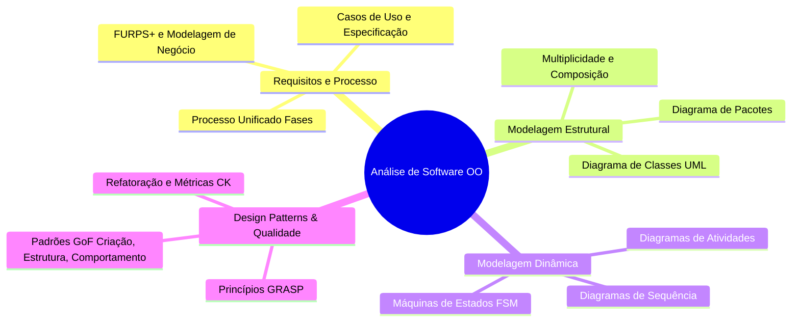

<div style="display: flex; justify-content: space-between; align-items: center; padding: 10px 16px; background: var(--light, #f8fafc); border: 1px solid var(--lightgray, #e2e8f0); border-radius: 10px; margin: 1.5rem 0;">
  <div>⬅️ <b><a href="/pt-br/resource/engenharia-de-computação/6-periodo/analise-de-software-orientada-a-objetos/anotacoes/aula-15-avaliacao-parcial-p2-e-apresentacao-de-projetos">Aula Anterior</a></b></div>
  <div>🏠 <b><a href="/pt-br/resource/engenharia-de-computação/6-periodo/analise-de-software-orientada-a-objetos">Hub da Disciplina</a></b></div>
  <div>➡️ <span style="color: gray;">Última Aula</span></div>
</div>

> [!info] 📅 Informações da Aula
> - **Disciplina:** Análise de Software Orientada a Objetos (CSECBJI.42)
> - **Professor:** Bruno
> - **Data Realizada:** 16/12/2026
> - **Tópico Principal:** Prova Final, Encerramento e Feedback do Semestre
> - **Status:** Concluída e Revisada

> [!note] 📂 Material Complementar & Slides
> - 📄 **Slides Oficiais:** [[slide-16-analise-de-software-orientada-a-objetos|Acessar Apresentação em PDF]]
> - 🎥 **Short Lecture / Gravação:** [[video-16-analise-de-software-orientada-a-objetos|Assistir Síntese da Aula (Vídeo)]]

---

### 📑 Resumo das Seções
- [📌 1. Anotações do Quadro: Prova Final, Encerramento e Feedback do Semestre](#-anotações-do-quadro-prova-final,-encerramento-e-feedback-do-semestre)
- [🧮 2. Formulação & Exemplo Prático Resolvido](#-formulação--exemplo-prático-resolvido)
- [📊 3. Esquema Visual & Fluxograma (Mermaid)](#-esquema-visual--fluxograma-mermaid)
- [🧠 4. Resumo Pessoal & Macetes do Professor](#-resumo-pessoal--macetes-do-professor)
- [📝 5. Dúvidas & Exercícios Recomendados para Casa](#-dúvidas--exercícios-recomendados-para-casa)

---

## 📌 Anotações do Quadro: Prova Final, Encerramento e Feedback do Semestre

### 16.1 Síntese Holística da Análise e Projeto de Software
A disciplina consolida as metodologias formais de engenharia de software para transformar requisitos complexos em arquiteturas escaláveis:
```text
Requisitos FURPS+ ──▶ Casos de Uso & UP ──▶ Classes & GRASP ──▶ Padrões GoF ──▶ Arquitetura em Camadas & Refatoração
```

### 16.2 Continuidade Curricular e Prática Profissional
- **Próximas Disciplinas:** Esta base metodológica será aplicada diretamente em **Projeto de Software Orientado a Objetos (7ºP)**, **Engenharia de Software Avançada** e no **Projeto Final de Curso (TCC)**.
- **Carreira:** O domínio de UML, GRASP, GoF e Clean Architecture é o diferencial técnico indispensável para atuar como Engenheiro de Software Sênior e Arquiteto de Soluções.

---

## 🧮 Formulação & Exemplo Prático Resolvido

### ✏️ Fechamento do Semestre Letivo

1. **Revisão Final:** Média Semestral $= (P1 + P2) / 2 \ge 6.0$.
2. **Compêndio Permanente:** Mantenha os diagramas e resumos como guia de referência técnica para modelagem de novos sistemas.

---

## 📊 Esquema Visual & Fluxograma (Mermaid)



---

## 🧠 Resumo Pessoal & Macetes do Professor

| Conceito-Chave | *Takeaway* do Professor | Dicas de Prova / Atenção |
| :--- | :--- | :--- |
| **A Regra de Ouro do Arquiteto** | Um bom design de software minimiza o custo humano de realizar modificações futuras no sistema. | Software que funciona mas não pode ser alterado é um software morto. |
| **Encerramento do Semestre** | Parabéns pela dedicação e conclusão com êxito da disciplina de Análise de Software Orientada a Objetos! | Aplicação prática direta |

---

## 📝 Dúvidas & Exercícios Recomendados para Casa

1. Revisão integral dos tópicos conceituais para a Prova Final.
2. Consulte as obras de referência clássica: Craig Larman (Utilizando UML e Padrões) e Gamma, Helm, Johnson & Vlissides (Padrões de Projeto - GoF).

---

<div style="display: flex; justify-content: space-between; align-items: center; padding: 10px 16px; background: var(--light, #f8fafc); border: 1px solid var(--lightgray, #e2e8f0); border-radius: 10px; margin: 1.5rem 0;">
  <div>⬅️ <b><a href="/pt-br/resource/engenharia-de-computação/6-periodo/analise-de-software-orientada-a-objetos/anotacoes/aula-15-avaliacao-parcial-p2-e-apresentacao-de-projetos">Aula Anterior</a></b></div>
  <div>🏠 <b><a href="/pt-br/resource/engenharia-de-computação/6-periodo/analise-de-software-orientada-a-objetos">Hub da Disciplina</a></b></div>
  <div>➡️ <span style="color: gray;">Última Aula</span></div>
</div>
