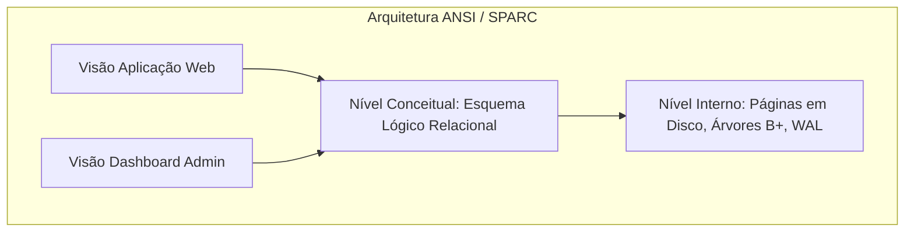

<div style="display: flex; justify-content: space-between; align-items: center; padding: 10px 16px; background: var(--light, #f8fafc); border: 1px solid var(--lightgray, #e2e8f0); border-radius: 10px; margin: 1.5rem 0;">
  <div>⬅️ <span style="color: gray;">Primeira Aula</span></div>
  <div>🏠 <b><a href="/pt-br/resource/engenharia-de-computação/6-periodo/banco-de-dados">Hub da Disciplina</a></b></div>
  <div>➡️ <b><a href="/pt-br/resource/engenharia-de-computação/6-periodo/banco-de-dados/anotacoes/aula-01-o-modelo-relacional-e-fundamentos-de-bancos-de-dados">Próxima Aula</a></b></div>
</div>

> [!info] 📅 Informações da Aula
> - **Disciplina:** Banco de Dados (CSECBJI.44)
> - **Professor:** Sérgio
> - **Data Realizada:** 25/08/2026
> - **Tópico Principal:** Apresentação da Disciplina, Ementa e Ambiente de Laboratório
> - **Status:** Concluída e Revisada

> [!note] 📂 Material Complementar & Slides
> - 📄 **Slides Oficiais:** [[slide-00-banco-de-dados|Acessar Apresentação em PDF]]
> - 🎥 **Short Lecture / Gravação:** [[video-00-banco-de-dados|Assistir Síntese da Aula (Vídeo)]]

---

### 📑 Resumo das Seções
- [📌 1. Anotações do Quadro: Apresentação da Disciplina, Ementa e Ambiente de Laboratório](#-anotações-do-quadro-apresentação-da-disciplina,-ementa-e-ambiente-de-laboratório)
- [🧮 2. Formulação & Exemplo Prático Resolvido](#-formulação--exemplo-prático-resolvido)
- [📊 3. Esquema Visual & Fluxograma (Mermaid)](#-esquema-visual--fluxograma-mermaid)
- [🧠 4. Resumo Pessoal & Macetes do Professor](#-resumo-pessoal--macetes-do-professor)
- [📝 5. Dúvidas & Exercícios Recomendados para Casa](#-dúvidas--exercícios-recomendados-para-casa)

---

## 📌 Anotações do Quadro: Apresentação da Disciplina, Ementa e Ambiente de Laboratório

### 1.1 Arquitetura em Três Níveis ANSI/SPARC
A arquitetura ANSI/SPARC divide os Sistemas Gerenciadores de Bancos de Dados (SGBDs) em três níveis de abstração para garantir independência de dados:

1. **Nível Externo (Visões de Usuário):** Define como diferentes grupos de usuários ou aplicações enxergam partes específicas da base de dados.
2. **Nível Conceitual (Esquema Lógico Global):** Descreve a estrutura completa do banco de dados (tabelas, colunas, tipos, restrições e relacionamentos), ocultando detalhes de implementação física.
3. **Nível Interno (Esquema Físico de Armazenamento):** Descreve como os dados são organizados no disco rígido/SSD (alocação de blocos, índices, ordenação, compressão).

### 1.2 Independência de Dados
- **Independência Lógica de Dados:** Capacidade de alterar o esquema conceitual sem modificar os esquemas externos ou as aplicações de usuário.
- **Independência Física de Dados:** Capacidade de reorganizar o armazenamento interno (ex: criar novos índices, trocar SSDs) sem alterar o esquema conceitual.

### 1.3 O SGBD PostgreSQL e Ferramentas de Laboratório
O PostgreSQL é um SGBD objeto-relacional open-source de padrão industrial, compatível com SQL padrão e transações ACID completas.

---

## 🧮 Formulação & Exemplo Prático Resolvido

### ✏️ Configuração do Ambiente e Conexão via Terminal `psql`

```bash
# Instalação e verificação do serviço
sudo systemctl status postgresql

# Acesso ao shell interativo
psql -U postgres -d postgres

# Criação de base de dados para o semestre
CREATE DATABASE engenharia_db;
\c engenharia_db

# Criação de tabela de teste
CREATE TABLE aluno (
    matricula VARCHAR(10) PRIMARY KEY,
    nome VARCHAR(100) NOT NULL,
    cra NUMERIC(4,2) CHECK (cra >= 0.0 AND cra <= 10.0)
);

\d aluno
```

---

## 📊 Esquema Visual & Fluxograma (Mermaid)



---

## 🧠 Resumo Pessoal & Macetes do Professor

| Conceito-Chave | *Takeaway* do Professor | Dicas de Prova / Atenção |
| :--- | :--- | :--- |
| **Independência Física vs Lógica** | Independência física protege contra mudanças de disco/índices; Independência lógica protege contra adição de novas tabelas/colunas. | Perguntas de prova frequentemente trocam essas duas definições. |
| **Schemas no PostgreSQL** | No PostgreSQL, um banco de dados contém múltiplos *Schemas* (o padrão é `public`). | Aplicação prática direta |

---

## 📝 Dúvidas & Exercícios Recomendados para Casa

1. Diferencie formalmente a Independência Lógica de Dados da Independência Física de Dados.
2. Explique o papel do Catálogo do Sistema (Metadados) em um SGBD relacional.

---

<div style="display: flex; justify-content: space-between; align-items: center; padding: 10px 16px; background: var(--light, #f8fafc); border: 1px solid var(--lightgray, #e2e8f0); border-radius: 10px; margin: 1.5rem 0;">
  <div>⬅️ <span style="color: gray;">Primeira Aula</span></div>
  <div>🏠 <b><a href="/pt-br/resource/engenharia-de-computação/6-periodo/banco-de-dados">Hub da Disciplina</a></b></div>
  <div>➡️ <b><a href="/pt-br/resource/engenharia-de-computação/6-periodo/banco-de-dados/anotacoes/aula-01-o-modelo-relacional-e-fundamentos-de-bancos-de-dados">Próxima Aula</a></b></div>
</div>
