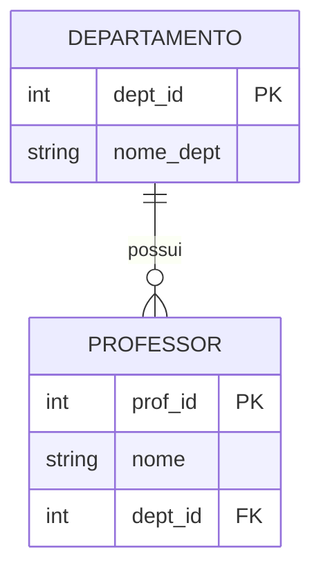

<div style="display: flex; justify-content: space-between; align-items: center; padding: 10px 16px; background: var(--light, #f8fafc); border: 1px solid var(--lightgray, #e2e8f0); border-radius: 10px; margin: 1.5rem 0;">
  <div>⬅️ <b><a href="/pt-br/resource/engenharia-de-computação/6-periodo/banco-de-dados/anotacoes/aula-00-apresentacao-da-disciplina-ementa-e-ambiente-de-laboratorio">Aula Anterior</a></b></div>
  <div>🏠 <b><a href="/pt-br/resource/engenharia-de-computação/6-periodo/banco-de-dados">Hub da Disciplina</a></b></div>
  <div>➡️ <b><a href="/pt-br/resource/engenharia-de-computação/6-periodo/banco-de-dados/anotacoes/aula-02-algebra-relacional-selecao-projecao-juncao-e-divisao">Próxima Aula</a></b></div>
</div>

> [!info] 📅 Informações da Aula
> - **Disciplina:** Banco de Dados (CSECBJI.44)
> - **Professor:** Sérgio
> - **Data Realizada:** 01/09/2026
> - **Tópico Principal:** O Modelo Relacional e Fundamentos de Bancos de Dados
> - **Status:** Concluída e Revisada

> [!note] 📂 Material Complementar & Slides
> - 📄 **Slides Oficiais:** [[slide-01-banco-de-dados|Acessar Apresentação em PDF]]
> - 🎥 **Short Lecture / Gravação:** [[video-01-banco-de-dados|Assistir Síntese da Aula (Vídeo)]]

---

### 📑 Resumo das Seções
- [📌 1. Anotações do Quadro: O Modelo Relacional e Fundamentos de Bancos de Dados](#-anotações-do-quadro-o-modelo-relacional-e-fundamentos-de-bancos-de-dados)
- [🧮 2. Formulação & Exemplo Prático Resolvido](#-formulação--exemplo-prático-resolvido)
- [📊 3. Esquema Visual & Fluxograma (Mermaid)](#-esquema-visual--fluxograma-mermaid)
- [🧠 4. Resumo Pessoal & Macetes do Professor](#-resumo-pessoal--macetes-do-professor)
- [📝 5. Dúvidas & Exercícios Recomendados para Casa](#-dúvidas--exercícios-recomendados-para-casa)

---

## 📌 Anotações do Quadro: O Modelo Relacional e Fundamentos de Bancos de Dados

### 1.1 O Modelo Relacional Formal (Codd, 1970)
No modelo relacional, os dados são organizados matematicamente em **relações** (tabelas):
- **Relação ($R$):** Subconjunto do produto cartesiano de domínios $D_1 \times D_2 \times \dots \times D_n$.
- **Tupla ($t$):** Linha ou registro individual na relação.
- **Atributo ($A$):** Coluna nomeada com um tipo/domínio associado.
- **Grau (*Arity*):** Número total de atributos na relação.
- **Cardinalidade:** Número total de tuplas atualmente armazenadas.

### 1.2 Chaves e Restrições de Integridade
1. **Superchave:** Conjunto de atributos que identifica unicamente cada tupla na relação.
2. **Chave Candidata ($CK$):** Superchave irredutível / mínima.
3. **Chave Primária ($PK$):** A chave candidata escolhida como identificador principal.
4. **Chave Estrangeira ($FK$):** Atributo em uma relação $R_1$ que faz referência à chave primária de $R_2$.

### 1.3 As Três Restrições de Integridade Fundamentais
- **Integridade de Domínio:** Cada valor de atributo deve pertencer ao seu domínio definido.
- **Integridade de Entidade:** Nenhum atributo componente da chave primária ($PK$) pode assumir valor nulo (`NULL`).
- **Integridade Referencial:** Toda chave estrangeira ($FK$) deve ser igual a um valor existente da chave primária referenciada, ou ser inteiramente nula (`NULL`).

---

## 🧮 Formulação & Exemplo Prático Resolvido

### ✏️ Definição de Esquema Relacional com Ações de Integridade Referencial

```sql
CREATE TABLE departamento (
    dept_id INT PRIMARY KEY,
    nome_dept VARCHAR(50) NOT NULL UNIQUE
);

CREATE TABLE professor (
    prof_id INT PRIMARY KEY,
    nome VARCHAR(80) NOT NULL,
    dept_id INT,
    CONSTRAINT fk_dept FOREIGN KEY (dept_id)
        REFERENCES departamento(dept_id)
        ON UPDATE CASCADE
        ON DELETE SET NULL
);
```

**Regras de Atualização/Exclusão:**
- `ON DELETE CASCADE`: Remove tuplas filhas automaticamente.
- `ON DELETE SET NULL`: Atribui `NULL` à chave estrangeira quando o pai é excluído.
- `ON DELETE RESTRICT`: Bloqueia a exclusão do pai se houver filhos dependentes.

---

## 📊 Esquema Visual & Fluxograma (Mermaid)



---

## 🧠 Resumo Pessoal & Macetes do Professor

| Conceito-Chave | *Takeaway* do Professor | Dicas de Prova / Atenção |
| :--- | :--- | :--- |
| **NULL em Chaves Primárias** | Chaves primárias NUNCA aceitam NULL (Integridade de Entidade). Chaves estrangeiras podem aceitar NULL caso a relação permita tuplas órfãs. | Chaves únicas (UNIQUE) aceitam múltiplos NULLs no padrão SQL. |
| **Superchave vs Chave Candidata** | Toda chave candidata é superchave, mas nem toda superchave é chave candidata (a chave candidata deve ser mínima). | Aplicação prática direta |

---

## 📝 Dúvidas & Exercícios Recomendados para Casa

1. Dado um esquema $R(A, B, C, D)$ com chaves candidatas $\{A, B\}$ e $\{A, C\}$, liste todas as possíveis superchaves de $R$.
2. Explique a diferença de comportamento entre `ON DELETE CASCADE` e `ON DELETE RESTRICT`.

---

<div style="display: flex; justify-content: space-between; align-items: center; padding: 10px 16px; background: var(--light, #f8fafc); border: 1px solid var(--lightgray, #e2e8f0); border-radius: 10px; margin: 1.5rem 0;">
  <div>⬅️ <b><a href="/pt-br/resource/engenharia-de-computação/6-periodo/banco-de-dados/anotacoes/aula-00-apresentacao-da-disciplina-ementa-e-ambiente-de-laboratorio">Aula Anterior</a></b></div>
  <div>🏠 <b><a href="/pt-br/resource/engenharia-de-computação/6-periodo/banco-de-dados">Hub da Disciplina</a></b></div>
  <div>➡️ <b><a href="/pt-br/resource/engenharia-de-computação/6-periodo/banco-de-dados/anotacoes/aula-02-algebra-relacional-selecao-projecao-juncao-e-divisao">Próxima Aula</a></b></div>
</div>
