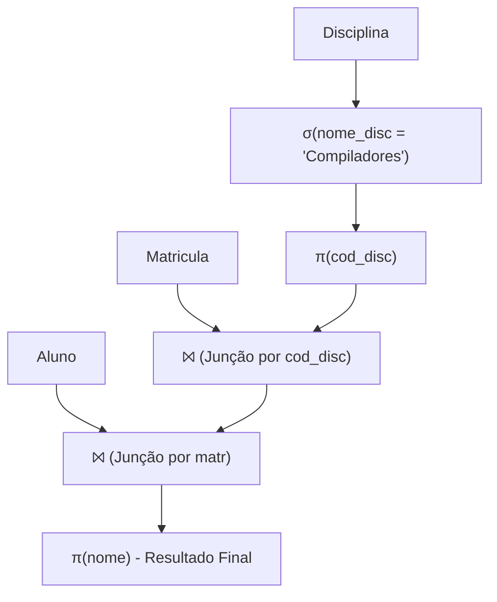

  
⬅️ <b><a href="/pt-br/resource/engenharia-de-computação/6-periodo/banco-de-dados/anotacoes/aula-01-o-modelo-relacional-e-fundamentos-de-bancos-de-dados">Aula Anterior</a></b>

  
🏠 <b><a href="/pt-br/resource/engenharia-de-computação/6-periodo/banco-de-dados">Hub da Disciplina</a></b>

  
➡️ <b><a href="/pt-br/resource/engenharia-de-computação/6-periodo/banco-de-dados/anotacoes/aula-03-sql-avancado-subconsultas-agrupamento-e-juncoes-complexas">Próxima Aula</a></b>

> [!info] 📅 Informações da Aula
> - **Disciplina:** Banco de Dados (CSECBJI.44)
> - **Professor:** Sérgio
> - **Data Realizada:** 08/09/2026
> - **Tópico Principal:** Álgebra Relacional: Seleção, Projeção, Junção e Divisão
> - **Status:** Concluída e Revisada

> [!note] 📂 Material Complementar & Slides
> - 📄 **Slides Oficiais:** [[slide-02-banco-de-dados|Acessar Apresentação em PDF]]
> - 🎥 **Short Lecture / Gravação:** [[video-02-banco-de-dados|Assistir Síntese da Aula (Vídeo)]]

---

### 📑 Resumo das Seções
- [📌 1. Anotações do Quadro: Álgebra Relacional: Seleção, Projeção, Junção e Divisão](#-anotações-do-quadro-álgebra-relacional-seleção,-projeção,-junção-e-divisão)
- [🧮 2. Formulação & Exemplo Prático Resolvido](#-formulação--exemplo-prático-resolvido)
- [📊 3. Esquema Visual & Fluxograma (Mermaid)](#-esquema-visual--fluxograma-mermaid)
- [🧠 4. Resumo Pessoal & Macetes do Professor](#-resumo-pessoal--macetes-do-professor)
- [📝 5. Dúvidas & Exercícios Recomendados para Casa](#-dúvidas--exercícios-recomendados-para-casa)

---

## 📌 Anotações do Quadro: Álgebra Relacional: Seleção, Projeção, Junção e Divisão

### 2.1 Fundamentação da Álgebra Relacional
A **Álgebra Relacional** é uma linguagem de consulta formal procedimental que opera sobre relações e produz novas relações como resultado.

#### Operadores Fundamentais:
1. **Seleção ($\sigma_p(R)$):** Filtra tuplas que satisfazem o predicado lógico $p$.
2. **Projeção ($\pi_{A_1, \dots, A_k}(R)$):** Mantém apenas as colunas especificadas, eliminando duplicatas.
3. **Produto Cartesiano ($R \times S$):** Combina todas as tuplas de $R$ com todas as de $S$.
4. **União ($R \cup S$):** Reúne tuplas de $R$ e $S$ (requer que $R$ e $S$ sejam compatíveis na união).
5. **Diferença de Conjuntos ($R - S$):** Retorna tuplas presentes em $R$ que não estão em $S$.
6. **Renomeação ($\rho_{S(B_1, \dots, B_n)}(R)$):** Altera o nome da relação e de seus atributos.

#### Operadores Derivados:
- **Junção Natural ($R \bowtie S$):** Realiza o produto cartesiano seguido de seleção por igualdade de atributos com mesmo nome e projeção para eliminar duplicatas de colunas.
- **Theta-Junção ($R \bowtie_\theta S$):** Junção com predicado de comparação genérico $\theta$.
- **Divisão ($R \div S$):** Identifica tuplas de $R$ que estão associadas a **todas** as tuplas de $S$.

---

## 🧮 Formulação & Exemplo Prático Resolvido

### ✏️ Resolução de Consulta: "Listar o nome dos alunos matriculados na disciplina 'Compiladores'"

**Esquemas:**
- `Aluno(matr, nome, cra)`
- `Matricula(matr, cod_disc, semestre)`
- `Disciplina(cod_disc, nome_disc, ch)`

**Expressão em Álgebra Relacional Passo a Passo:**
$$\pi_{\text{nome}}(\sigma_{\text{nome\_disc} = \text{'Compiladores'}}(\text{Aluno} \bowtie \text{Matricula} \bowtie \text{Disciplina}))$$

**Otimização Algébrica (Push-down da Seleção):**
$$\pi_{\text{nome}}(\text{Aluno} \bowtie \text{Matricula} \bowtie (\pi_{\text{cod\_disc}}(\sigma_{\text{nome\_disc} = \text{'Compiladores'}}(\text{Disciplina}))))$$

A seleção antecipada reduz drasticamente o número de tuplas processadas nas junções intermediárias!

---

## 📊 Esquema Visual & Fluxograma (Mermaid)

---

## 🧠 Resumo Pessoal & Macetes do Professor

| Conceito-Chave | *Takeaway* do Professor | Dicas de Prova / Atenção |
| :--- | :--- | :--- |
| **Compatibilidade de União** | As operações de União ($\cup$), Interseção ($\cap$) e Diferença ($-$) exigem que as relações tenham o mesmo número de atributos e domínios compatíveis. | Projeção elimina tuplas duplicadas na teoria formal! |
| **Operador Divisão ($\div$)** | Utilizado para consultas com quantificador universal ('para todo' / 'em todas as disciplinas'). | Aplicação prática direta |

---

## 📝 Dúvidas & Exercícios Recomendados para Casa

1. Escreva a expressão em álgebra relacional para 'Encontrar os alunos matriculados em TODAS as disciplinas do 6º período' utilizando o operador de divisão.
2. Converta a consulta $\pi_{nome}(\sigma_{cra \ge 8.0}(Aluno))$ para o comando equivalente em SQL.

---

  
⬅️ <b><a href="/pt-br/resource/engenharia-de-computação/6-periodo/banco-de-dados/anotacoes/aula-01-o-modelo-relacional-e-fundamentos-de-bancos-de-dados">Aula Anterior</a></b>

  
🏠 <b><a href="/pt-br/resource/engenharia-de-computação/6-periodo/banco-de-dados">Hub da Disciplina</a></b>

  
➡️ <b><a href="/pt-br/resource/engenharia-de-computação/6-periodo/banco-de-dados/anotacoes/aula-03-sql-avancado-subconsultas-agrupamento-e-juncoes-complexas">Próxima Aula</a></b>

