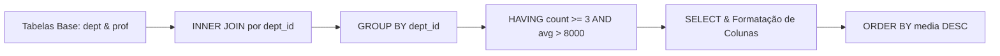

<div style="display: flex; justify-content: space-between; align-items: center; padding: 10px 16px; background: var(--light, #f8fafc); border: 1px solid var(--lightgray, #e2e8f0); border-radius: 10px; margin: 1.5rem 0;">
  <div>⬅️ <b><a href="/pt-br/resource/engenharia-de-computação/6-periodo/banco-de-dados/anotacoes/aula-02-algebra-relacional-selecao-projecao-juncao-e-divisao">Aula Anterior</a></b></div>
  <div>🏠 <b><a href="/pt-br/resource/engenharia-de-computação/6-periodo/banco-de-dados">Hub da Disciplina</a></b></div>
  <div>➡️ <b><a href="/pt-br/resource/engenharia-de-computação/6-periodo/banco-de-dados/anotacoes/aula-04-teoria-da-normalizacao-dependencias-funcionais-1fn-2fn-e-3fn">Próxima Aula</a></b></div>
</div>

> [!info] 📅 Informações da Aula
> - **Disciplina:** Banco de Dados (CSECBJI.44)
> - **Professor:** Sérgio
> - **Data Realizada:** 15/09/2026
> - **Tópico Principal:** SQL Avançado: Subconsultas, Agrupamento e Junções Complexas
> - **Status:** Concluída e Revisada

> [!note] 📂 Material Complementar & Slides
> - 📄 **Slides Oficiais:** [[slide-03-banco-de-dados|Acessar Apresentação em PDF]]
> - 🎥 **Short Lecture / Gravação:** [[video-03-banco-de-dados|Assistir Síntese da Aula (Vídeo)]]

---

### 📑 Resumo das Seções
- [📌 1. Anotações do Quadro: SQL Avançado: Subconsultas, Agrupamento e Junções Complexas](#-anotações-do-quadro-sql-avançado-subconsultas,-agrupamento-e-junções-complexas)
- [🧮 2. Formulação & Exemplo Prático Resolvido](#-formulação--exemplo-prático-resolvido)
- [📊 3. Esquema Visual & Fluxograma (Mermaid)](#-esquema-visual--fluxograma-mermaid)
- [🧠 4. Resumo Pessoal & Macetes do Professor](#-resumo-pessoal--macetes-do-professor)
- [📝 5. Dúvidas & Exercícios Recomendados para Casa](#-dúvidas--exercícios-recomendados-para-casa)

---

## 📌 Anotações do Quadro: SQL Avançado: Subconsultas, Agrupamento e Junções Complexas

### 3.1 Cláusulas Avançadas de Agrupamento em SQL
A ordem lógica de execução de uma consulta SQL difere da ordem textual:
```text
1. FROM & JOINs ──▶ 2. WHERE ──▶ 3. GROUP BY ──▶ 4. HAVING ──▶ 5. SELECT ──▶ 6. ORDER BY ──▶ 7. LIMIT
```

- `WHERE`: Filtra linhas individuais **antes** do agrupamento.
- `GROUP BY`: Agrupa tuplas com mesmos valores nas colunas indicadas.
- `HAVING`: Filtra grupos inteiros **após** a aplicação de funções de agregação (`COUNT`, `SUM`, `AVG`, `MIN`, `MAX`).

### 3.2 Common Table Expressions (CTEs) e Subconsultas
- **CTEs (`WITH ... AS`):** Definem tabelas temporárias nomeadas no início da query, melhorando a legibilidade e permitindo recursão.
- **Subconsultas Correlacionadas:** Subconsultas no `WHERE` que referenciam colunas da consulta externa (avaliadas para cada linha).
- **Operadores de Conjunto e Existência:** `EXISTS`, `NOT EXISTS`, `IN`, `ALL`, `ANY`.

---

## 🧮 Formulação & Exemplo Prático Resolvido

### ✏️ Consulta Complexa: "Departamentos com média salarial superior a R$ 8.000 e mais de 3 professores"

```sql
WITH MediaSalarialDept AS (
    SELECT 
        d.dept_id,
        d.nome_dept,
        COUNT(p.prof_id) AS total_professores,
        AVG(p.salario) AS media_salarial
    FROM departamento d
    INNER JOIN professor p ON d.dept_id = p.dept_id
    GROUP BY d.dept_id, d.nome_dept
    HAVING COUNT(p.prof_id) >= 3 AND AVG(p.salario) > 8000.00
)
SELECT 
    nome_dept,
    total_professores,
    ROUND(media_salarial, 2) AS media_formatada
FROM MediaSalarialDept
ORDER BY media_salarial DESC;
```

---

## 📊 Esquema Visual & Fluxograma (Mermaid)



---

## 🧠 Resumo Pessoal & Macetes do Professor

| Conceito-Chave | *Takeaway* do Professor | Dicas de Prova / Atenção |
| :--- | :--- | :--- |
| **WHERE vs HAVING** | Nunca utilize funções de agregação (ex: `WHERE COUNT(*) > 5`) no `WHERE`! O `WHERE` filtra linhas; o `HAVING` filtra grupos. | A regra mais cobrada em concursos e provas de banco. |
| **Left Join com IS NULL** | Para encontrar registros sem correspondência (ex: 'departamentos sem nenhum professor'), utilize `LEFT JOIN ... WHERE prof.id IS NULL`. | Aplicação prática direta |

---

## 📝 Dúvidas & Exercícios Recomendados para Casa

1. Escreva uma consulta SQL que liste o nome do aluno e sua nota mais alta, apenas para alunos que cursaram mais de 5 disciplinas.
2. Explique a diferença entre `INNER JOIN`, `LEFT JOIN` e `FULL OUTER JOIN` através de diagramas de Venn.

---

<div style="display: flex; justify-content: space-between; align-items: center; padding: 10px 16px; background: var(--light, #f8fafc); border: 1px solid var(--lightgray, #e2e8f0); border-radius: 10px; margin: 1.5rem 0;">
  <div>⬅️ <b><a href="/pt-br/resource/engenharia-de-computação/6-periodo/banco-de-dados/anotacoes/aula-02-algebra-relacional-selecao-projecao-juncao-e-divisao">Aula Anterior</a></b></div>
  <div>🏠 <b><a href="/pt-br/resource/engenharia-de-computação/6-periodo/banco-de-dados">Hub da Disciplina</a></b></div>
  <div>➡️ <b><a href="/pt-br/resource/engenharia-de-computação/6-periodo/banco-de-dados/anotacoes/aula-04-teoria-da-normalizacao-dependencias-funcionais-1fn-2fn-e-3fn">Próxima Aula</a></b></div>
</div>
