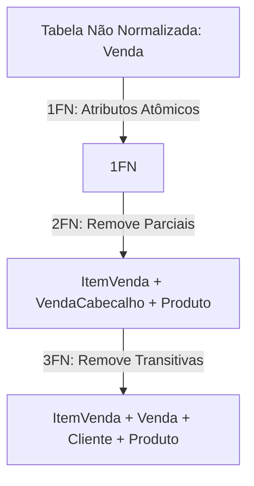

  
⬅️ <b><a href="/pt-br/resource/engenharia-de-computação/6-periodo/banco-de-dados/anotacoes/aula-03-sql-avancado-subconsultas-agrupamento-e-juncoes-complexas">Aula Anterior</a></b>

  
🏠 <b><a href="/pt-br/resource/engenharia-de-computação/6-periodo/banco-de-dados">Hub da Disciplina</a></b>

  
➡️ <b><a href="/pt-br/resource/engenharia-de-computação/6-periodo/banco-de-dados/anotacoes/aula-05-normalizacao-avancada-forma-normal-de-boyce-codd-bcnf-e-4fn">Próxima Aula</a></b>

> [!info] 📅 Informações da Aula
> - **Disciplina:** Banco de Dados (CSECBJI.44)
> - **Professor:** Sérgio
> - **Data Realizada:** 22/09/2026
> - **Tópico Principal:** Teoria da Normalização: Dependências Funcionais, 1FN, 2FN e 3FN
> - **Status:** Concluída e Revisada

> [!note] 📂 Material Complementar & Slides
> - 📄 **Slides Oficiais:** [[slide-04-banco-de-dados|Acessar Apresentação em PDF]]
> - 🎥 **Short Lecture / Gravação:** [[video-04-banco-de-dados|Assistir Síntese da Aula (Vídeo)]]

---

### 📑 Resumo das Seções
- [📌 1. Anotações do Quadro: Teoria da Normalização: Dependências Funcionais, 1FN, 2FN e 3FN](#-anotações-do-quadro-teoria-da-normalização-dependências-funcionais,-1fn,-2fn-e-3fn)
- [🧮 2. Formulação & Exemplo Prático Resolvido](#-formulação--exemplo-prático-resolvido)
- [📊 3. Esquema Visual & Fluxograma (Mermaid)](#-esquema-visual--fluxograma-mermaid)
- [🧠 4. Resumo Pessoal & Macetes do Professor](#-resumo-pessoal--macetes-do-professor)
- [📝 5. Dúvidas & Exercícios Recomendados para Casa](#-dúvidas--exercícios-recomendados-para-casa)

---

## 📌 Anotações do Quadro: Teoria da Normalização: Dependências Funcionais, 1FN, 2FN e 3FN

### 4.1 Teoria da Normalização e Anomalias de Esquema
O objetivo da normalização é eliminar redundâncias de dados e anomalias de atualização, inserção e exclusão através da decomposição de relações.

### 4.2 Dependências Funcionais (DFs)
Dada uma relação $R$, a dependência funcional $X \to Y$ afirma que se duas tuplas concordam nos valores dos atributos de $X$, elas devem obrigatoriamente concordar nos atributos de $Y$.

**Axiomas de Armstrong (Regras de Inferência):**
1. **Reflexividade:** Se $Y \subseteq X$, então $X \to Y$.
2. **Aumento:** Se $X \to Y$, então $X Z \to Y Z$.
3. **Transitividade:** Se $X \to Y$ e $Y \to Z$, então $X \to Z$.

### 4.3 Formas Normais Fundamentais
- **Primeira Forma Normal (1FN):** Todos os atributos devem ser atômicos (indivisíveis, sem listas ou atributos multivalorados/compostos).
- **Segunda Forma Normal (2FN):** Está em 1FN e todo atributo não-chave depende **totalmente** de toda a chave primária (sem dependência parcial de parte da $PK$ composta).
- **Terceira Forma Normal (3FN):** Está em 2FN e nenhum atributo não-chave depende transitivamente de outra coluna não-chave ($X \to Y \to Z$).

---

## 🧮 Formulação & Exemplo Prático Resolvido

### ✏️ Normalização Passo a Passo de uma Tabela Não-Normalizada

**Tabela Original:** `Venda(id_venda, id_cliente, nome_cliente, id_prod, nome_prod, qtd, preco_unit)`
Chave Primária: `{id_venda, id_prod}`

**Passo 1 (1FN):**
Garante valores atômicos por célula.

**Passo 2 (2FN - Eliminar Dependências Parciais):**
- `id_venda, id_prod -> qtd` (Dependência Total)
- `id_venda -> id_cliente, nome_cliente` (Dependência Parcial de `id_venda`)
- `id_prod -> nome_prod, preco_unit` (Dependência Parcial de `id_prod`)
- *Decomposição:*
  - `ItemVenda(id_venda, id_prod, qtd)`
  - `VendaCabecalho(id_venda, id_cliente, nome_cliente)`
  - `Produto(id_prod, nome_prod, preco_unit)`

**Passo 3 (3FN - Eliminar Dependências Transitivas):**
Em `VendaCabecalho`: `id_venda -> id_cliente` e `id_cliente -> nome_cliente`.
- *Decomposição Final:*
  - `Venda(id_venda, id_cliente)`
  - `Cliente(id_cliente, nome_cliente)`

---

## 📊 Esquema Visual & Fluxograma (Mermaid)

---

## 🧠 Resumo Pessoal & Macetes do Professor

| Conceito-Chave | *Takeaway* do Professor | Dicas de Prova / Atenção |
| :--- | :--- | :--- |
| **Identificação Rápida de 2FN** | Se a chave primária da tabela for simples (um único atributo), ela automaticamente já está na 2FN! | A 2FN só é violada se a PK for COMPOSTA e houver dependência parcial. |
| **Regra Prática da 3FN** | Cada atributo não-chave deve depender 'da chave, de toda a chave e de nada além da chave' (Kent, 1983). | Aplicação prática direta |

---

## 📝 Dúvidas & Exercícios Recomendados para Casa

1. Dada a relação $R(A, B, C, D, E)$ com $DFs: \{A 	o B, BC 	o D, D 	o E\}$, determine a chave candidata de $R$.
2. Identifique em qual forma normal a relação $R$ se encontra e normalize-a até a 3FN.

---

  
⬅️ <b><a href="/pt-br/resource/engenharia-de-computação/6-periodo/banco-de-dados/anotacoes/aula-03-sql-avancado-subconsultas-agrupamento-e-juncoes-complexas">Aula Anterior</a></b>

  
🏠 <b><a href="/pt-br/resource/engenharia-de-computação/6-periodo/banco-de-dados">Hub da Disciplina</a></b>

  
➡️ <b><a href="/pt-br/resource/engenharia-de-computação/6-periodo/banco-de-dados/anotacoes/aula-05-normalizacao-avancada-forma-normal-de-boyce-codd-bcnf-e-4fn">Próxima Aula</a></b>

