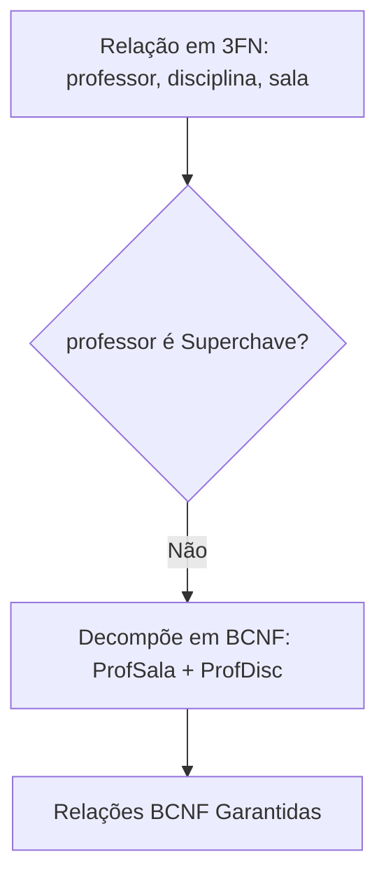

  
⬅️ <b><a href="/pt-br/resource/engenharia-de-computação/6-periodo/banco-de-dados/anotacoes/aula-04-teoria-da-normalizacao-dependencias-funcionais-1fn-2fn-e-3fn">Aula Anterior</a></b>

  
🏠 <b><a href="/pt-br/resource/engenharia-de-computação/6-periodo/banco-de-dados">Hub da Disciplina</a></b>

  
➡️ <b><a href="/pt-br/resource/engenharia-de-computação/6-periodo/banco-de-dados/anotacoes/aula-06-estruturas-de-armazenamento-e-indexacao-arvores-b-e-b">Próxima Aula</a></b>

> [!info] 📅 Informações da Aula
> - **Disciplina:** Banco de Dados (CSECBJI.44)
> - **Professor:** Sérgio
> - **Data Realizada:** 29/09/2026
> - **Tópico Principal:** Normalização Avançada: Forma Normal de Boyce-Codd (BCNF) e 4FN
> - **Status:** Concluída e Revisada

> [!note] 📂 Material Complementar & Slides
> - 📄 **Slides Oficiais:** [[slide-05-banco-de-dados|Acessar Apresentação em PDF]]
> - 🎥 **Short Lecture / Gravação:** [[video-05-banco-de-dados|Assistir Síntese da Aula (Vídeo)]]

---

### 📑 Resumo das Seções
- [📌 1. Anotações do Quadro: Normalização Avançada: Forma Normal de Boyce-Codd (BCNF) e 4FN](#-anotações-do-quadro-normalização-avançada-forma-normal-de-boyce-codd-bcnf-e-4fn)
- [🧮 2. Formulação & Exemplo Prático Resolvido](#-formulação--exemplo-prático-resolvido)
- [📊 3. Esquema Visual & Fluxograma (Mermaid)](#-esquema-visual--fluxograma-mermaid)
- [🧠 4. Resumo Pessoal & Macetes do Professor](#-resumo-pessoal--macetes-do-professor)
- [📝 5. Dúvidas & Exercícios Recomendados para Casa](#-dúvidas--exercícios-recomendados-para-casa)

---

## 📌 Anotações do Quadro: Normalização Avançada: Forma Normal de Boyce-Codd (BCNF) e 4FN

### 5.1 Forma Normal de Boyce-Codd (BCNF)
Uma relação $R$ está na **BCNF** se, para toda dependência funcional não-trivial $X \to Y$, **$X$ for uma Superchave** de $R$.

A BCNF é mais rigorosa que a 3FN: enquanto a 3FN tolera que $Y$ seja um atributo primo (parte de alguma chave candidata), a BCNF exige que o determinante $X$ seja estritamente uma superchave.

### 5.2 Propriedades da Decomposição
1. **Junção Sem Perdas (*Lossless Join*):** A decomposição de $R$ em $R_1$ e $R_2$ é sem perdas se e somente se:
   $$(R_1 \cap R_2) \to R_1 \quad \text{ou} \quad (R_1 \cap R_2) \to R_2$$
2. **Preservação de Dependências:** Todas as DFs do conjunto original $F$ podem ser verificadas sem a necessidade de junções entre tabelas.

### 5.3 Quarta Forma Normal (4FN) e Dependências Multivaloradas
Uma **Dependência Multivalorada ($X \twoheadrightarrow Y$)** ocorre quando a presença de valores de $Y$ independe dos demais atributos da relação para um dado $X$. A 4FN elimina DMs independentes em uma mesma relação.

---

## 🧮 Formulação & Exemplo Prático Resolvido

### ✏️ Exemplo de Relação em 3FN que NÃO está em BCNF

Considere a alocação de salas e professores:
`Aula(professor, disciplina, sala)`
Com restrições:
1. `professor -> sala` (Cada professor leciona sempre na mesma sala)
2. `{disciplina, sala} -> professor` (Em uma dada sala e disciplina, há apenas um professor)

Chaves Candidatas: `{disciplina, sala}` e `{disciplina, professor}`.

- A relação está em 3FN porque em `professor -> sala`, o atributo `sala` é parte da chave `{disciplina, sala}` (atributo primo).
- **Não está em BCNF** porque `professor` não é uma superchave!

**Decomposição em BCNF:**
- `ProfSala(professor, sala)` (onde `professor` é PK)
- `ProfDisc(professor, disciplina)` (onde `{professor, disciplina}` é PK)

---

## 📊 Esquema Visual & Fluxograma (Mermaid)

---

## 🧠 Resumo Pessoal & Macetes do Professor

| Conceito-Chave | *Takeaway* do Professor | Dicas de Prova / Atenção |
| :--- | :--- | :--- |
| **3FN vs BCNF Trade-off** | Toda relação em BCNF está em 3FN, mas nem toda relação pode ser decomposta em BCNF mantendo a preservação de dependências. | Em casos raros de conflito, a indústria prefere a 3FN para manter integridade de DFs. |
| **Teste de Lossless Join** | A interseção das duas tabelas decompostas DEVE ser chave primária de pelo menos uma delas. | Aplicação prática direta |

---

## 📝 Dúvidas & Exercícios Recomendados para Casa

1. Mostre o algoritmo de decomposição em BCNF passo a passo para $R(A, B, C, D)$ com $A 	o B$, $B 	o C$, $C 	o D$.
2. Explique a dependência multivalorada existente na relação `Pessoa(cpf, telefone, email)` e normalize-a para a 4FN.

---

  
⬅️ <b><a href="/pt-br/resource/engenharia-de-computação/6-periodo/banco-de-dados/anotacoes/aula-04-teoria-da-normalizacao-dependencias-funcionais-1fn-2fn-e-3fn">Aula Anterior</a></b>

  
🏠 <b><a href="/pt-br/resource/engenharia-de-computação/6-periodo/banco-de-dados">Hub da Disciplina</a></b>

  
➡️ <b><a href="/pt-br/resource/engenharia-de-computação/6-periodo/banco-de-dados/anotacoes/aula-06-estruturas-de-armazenamento-e-indexacao-arvores-b-e-b">Próxima Aula</a></b>

