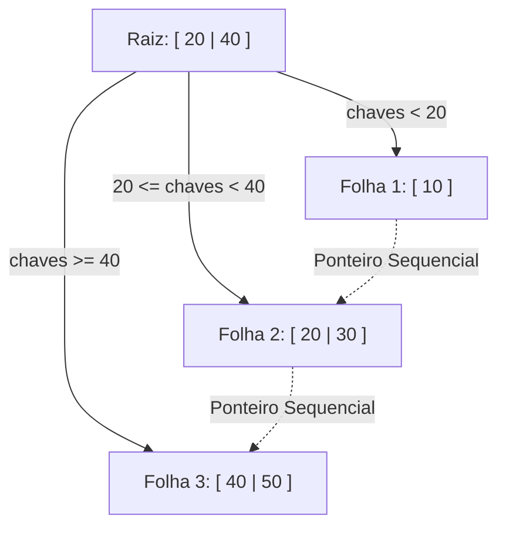

<div style="display: flex; justify-content: space-between; align-items: center; padding: 10px 16px; background: var(--light, #f8fafc); border: 1px solid var(--lightgray, #e2e8f0); border-radius: 10px; margin: 1.5rem 0;">
  <div>⬅️ <b><a href="/pt-br/resource/engenharia-de-computação/6-periodo/banco-de-dados/anotacoes/aula-05-normalizacao-avancada-forma-normal-de-boyce-codd-bcnf-e-4fn">Aula Anterior</a></b></div>
  <div>🏠 <b><a href="/pt-br/resource/engenharia-de-computação/6-periodo/banco-de-dados">Hub da Disciplina</a></b></div>
  <div>➡️ <b><a href="/pt-br/resource/engenharia-de-computação/6-periodo/banco-de-dados/anotacoes/aula-07-avaliacao-teorico-pratica-p1-algebra-sql-e-normalizacao">Próxima Aula</a></b></div>
</div>

> [!info] 📅 Informações da Aula
> - **Disciplina:** Banco de Dados (CSECBJI.44)
> - **Professor:** Sérgio
> - **Data Realizada:** 06/10/2026
> - **Tópico Principal:** Estruturas de Armazenamento e Indexação: Árvores B e B+
> - **Status:** Concluída e Revisada

> [!note] 📂 Material Complementar & Slides
> - 📄 **Slides Oficiais:** [[slide-06-banco-de-dados|Acessar Apresentação em PDF]]
> - 🎥 **Short Lecture / Gravação:** [[video-06-banco-de-dados|Assistir Síntese da Aula (Vídeo)]]

---

### 📑 Resumo das Seções
- [📌 1. Anotações do Quadro: Estruturas de Armazenamento e Indexação: Árvores B e B+](#-anotações-do-quadro-estruturas-de-armazenamento-e-indexação-árvores-b-e-b+)
- [🧮 2. Formulação & Exemplo Prático Resolvido](#-formulação--exemplo-prático-resolvido)
- [📊 3. Esquema Visual & Fluxograma (Mermaid)](#-esquema-visual--fluxograma-mermaid)
- [🧠 4. Resumo Pessoal & Macetes do Professor](#-resumo-pessoal--macetes-do-professor)
- [📝 5. Dúvidas & Exercícios Recomendados para Casa](#-dúvidas--exercícios-recomendados-para-casa)

---

## 📌 Anotações do Quadro: Estruturas de Armazenamento e Indexação: Árvores B e B+

### 6.1 Organização Física e Custos de I/O em Disco
A unidade básica de transferência de dados entre o armazenamento secundário (disco) e a memória RAM é o **Bloco / Página de Disco** (geralmente 4 KB ou 8 KB no PostgreSQL). O objetivo dos índices é minimizar a quantidade de leituras de blocos de disco.

### 6.2 Estrutura de Árvores B e Árvores B+
A **Árvore B+** é a estrutura de indexação padrão dos SGBDs modernos:
1. **Nós Internos (Roteamento):** Armazenam apenas chaves e ponteiros para nós filhos; não contêm registros de dados.
2. **Nós Folha (Dados):** Armazenam todas as chaves com ponteiros para as tuplas físicas (ou as próprias tuplas em índices clusterizados).
3. **Lista Duplamente Encadeada:** Todos os nós folha são interligados sequencialmente, permitindo varreduras por faixa (*Range Scans*, `BETWEEN`) com custo ótimo $O(\log n + k)$.

### 6.3 Operações Fundamentais
- **Busca Pontual:** Desce da raiz até a folha em tempo $O(h)$, onde $h = \lceil \log_B(N) \rceil$ (com fan-out $B \approx 100$, uma árvore com $10^7$ registros tem altura $h \le 4$).
- **Inserção e Divisão (*Split*):** Ao inserir em um nó cheio (com mais de $2d$ chaves), divide o nó em dois nós com $d$ chaves e promove a chave mediana para o nó pai.

---

## 🧮 Formulação & Exemplo Prático Resolvido

### ✏️ Simulação de Inserção e Split em Árvore B+ de Ordem $M=3$

Considere inserções sequenciais: `[10, 20, 30, 40, 50]`

1. Insere `10, 20`: Nó folha `[10 | 20]`
2. Insere `30`: Folha estoura. Divide: Folha 1 `[10]`, Folha 2 `[20 | 30]`, promove `20` para a Raiz.
   ```text
         [ 20 ]
        /      \\
     [ 10 ] -> [ 20 | 30 ]
   ```
3. Insere `40, 50`: A folha direita divide novamente, promovendo `40` para a raiz `[20 | 40]`.

**Índices no PostgreSQL:**
```sql
CREATE INDEX idx_aluno_cra ON aluno USING btree (cra);
```

---

## 📊 Esquema Visual & Fluxograma (Mermaid)



---

## 🧠 Resumo Pessoal & Macetes do Professor

| Conceito-Chave | *Takeaway* do Professor | Dicas de Prova / Atenção |
| :--- | :--- | :--- |
| **Por que Árvore B+ e não Árvore B?** | A Árvore B+ armazena mais chaves por nó interno (maior fan-out e menor altura) e nós folha encadeados aceleram consultas de faixa (`> 100 AND < 500`). | Árvores binárias (AVL, Red-Black) são péssimas para disco por causa da alta altura. |
| **Índice Clusterizado vs Não-Clusterizado** | O índice clusterizado define a ordem física real das tuplas no arquivo de dados (só pode haver 1 por tabela). | Aplicação prática direta |

---

## 📝 Dúvidas & Exercícios Recomendados para Casa

1. Calcule a altura máxima de uma árvore B+ com ordem $M=100$ capaz de indexar 1.000.000 de registros.
2. Desenhe a estrutura da árvore B+ após a inserção dos valores 5, 15, 25, 35, 45 em uma árvore vazia de ordem 3.

---

<div style="display: flex; justify-content: space-between; align-items: center; padding: 10px 16px; background: var(--light, #f8fafc); border: 1px solid var(--lightgray, #e2e8f0); border-radius: 10px; margin: 1.5rem 0;">
  <div>⬅️ <b><a href="/pt-br/resource/engenharia-de-computação/6-periodo/banco-de-dados/anotacoes/aula-05-normalizacao-avancada-forma-normal-de-boyce-codd-bcnf-e-4fn">Aula Anterior</a></b></div>
  <div>🏠 <b><a href="/pt-br/resource/engenharia-de-computação/6-periodo/banco-de-dados">Hub da Disciplina</a></b></div>
  <div>➡️ <b><a href="/pt-br/resource/engenharia-de-computação/6-periodo/banco-de-dados/anotacoes/aula-07-avaliacao-teorico-pratica-p1-algebra-sql-e-normalizacao">Próxima Aula</a></b></div>
</div>
