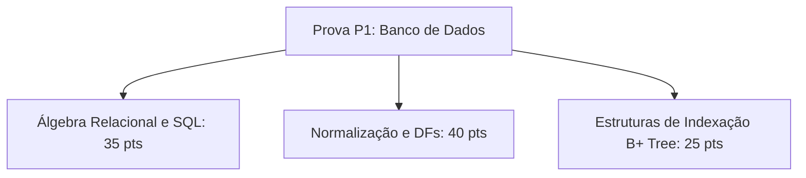

  
⬅️ <b><a href="/pt-br/resource/engenharia-de-computação/6-periodo/banco-de-dados/anotacoes/aula-06-estruturas-de-armazenamento-e-indexacao-arvores-b-e-b">Aula Anterior</a></b>

  
🏠 <b><a href="/pt-br/resource/engenharia-de-computação/6-periodo/banco-de-dados">Hub da Disciplina</a></b>

  
➡️ <b><a href="/pt-br/resource/engenharia-de-computação/6-periodo/banco-de-dados/anotacoes/aula-08-processamento-e-otimizacao-de-consultas">Próxima Aula</a></b>

> [!info] 📅 Informações da Aula
> - **Disciplina:** Banco de Dados (CSECBJI.44)
> - **Professor:** Sérgio
> - **Data Realizada:** 13/10/2026
> - **Tópico Principal:** Avaliação Teórico-Prática P1 (Álgebra, SQL e Normalização)
> - **Status:** Concluída e Revisada

> [!note] 📂 Material Complementar & Slides
> - 📄 **Slides Oficiais:** [[slide-07-banco-de-dados|Acessar Apresentação em PDF]]
> - 🎥 **Short Lecture / Gravação:** [[video-07-banco-de-dados|Assistir Síntese da Aula (Vídeo)]]

---

### 📑 Resumo das Seções
- [📌 1. Anotações do Quadro: Avaliação Teórico-Prática P1 (Álgebra, SQL e Normalização)](#-anotações-do-quadro-avaliação-teórico-prática-p1-álgebra,-sql-e-normalização)
- [🧮 2. Formulação & Exemplo Prático Resolvido](#-formulação--exemplo-prático-resolvido)
- [📊 3. Esquema Visual & Fluxograma (Mermaid)](#-esquema-visual--fluxograma-mermaid)
- [🧠 4. Resumo Pessoal & Macetes do Professor](#-resumo-pessoal--macetes-do-professor)
- [📝 5. Dúvidas & Exercícios Recomendados para Casa](#-dúvidas--exercícios-recomendados-para-casa)

---

## 📌 Anotações do Quadro: Avaliação Teórico-Prática P1 (Álgebra, SQL e Normalização)

### 7.1 Síntese Conceitual para Avaliação Parcial P1
A avaliação teórica e prática P1 consolida os pilares relacionais:
1. **Modelo Relacional e Álgebra:**
   - Domínios, relações, superchaves, chaves primárias e integridade referencial.
   - Tradução formal entre Álgebra Relacional e consultas declarativas em SQL.
2. **SQL Avançado:**
   - Agrupamento, funções analíticas, `HAVING`, CTEs e subconsultas correlacionadas.
3. **Normalização de Esquemas:**
   - Fecho de dependências funcionais ($F^+$) e cálculo de chaves candidatas.
   - Decomposição estrita em 1FN, 2FN, 3FN e BCNF com verificação de *lossless join*.
4. **Armazenamento:**
   - Funcionamento mecânico de índices em Árvores B+.

---

## 🧮 Formulação & Exemplo Prático Resolvido

### ✏️ Resolução de Exercício Típico de Prova P1

**Problema:** Dada a relação $R(A, B, C, D, E, G)$ com $F = \{AB \to C, C \to D, D \to E, E \to G, G \to A\}$.
1. Determine o fecho de $\{A, B\}$: $(AB)^+ = \{A, B, C, D, E, G\} \implies AB$ é chave candidata.
2. Encontre as demais chaves: como $G \to A$, $\{G, B\}$ é chave; como $E \to G$, $\{E, B\}$ é chave; como $D \to E$, $\{D, B\}$ é chave; como $C \to D$, $\{C, B\}$ é chave.
3. Classifique a forma normal:
   - Em $C \to D$, $C$ não é superchave, mas $D$ é atributo primo (pertence à chave $\{D, B\}$).
   - Logo, $R$ está em **3FN**, mas **NÃO está em BCNF**!

---

## 📊 Esquema Visual & Fluxograma (Mermaid)

---

## 🧠 Resumo Pessoal & Macetes do Professor

| Conceito-Chave | *Takeaway* do Professor | Dicas de Prova / Atenção |
| :--- | :--- | :--- |
| **Roteiro para Prova de DFs** | 1. Calcule o fecho do lado esquerdo de cada DF; 2. Encontre todas as chaves candidatas; 3. Liste atributos primos e não-primos; 4. Teste 2FN, 3FN e BCNF sequencialmente. | Não pule etapas! |
| **Atenção com DISTINCT no SQL** | O operador DISTINCT tem alto custo de ordenação/hashing na CPU do banco. | Aplicação prática direta |

---

## 📝 Dúvidas & Exercícios Recomendados para Casa

1. Revise todos os exercícios das listas 1 a 6.
2. Refaça a normalização completa de um esquema de clínicas médicas com médicos, pacientes e consultas.

---

  
⬅️ <b><a href="/pt-br/resource/engenharia-de-computação/6-periodo/banco-de-dados/anotacoes/aula-06-estruturas-de-armazenamento-e-indexacao-arvores-b-e-b">Aula Anterior</a></b>

  
🏠 <b><a href="/pt-br/resource/engenharia-de-computação/6-periodo/banco-de-dados">Hub da Disciplina</a></b>

  
➡️ <b><a href="/pt-br/resource/engenharia-de-computação/6-periodo/banco-de-dados/anotacoes/aula-08-processamento-e-otimizacao-de-consultas">Próxima Aula</a></b>

