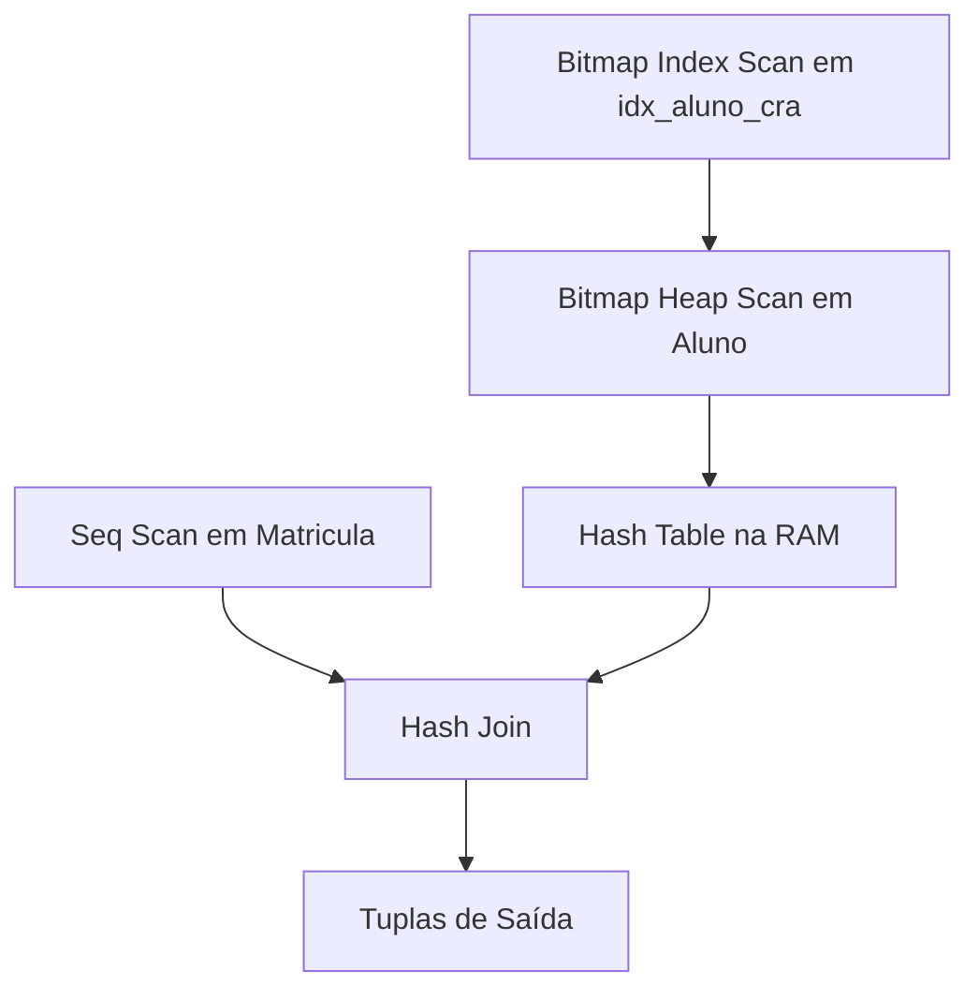

<div style="display: flex; justify-content: space-between; align-items: center; padding: 10px 16px; background: var(--light, #f8fafc); border: 1px solid var(--lightgray, #e2e8f0); border-radius: 10px; margin: 1.5rem 0;">
  <div>⬅️ <b><a href="/pt-br/resource/engenharia-de-computação/6-periodo/banco-de-dados/anotacoes/aula-07-avaliacao-teorico-pratica-p1-algebra-sql-e-normalizacao">Aula Anterior</a></b></div>
  <div>🏠 <b><a href="/pt-br/resource/engenharia-de-computação/6-periodo/banco-de-dados">Hub da Disciplina</a></b></div>
  <div>➡️ <b><a href="/pt-br/resource/engenharia-de-computação/6-periodo/banco-de-dados/anotacoes/aula-09-gerenciamento-de-transacoes-e-propriedades-acid">Próxima Aula</a></b></div>
</div>

> [!info] 📅 Informações da Aula
> - **Disciplina:** Banco de Dados (CSECBJI.44)
> - **Professor:** Sérgio
> - **Data Realizada:** 20/10/2026
> - **Tópico Principal:** Processamento e Otimização de Consultas
> - **Status:** Concluída e Revisada

> [!note] 📂 Material Complementar & Slides
> - 📄 **Slides Oficiais:** [[slide-08-banco-de-dados|Acessar Apresentação em PDF]]
> - 🎥 **Short Lecture / Gravação:** [[video-08-banco-de-dados|Assistir Síntese da Aula (Vídeo)]]

---

### 📑 Resumo das Seções
- [📌 1. Anotações do Quadro: Processamento e Otimização de Consultas](#-anotações-do-quadro-processamento-e-otimização-de-consultas)
- [🧮 2. Formulação & Exemplo Prático Resolvido](#-formulação--exemplo-prático-resolvido)
- [📊 3. Esquema Visual & Fluxograma (Mermaid)](#-esquema-visual--fluxograma-mermaid)
- [🧠 4. Resumo Pessoal & Macetes do Professor](#-resumo-pessoal--macetes-do-professor)
- [📝 5. Dúvidas & Exercícios Recomendados para Casa](#-dúvidas--exercícios-recomendados-para-casa)

---

## 📌 Anotações do Quadro: Processamento e Otimização de Consultas

### 8.1 Fases do Processamento de Consultas
O processador de consultas (*Query Engine*) converte uma instrução declarativa em SQL em um plano físico de execução executável:
```text
SQL Text ──▶ Parser & Catalog ──▶ Árvore Álgebrica ──▶ Otimizador de Consultas ──▶ Plano de Execução Físico ──▶ Motor de Execução
```

### 8.2 Algoritmos de Junção Física
1. **Nested Loop Join:** Para cada tupla da tabela externa, varre a tabela interna. Excelente se a tabela interna possuir índice na chave de junção (*Index Nested Loop*).
2. **Hash Join:** Constrói uma tabela hash na memória com a menor relação (*Build Phase*) e varre a relação maior buscando correspondências (*Probe Phase*). Ideal para relações grandes não ordenadas.
3. **Sort-Merge Join:** Ordena ambas as relações pelas chaves de junção e realiza uma varredura paralela linear. Ideal quando os dados já estão ordenados por índice B+.

### 8.3 Otimização Baseada em Custo (CBO)
O otimizador calcula o custo estimado de CPU e E/S usando estatísticas coletadas no catálogo do banco (histogramas, número de páginas, cardinalidade).

---

## 🧮 Formulação & Exemplo Prático Resolvido

### ✏️ Análise de Plano de Execução com `EXPLAIN ANALYZE` no PostgreSQL

```sql
EXPLAIN ANALYZE
SELECT a.nome, m.nota 
FROM aluno a 
JOIN matricula m ON a.matricula = m.matricula 
WHERE a.cra > 8.5;
```

**Interpretação da Saída:**
- `Hash Join (cost=12.50..45.80 rows=120 width=64) (actual time=0.082..0.345 rows=115 loops=1)`
  - `Hash Cond: (m.matricula = a.matricula)`
  - `-> Seq Scan on matricula m ...`
  - `-> Hash ...`
    - `-> Bitmap Heap Scan on aluno a ...`
      - `Recheck Cond: (cra > 8.5)`
      - `-> Bitmap Index Scan on idx_aluno_cra ...`

O otimizador utilizou busca no índice B+ para filtrar alunos com CRA alto e combinou com matrículas via Hash Join em apenas 0.345 ms!

---

## 📊 Esquema Visual & Fluxograma (Mermaid)



---

## 🧠 Resumo Pessoal & Macetes do Professor

| Conceito-Chave | *Takeaway* do Professor | Dicas de Prova / Atenção |
| :--- | :--- | :--- |
| **Seq Scan vs Index Scan** | Se a consulta filtrar mais de 15% a 20% das linhas de uma tabela, o otimizador prefere um Sequential Scan direto, pois acessos aleatórios no índice tornam-se mais lentos que leitura sequencial em bloco. | Ter um índice não garante que ele será usado. |
| **Atualização de Estatísticas** | Execute `ANALYZE nome_tabela;` regularmente para manter os histogramas de estatísticas calibrados. | Aplicação prática direta |

---

## 📝 Dúvidas & Exercícios Recomendados para Casa

1. Explique a diferença funcional e de complexidade entre o Nested Loop Join e o Hash Join.
2. Utilize o `EXPLAIN ANALYZE` em um banco local e compare o plano de uma consulta antes e após a criação de um índice.

---

<div style="display: flex; justify-content: space-between; align-items: center; padding: 10px 16px; background: var(--light, #f8fafc); border: 1px solid var(--lightgray, #e2e8f0); border-radius: 10px; margin: 1.5rem 0;">
  <div>⬅️ <b><a href="/pt-br/resource/engenharia-de-computação/6-periodo/banco-de-dados/anotacoes/aula-07-avaliacao-teorico-pratica-p1-algebra-sql-e-normalizacao">Aula Anterior</a></b></div>
  <div>🏠 <b><a href="/pt-br/resource/engenharia-de-computação/6-periodo/banco-de-dados">Hub da Disciplina</a></b></div>
  <div>➡️ <b><a href="/pt-br/resource/engenharia-de-computação/6-periodo/banco-de-dados/anotacoes/aula-09-gerenciamento-de-transacoes-e-propriedades-acid">Próxima Aula</a></b></div>
</div>
