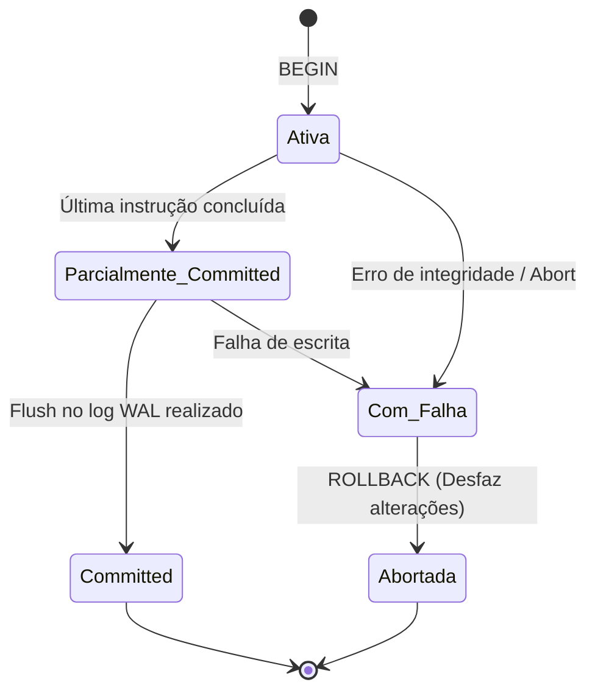

<div style="display: flex; justify-content: space-between; align-items: center; padding: 10px 16px; background: var(--light, #f8fafc); border: 1px solid var(--lightgray, #e2e8f0); border-radius: 10px; margin: 1.5rem 0;">
  <div>⬅️ <b><a href="/pt-br/resource/engenharia-de-computação/6-periodo/banco-de-dados/anotacoes/aula-08-processamento-e-otimizacao-de-consultas">Aula Anterior</a></b></div>
  <div>🏠 <b><a href="/pt-br/resource/engenharia-de-computação/6-periodo/banco-de-dados">Hub da Disciplina</a></b></div>
  <div>➡️ <b><a href="/pt-br/resource/engenharia-de-computação/6-periodo/banco-de-dados/anotacoes/aula-10-controle-de-concorrencia-bloqueio-em-duas-fases-2pl-e-timestamps">Próxima Aula</a></b></div>
</div>

> [!info] 📅 Informações da Aula
> - **Disciplina:** Banco de Dados (CSECBJI.44)
> - **Professor:** Sérgio
> - **Data Realizada:** 27/10/2026
> - **Tópico Principal:** Gerenciamento de Transações e Propriedades ACID
> - **Status:** Concluída e Revisada

> [!note] 📂 Material Complementar & Slides
> - 📄 **Slides Oficiais:** [[slide-09-banco-de-dados|Acessar Apresentação em PDF]]
> - 🎥 **Short Lecture / Gravação:** [[video-09-banco-de-dados|Assistir Síntese da Aula (Vídeo)]]

---

### 📑 Resumo das Seções
- [📌 1. Anotações do Quadro: Gerenciamento de Transações e Propriedades ACID](#-anotações-do-quadro-gerenciamento-de-transações-e-propriedades-acid)
- [🧮 2. Formulação & Exemplo Prático Resolvido](#-formulação--exemplo-prático-resolvido)
- [📊 3. Esquema Visual & Fluxograma (Mermaid)](#-esquema-visual--fluxograma-mermaid)
- [🧠 4. Resumo Pessoal & Macetes do Professor](#-resumo-pessoal--macetes-do-professor)
- [📝 5. Dúvidas & Exercícios Recomendados para Casa](#-dúvidas--exercícios-recomendados-para-casa)

---

## 📌 Anotações do Quadro: Gerenciamento de Transações e Propriedades ACID

### 9.1 Conceito Formal de Transação
Uma **Transação** é uma unidade lógica de execução atômica composta por um conjunto de operações de leitura e escrita no banco de dados (`BEGIN TRANSACTION ... COMMIT / ROLLBACK`).

### 9.2 As Propriedades ACID
- **Atomicidade (*Atomicity*):** "Tudo ou nada". Ou todas as operações da transação são efetivadas com sucesso, ou nenhuma modificação persiste.
- **Consistência (*Consistency*):** A transação leva o banco de um estado válido a outro estado válido, respeitando todas as regras de integridade e restrições.
- **Isolamento (*Isolation*):** A execução concorrente de múltiplas transações não deve interferir mutuamente, produzindo um resultado idêntico a uma execução serial.
- **Durabilidade (*Durability*):** Uma vez confirmada (*COMMIT*), as alterações persistem no banco mesmo em caso de pane do servidor ou falha de energia.

### 9.3 Anomalias de Concorrência e Níveis de Isolamento ANSI SQL

| Nível de Isolamento | Leitura Suja (*Dirty Read*) | Leitura Não-Repetível | Leitura Fantasma (*Phantom*) |
| :--- | :--- | :--- | :--- |
| **Read Uncommitted** | Possível | Possível | Possível |
| **Read Committed** (Padrão PG) | **Impedida** | Possível | Possível |
| **Repeatable Read** | **Impedida** | **Impedida** | Possível |
| **Serializable** | **Impedida** | **Impedida** | **Impedida** |

---

## 🧮 Formulação & Exemplo Prático Resolvido

### ✏️ Simulação de Transferência Bancária com Rollback Automático

```sql
BEGIN;

-- 1. Debita conta origem
UPDATE conta SET saldo = saldo - 500.00 WHERE id = 1;

-- 2. Credita conta destino
UPDATE conta SET saldo = saldo + 500.00 WHERE id = 2;

-- Validação de integridade: se saldo ficar negativo, aborta
DO $$
BEGIN
    IF (SELECT saldo FROM conta WHERE id = 1) < 0 THEN
        RAISE EXCEPTION 'Saldo insuficiente para transferência!';
    END IF;
END $$;

COMMIT;
-- Em caso de erro em qualquer instrução, o SGBD executa ROLLBACK automaticamente.
```

---

## 📊 Esquema Visual & Fluxograma (Mermaid)



---

## 🧠 Resumo Pessoal & Macetes do Professor

| Conceito-Chave | *Takeaway* do Professor | Dicas de Prova / Atenção |
| :--- | :--- | :--- |
| **Leitura Suja vs Leitura Fantasma** | Leitura Suja lê dados não-comitados que podem sofrer rollback; Leitura Fantasma ocorre quando uma transação relê um intervalo e encontra NOVAS linhas inseridas por outra transação comitada. | Repeatable Read em PostgreSQL implementa Snapshot Isolation que previne até fantasmas. |
| **Auto-Commit** | No PostgreSQL interativo, comandos fora de bloco `BEGIN ... COMMIT` operam em modo auto-commit implícito. | Aplicação prática direta |

---

## 📝 Dúvidas & Exercícios Recomendados para Casa

1. Descreva detalhadamente o fenômeno de Leitura Não-Repetível (*Non-Repeatable Read*) com um exemplo de linha do tempo entre duas transações $T_1$ e $T_2$.
2. Explique como o mecanismo de MVCC (*Multi-Version Concurrency Control*) permite leituras não-bloqueantes em PostgreSQL.

---

<div style="display: flex; justify-content: space-between; align-items: center; padding: 10px 16px; background: var(--light, #f8fafc); border: 1px solid var(--lightgray, #e2e8f0); border-radius: 10px; margin: 1.5rem 0;">
  <div>⬅️ <b><a href="/pt-br/resource/engenharia-de-computação/6-periodo/banco-de-dados/anotacoes/aula-08-processamento-e-otimizacao-de-consultas">Aula Anterior</a></b></div>
  <div>🏠 <b><a href="/pt-br/resource/engenharia-de-computação/6-periodo/banco-de-dados">Hub da Disciplina</a></b></div>
  <div>➡️ <b><a href="/pt-br/resource/engenharia-de-computação/6-periodo/banco-de-dados/anotacoes/aula-10-controle-de-concorrencia-bloqueio-em-duas-fases-2pl-e-timestamps">Próxima Aula</a></b></div>
</div>
