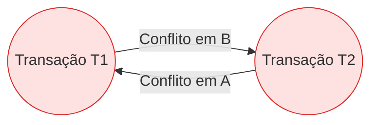

  
⬅️ <b><a href="/pt-br/resource/engenharia-de-computação/6-periodo/banco-de-dados/anotacoes/aula-09-gerenciamento-de-transacoes-e-propriedades-acid">Aula Anterior</a></b>

  
🏠 <b><a href="/pt-br/resource/engenharia-de-computação/6-periodo/banco-de-dados">Hub da Disciplina</a></b>

  
➡️ <b><a href="/pt-br/resource/engenharia-de-computação/6-periodo/banco-de-dados/anotacoes/aula-11-recuperacao-de-falhas-logs-wal-checkpoints-e-algoritmo-aries">Próxima Aula</a></b>

> [!info] 📅 Informações da Aula
> - **Disciplina:** Banco de Dados (CSECBJI.44)
> - **Professor:** Sérgio
> - **Data Realizada:** 03/11/2026
> - **Tópico Principal:** Controle de Concorrência: Bloqueio em Duas Fases (2PL) e Timestamps
> - **Status:** Concluída e Revisada

> [!note] 📂 Material Complementar & Slides
> - 📄 **Slides Oficiais:** [[slide-10-banco-de-dados|Acessar Apresentação em PDF]]
> - 🎥 **Short Lecture / Gravação:** [[video-10-banco-de-dados|Assistir Síntese da Aula (Vídeo)]]

---

### 📑 Resumo das Seções
- [📌 1. Anotações do Quadro: Controle de Concorrência: Bloqueio em Duas Fases (2PL) e Timestamps](#-anotações-do-quadro-controle-de-concorrência-bloqueio-em-duas-fases-2pl-e-timestamps)
- [🧮 2. Formulação & Exemplo Prático Resolvido](#-formulação--exemplo-prático-resolvido)
- [📊 3. Esquema Visual & Fluxograma (Mermaid)](#-esquema-visual--fluxograma-mermaid)
- [🧠 4. Resumo Pessoal & Macetes do Professor](#-resumo-pessoal--macetes-do-professor)
- [📝 5. Dúvidas & Exercícios Recomendados para Casa](#-dúvidas--exercícios-recomendados-para-casa)

---

## 📌 Anotações do Quadro: Controle de Concorrência: Bloqueio em Duas Fases (2PL) e Timestamps

### 10.1 Serializabilidade e Grafos de Precedência
Um escalonamento concorrente $S$ de transações é **serializável por conflito** se for equivalente a algum escalonamento serial.
- **Conflito:** Duas operações consecutivas de transações distintas entram em conflito se acessam o mesmo item de dado $X$ e pelo menos uma delas é de escrita ($\text{write}(X)$).
- **Grafo de Precedência (Grafo de Serializabilidade):** Cria-se uma aresta $T_i \to T_j$ se $T_i$ executa uma operação conflitante antes de $T_j$. Se o grafo **não tiver ciclos**, o escalonamento é serializável!

### 10.2 Protocolo de Bloqueio em Duas Fases (2PL - *Two-Phase Locking*)
Garante serializabilidade através de duas fases obrigatórias:
1. **Fase de Crescimento (*Growing Phase*):** A transação pode adquirir bloqueios compartilhados ($S$) ou exclusivos ($X$), mas **não pode liberar nenhum bloqueio**.
2. **Fase de Encolhimento (*Shrinking Phase*):** A transação libera bloqueios, mas **não pode solicitar nenhum novo bloqueio**.

Variantes:
- **2PL Estrito (*Strict 2PL*):** Mantém todos os bloqueios exclusivos ($X$) até o *COMMIT/ROLLBACK* (evita abortos em cascata).
- **2PL Rigoroso (*Rigorous 2PL*):** Mantém TODOS os bloqueios ($S$ e $X$) até o fim da transação.

### 10.3 Tratamento de Deadlocks
- **Wait-Die:** Se transação mais velha precisa de recurso da mais jovem, ela espera; se a mais jovem precisa de recurso da mais velha, ela morre (*kill*).
- **Wound-Wait:** Se transação mais velha precisa de recurso da jovem, ela 'fere' a jovem e toma o recurso; se jovem precisa da velha, ela espera.

---

## 🧮 Formulação & Exemplo Prático Resolvido

### ✏️ Análise de Serializabilidade via Grafo de Conflito

Considere o escalonamento:
$$S: r_1(A); \; r_2(A); \; w_1(A); \; r_1(B); \; w_2(B); \; w_1(B); \; c_1; \; c_2;$$

**Identificação de Conflitos:**
1. $r_2(A)$ antes de $w_1(A) \implies T_2 \to T_1$
2. $r_1(B)$ antes de $w_2(B) \implies T_1 \to T_2$

**Diagnóstico:**
Existe ciclo direcionado $T_1 \rightleftarrows T_2$. O escalonamento **NÃO é serializável por conflito** e causará inconsistências se executado concorrentemente!

---

## 📊 Esquema Visual & Fluxograma (Mermaid)

---

## 🧠 Resumo Pessoal & Macetes do Professor

| Conceito-Chave | *Takeaway* do Professor | Dicas de Prova / Atenção |
| :--- | :--- | :--- |
| **2PL e Deadlocks** | O protocolo 2PL garante serializabilidade, mas NÃO impede deadlocks! O SGBD precisa de um módulo de detecção de ciclo no grafo de espera (*Wait-For Graph*). | Cuidado: 2PL evita anomalias, mas pode causar impasses. |
| **Bloqueios Compartilhados vs Exclusivos** | Leituras pedem Shared Lock (`SELECT ... FOR SHARE`); Escritas pedem Exclusive Lock (`SELECT ... FOR UPDATE`). | Aplicação prática direta |

---

## 📝 Dúvidas & Exercícios Recomendados para Casa

1. Construa o grafo de precedência para o escalonamento $S: r_1(X); r_3(X); w_1(X); r_2(Y); w_3(Y); c_1; c_2; c_3;$ e verifique se é serializável.
2. Explique a diferença entre detecção de deadlocks por Grafo de Espera (*Wait-For Graph*) e prevenção por Timeouts.

---

  
⬅️ <b><a href="/pt-br/resource/engenharia-de-computação/6-periodo/banco-de-dados/anotacoes/aula-09-gerenciamento-de-transacoes-e-propriedades-acid">Aula Anterior</a></b>

  
🏠 <b><a href="/pt-br/resource/engenharia-de-computação/6-periodo/banco-de-dados">Hub da Disciplina</a></b>

  
➡️ <b><a href="/pt-br/resource/engenharia-de-computação/6-periodo/banco-de-dados/anotacoes/aula-11-recuperacao-de-falhas-logs-wal-checkpoints-e-algoritmo-aries">Próxima Aula</a></b>

