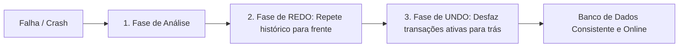

<div style="display: flex; justify-content: space-between; align-items: center; padding: 10px 16px; background: var(--light, #f8fafc); border: 1px solid var(--lightgray, #e2e8f0); border-radius: 10px; margin: 1.5rem 0;">
  <div>⬅️ <b><a href="/pt-br/resource/engenharia-de-computação/6-periodo/banco-de-dados/anotacoes/aula-10-controle-de-concorrencia-bloqueio-em-duas-fases-2pl-e-timestamps">Aula Anterior</a></b></div>
  <div>🏠 <b><a href="/pt-br/resource/engenharia-de-computação/6-periodo/banco-de-dados">Hub da Disciplina</a></b></div>
  <div>➡️ <b><a href="/pt-br/resource/engenharia-de-computação/6-periodo/banco-de-dados/anotacoes/aula-12-programacao-no-banco-stored-procedures-e-triggers-em-pl-pgsql">Próxima Aula</a></b></div>
</div>

> [!info] 📅 Informações da Aula
> - **Disciplina:** Banco de Dados (CSECBJI.44)
> - **Professor:** Sérgio
> - **Data Realizada:** 10/11/2026
> - **Tópico Principal:** Recuperação de Falhas: Logs WAL, Checkpoints e Algoritmo ARIES
> - **Status:** Concluída e Revisada

> [!note] 📂 Material Complementar & Slides
> - 📄 **Slides Oficiais:** [[slide-11-banco-de-dados|Acessar Apresentação em PDF]]
> - 🎥 **Short Lecture / Gravação:** [[video-11-banco-de-dados|Assistir Síntese da Aula (Vídeo)]]

---

### 📑 Resumo das Seções
- [📌 1. Anotações do Quadro: Recuperação de Falhas: Logs WAL, Checkpoints e Algoritmo ARIES](#-anotações-do-quadro-recuperação-de-falhas-logs-wal,-checkpoints-e-algoritmo-aries)
- [🧮 2. Formulação & Exemplo Prático Resolvido](#-formulação--exemplo-prático-resolvido)
- [📊 3. Esquema Visual & Fluxograma (Mermaid)](#-esquema-visual--fluxograma-mermaid)
- [🧠 4. Resumo Pessoal & Macetes do Professor](#-resumo-pessoal--macetes-do-professor)
- [📝 5. Dúvidas & Exercícios Recomendados para Casa](#-dúvidas--exercícios-recomendados-para-casa)

---

## 📌 Anotações do Quadro: Recuperação de Falhas: Logs WAL, Checkpoints e Algoritmo ARIES

### 11.1 Fundamentos de Recuperação e o Protocolo WAL
Para garantir Durabilidade e Atomicidade mesmo em quedas de energia e falhas de hardware, os SGBDs utilizam o protocolo **Write-Ahead Logging (WAL)**:
- **Regra Fundamental do WAL:** Nenhuma página de dados modificada no buffer da RAM pode ser gravada no disco permanente antes que os respectivos registros de log de alterações tenham sido gravados e sincronizados (*fsync*) no disco de log!

### 11.2 Checkpoints (Pontos de Verificação)
Para evitar ter que reprocessar todo o arquivo de log desde o início dos tempos durante uma recuperação pós-crash, o SGBD realiza **Checkpoints periódicos**:
1. Suspende a admissão de novas transações (ou usa checkpoint fuzzy).
2. Força a escrita de todas as páginas sujas (*dirty pages*) do buffer para o disco.
3. Grava um registro `<CHECKPOINT [lista_transacoes_ativas]>` no log WAL e sincroniza.

### 11.3 O Algoritmo de Recuperação ARIES (IBM)
Executa em três fases sequenciais:
1. **Fase de Análise:** Varre o log para frente a partir do último checkpoint para identificar transações ativas no momento da falha e páginas sujas.
2. **Fase de REDO (Repetir Histórico):** Varre o log para frente refazendo TODAS as operações de transações comitadas e não comitadas, restaurando o estado exato anterior ao crash.
3. **Fase de UNDO (Desfazer):** Varre o log para trás desfazendo as operações de todas as transações que estavam ativas (não comitadas) no momento da queda, emitindo registros CLR (*Compensation Log Records*).

---

## 🧮 Formulação & Exemplo Prático Resolvido

### ✏️ Rastreamento de Recuperação de Falhas com Log WAL

**Histórico no Log:**
```text
1. <T1 start>
2. <T1, A, 100, 150>
3. <T2 start>
4. <T2, B, 500, 600>
5. <T1 commit>
6. <T3 start>
7. <T3, C, 300, 350>
--- FALHA DE ENERGIA (CRASH DO SERVIDOR) ---
```

**Processo de Recuperação ARIES:**
- **Transações Comitadas:** $T_1 \implies$ Fase de **REDO** garante que $A=150$ persista no disco.
- **Transações Não-Comitadas:** $T_2$ e $T_3 \implies$ Fase de **UNDO** desfaz as alterações, restaurando $B=500$ e $C=300$.
- O banco reinicia em estado $100\%$ consistente!

---

## 📊 Esquema Visual & Fluxograma (Mermaid)



---

## 🧠 Resumo Pessoal & Macetes do Professor

| Conceito-Chave | *Takeaway* do Professor | Dicas de Prova / Atenção |
| :--- | :--- | :--- |
| **Steal vs No-Force Policy** | SGBDs modernos utilizam política *Steal* (páginas de transações não-comitadas podem ir ao disco, exigindo UNDO) e *No-Force* (páginas de transações comitadas não precisam ir ao disco imediatamente, exigindo REDO via log). | Garante máxima velocidade de I/O em operação normal. |
| **Log Sequencial** | Escrever no log WAL é muito mais rápido que gravar na tabela porque a escrita em log é puramente sequencial (*append-only*). | Aplicação prática direta |

---

## 📝 Dúvidas & Exercícios Recomendados para Casa

1. Explique a regra básica do protocolo Write-Ahead Logging (WAL) e por que ela é indispensável.
2. Dada uma sequência de registros de log com checkpoint, identifique quais transações sofrem REDO e quais sofrem UNDO.

---

<div style="display: flex; justify-content: space-between; align-items: center; padding: 10px 16px; background: var(--light, #f8fafc); border: 1px solid var(--lightgray, #e2e8f0); border-radius: 10px; margin: 1.5rem 0;">
  <div>⬅️ <b><a href="/pt-br/resource/engenharia-de-computação/6-periodo/banco-de-dados/anotacoes/aula-10-controle-de-concorrencia-bloqueio-em-duas-fases-2pl-e-timestamps">Aula Anterior</a></b></div>
  <div>🏠 <b><a href="/pt-br/resource/engenharia-de-computação/6-periodo/banco-de-dados">Hub da Disciplina</a></b></div>
  <div>➡️ <b><a href="/pt-br/resource/engenharia-de-computação/6-periodo/banco-de-dados/anotacoes/aula-12-programacao-no-banco-stored-procedures-e-triggers-em-pl-pgsql">Próxima Aula</a></b></div>
</div>
