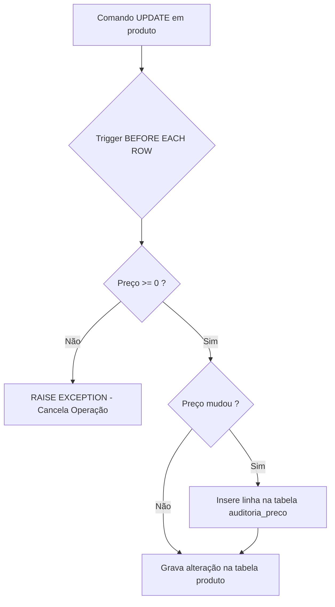

<div style="display: flex; justify-content: space-between; align-items: center; padding: 10px 16px; background: var(--light, #f8fafc); border: 1px solid var(--lightgray, #e2e8f0); border-radius: 10px; margin: 1.5rem 0;">
  <div>⬅️ <b><a href="/pt-br/resource/engenharia-de-computação/6-periodo/banco-de-dados/anotacoes/aula-11-recuperacao-de-falhas-logs-wal-checkpoints-e-algoritmo-aries">Aula Anterior</a></b></div>
  <div>🏠 <b><a href="/pt-br/resource/engenharia-de-computação/6-periodo/banco-de-dados">Hub da Disciplina</a></b></div>
  <div>➡️ <b><a href="/pt-br/resource/engenharia-de-computação/6-periodo/banco-de-dados/anotacoes/aula-13-seguranca-visoes-materializadas-e-controle-de-acesso">Próxima Aula</a></b></div>
</div>

> [!info] 📅 Informações da Aula
> - **Disciplina:** Banco de Dados (CSECBJI.44)
> - **Professor:** Sérgio
> - **Data Realizada:** 17/11/2026
> - **Tópico Principal:** Programação no Banco: Stored Procedures e Triggers em PL/pgSQL
> - **Status:** Concluída e Revisada

> [!note] 📂 Material Complementar & Slides
> - 📄 **Slides Oficiais:** [[slide-12-banco-de-dados|Acessar Apresentação em PDF]]
> - 🎥 **Short Lecture / Gravação:** [[video-12-banco-de-dados|Assistir Síntese da Aula (Vídeo)]]

---

### 📑 Resumo das Seções
- [📌 1. Anotações do Quadro: Programação no Banco: Stored Procedures e Triggers em PL/pgSQL](#-anotações-do-quadro-programação-no-banco-stored-procedures-e-triggers-em-pl/pgsql)
- [🧮 2. Formulação & Exemplo Prático Resolvido](#-formulação--exemplo-prático-resolvido)
- [📊 3. Esquema Visual & Fluxograma (Mermaid)](#-esquema-visual--fluxograma-mermaid)
- [🧠 4. Resumo Pessoal & Macetes do Professor](#-resumo-pessoal--macetes-do-professor)
- [📝 5. Dúvidas & Exercícios Recomendados para Casa](#-dúvidas--exercícios-recomendados-para-casa)

---

## 📌 Anotações do Quadro: Programação no Banco: Stored Procedures e Triggers em PL/pgSQL

### 12.1 Programação Procedural no Banco: PL/pgSQL
O PL/pgSQL é uma linguagem procedural que estende o SQL com estruturas de controle de fluxo, variáveis, laços e tratamento estruturado de exceções, executando diretamente dentro do processo do SGBD (eliminando o tráfego de rede entre aplicação e banco).

### 12.2 Gatilhos (*Triggers*)
Um **Trigger** é um procedimento disparado automaticamente pelo SGBD quando ocorre um evento de manipulação de dados (`INSERT`, `UPDATE`, `DELETE`) em uma tabela ou visão:
- **Momento:** `BEFORE` (validação e transformação antes da gravação) ou `AFTER` (auditoria, sincronização de réplicas e agregações).
- **Nível:** `FOR EACH ROW` (executado para cada linha afetada, com acesso às variáveis de registro `NEW` e `OLD`) ou `FOR EACH STATEMENT` (executado uma única vez por comando SQL).

---

## 🧮 Formulação & Exemplo Prático Resolvido

### ✏️ Implementação de Trigger de Auditoria e Validação de Estoque

```sql
-- 1. Criação da tabela de auditoria
CREATE TABLE auditoria_preco (
    id_audit SERIAL PRIMARY KEY,
    prod_id INT NOT NULL,
    preco_antigo NUMERIC(10,2),
    preco_novo NUMERIC(10,2),
    alterado_por VARCHAR(50),
    data_alteracao TIMESTAMP DEFAULT CURRENT_TIMESTAMP
);

-- 2. Criação da função do trigger
CREATE OR REPLACE FUNCTION trg_auditar_preco_func()
RETURNS TRIGGER AS $$
BEGIN
    -- Validação de integridade
    IF NEW.preco_unit < 0 THEN
        RAISE EXCEPTION 'Preço não pode ser negativo: %', NEW.preco_unit;
    END IF;
    
    -- Grava histórico se houve alteração no preço
    IF OLD.preco_unit IS DISTINCT FROM NEW.preco_unit THEN
        INSERT INTO auditoria_preco(prod_id, preco_antigo, preco_novo, alterado_por)
        VALUES (OLD.prod_id, OLD.preco_unit, NEW.preco_unit, CURRENT_USER);
    END IF;
    
    RETURN NEW;
END;
$$ LANGUAGE plpgsql;

-- 3. Associação do trigger à tabela de produtos
CREATE TRIGGER trg_valida_e_audita_preco
BEFORE UPDATE ON produto
FOR EACH ROW
EXECUTE FUNCTION trg_auditar_preco_func();
```

---

## 📊 Esquema Visual & Fluxograma (Mermaid)



---

## 🧠 Resumo Pessoal & Macetes do Professor

| Conceito-Chave | *Takeaway* do Professor | Dicas de Prova / Atenção |
| :--- | :--- | :--- |
| **Variáveis Especiais NEW e OLD** | No `INSERT`, apenas `NEW` está disponível; no `DELETE`, apenas `OLD` está disponível; no `UPDATE`, ambos `NEW` e `OLD` existem. | Acessar `OLD` em um trigger de `INSERT` gera erro de tempo de execução! |
| **Trigger BEFORE vs AFTER** | Use `BEFORE` para validar dados ou alterar valores de `NEW`; use `AFTER` para gravar em outras tabelas de log ou disparar notificações. | Aplicação prática direta |

---

## 📝 Dúvidas & Exercícios Recomendados para Casa

1. Implemente uma Stored Procedure em PL/pgSQL que calcule a média ponderada de notas de todos os alunos e atualize o campo `cra`.
2. Crie um trigger que impeça a exclusão de clientes que possuam vendas ativas no sistema.

---

<div style="display: flex; justify-content: space-between; align-items: center; padding: 10px 16px; background: var(--light, #f8fafc); border: 1px solid var(--lightgray, #e2e8f0); border-radius: 10px; margin: 1.5rem 0;">
  <div>⬅️ <b><a href="/pt-br/resource/engenharia-de-computação/6-periodo/banco-de-dados/anotacoes/aula-11-recuperacao-de-falhas-logs-wal-checkpoints-e-algoritmo-aries">Aula Anterior</a></b></div>
  <div>🏠 <b><a href="/pt-br/resource/engenharia-de-computação/6-periodo/banco-de-dados">Hub da Disciplina</a></b></div>
  <div>➡️ <b><a href="/pt-br/resource/engenharia-de-computação/6-periodo/banco-de-dados/anotacoes/aula-13-seguranca-visoes-materializadas-e-controle-de-acesso">Próxima Aula</a></b></div>
</div>
