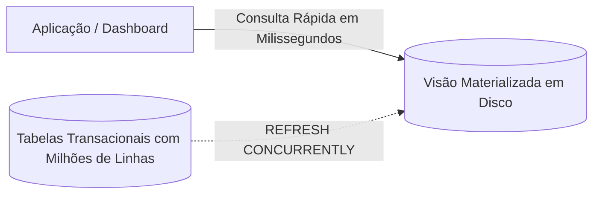

<div style="display: flex; justify-content: space-between; align-items: center; padding: 10px 16px; background: var(--light, #f8fafc); border: 1px solid var(--lightgray, #e2e8f0); border-radius: 10px; margin: 1.5rem 0;">
  <div>⬅️ <b><a href="/pt-br/resource/engenharia-de-computação/6-periodo/banco-de-dados/anotacoes/aula-12-programacao-no-banco-stored-procedures-e-triggers-em-pl-pgsql">Aula Anterior</a></b></div>
  <div>🏠 <b><a href="/pt-br/resource/engenharia-de-computação/6-periodo/banco-de-dados">Hub da Disciplina</a></b></div>
  <div>➡️ <b><a href="/pt-br/resource/engenharia-de-computação/6-periodo/banco-de-dados/anotacoes/aula-14-introducao-aos-bancos-nao-relacionais-nosql-e-teorema-cap">Próxima Aula</a></b></div>
</div>

> [!info] 📅 Informações da Aula
> - **Disciplina:** Banco de Dados (CSECBJI.44)
> - **Professor:** Sérgio
> - **Data Realizada:** 24/11/2026
> - **Tópico Principal:** Segurança, Visões Materializadas e Controle de Acesso
> - **Status:** Concluída e Revisada

> [!note] 📂 Material Complementar & Slides
> - 📄 **Slides Oficiais:** [[slide-13-banco-de-dados|Acessar Apresentação em PDF]]
> - 🎥 **Short Lecture / Gravação:** [[video-13-banco-de-dados|Assistir Síntese da Aula (Vídeo)]]

---

### 📑 Resumo das Seções
- [📌 1. Anotações do Quadro: Segurança, Visões Materializadas e Controle de Acesso](#-anotações-do-quadro-segurança,-visões-materializadas-e-controle-de-acesso)
- [🧮 2. Formulação & Exemplo Prático Resolvido](#-formulação--exemplo-prático-resolvido)
- [📊 3. Esquema Visual & Fluxograma (Mermaid)](#-esquema-visual--fluxograma-mermaid)
- [🧠 4. Resumo Pessoal & Macetes do Professor](#-resumo-pessoal--macetes-do-professor)
- [📝 5. Dúvidas & Exercícios Recomendados para Casa](#-dúvidas--exercícios-recomendados-para-casa)

---

## 📌 Anotações do Quadro: Segurança, Visões Materializadas e Controle de Acesso

### 13.1 Segurança e Controle de Acesso Discricionário (DAC)
O controle de acesso discricionário gerencia permissões concedidas a usuários e papéis (*Roles*):
- `GRANT {SELECT | INSERT | UPDATE | DELETE} ON tabela TO usuario;`
- `REVOKE {privilégios} ON tabela FROM usuario;`
- **Roles (Papéis):** Agrupam privilégios facilitando a governança em ambientes corporativos (`CREATE ROLE admin_financeiro;`).

### 13.2 Segurança em Nível de Linha (Row-Level Security - RLS)
Permite que diferentes usuários executem a mesma query `SELECT * FROM pedido`, mas vejam apenas as linhas pertencentes à sua filial ou usuário:
```sql
ALTER TABLE pedido ENABLE ROW LEVEL SECURITY;
CREATE POLICY politica_pedidos_cliente ON pedido
    FOR ALL TO web_users
    USING (cliente_id = current_setting('app.current_client_id')::INT);
```

### 13.3 Visões Tradicionais vs Visões Materializadas
- **Visão Padrão (`CREATE VIEW`):** Consulta virtual salva. Toda vez que a visão é consultada, a query base é reexecutada.
- **Visão Materializada (`CREATE MATERIALIZED VIEW`):** Persiste o resultado da consulta fisicamente no disco. Leituras subsequentes são ultrarrápidas, necessitando de atualização periódica via `REFRESH MATERIALIZED VIEW`.

---

## 🧮 Formulação & Exemplo Prático Resolvido

### ✏️ Criação de Visão Materializada para Relatórios de Vendas

```sql
CREATE MATERIALIZED VIEW mv_vendas_por_mes AS
SELECT 
    DATE_TRUNC('month', data_venda) AS mes,
    COUNT(id_venda) AS total_pedidos,
    SUM(valor_total) AS faturamento_total
FROM venda
GROUP BY DATE_TRUNC('month', data_venda);

-- Criação de índice único sobre a visão para permitir refresh concorrente
CREATE UNIQUE INDEX idx_mv_mes ON mv_vendas_por_mes(mes);

-- Atualização sem travar leituras da aplicação
REFRESH MATERIALIZED VIEW CONCURRENTLY mv_vendas_por_mes;
```

---

## 📊 Esquema Visual & Fluxograma (Mermaid)



---

## 🧠 Resumo Pessoal & Macetes do Professor

| Conceito-Chave | *Takeaway* do Professor | Dicas de Prova / Atenção |
| :--- | :--- | :--- |
| **WITH CHECK OPTION em Views** | Ao criar visões atualizáveis, use `WITH CHECK OPTION` para impedir que um usuário insira ou atualize linhas que não satisfaçam o predicado do `WHERE` da visão. | Previne vazamento de dados inseridos fora da visão. |
| **Refresh Concorrente** | `REFRESH MATERIALIZED VIEW CONCURRENTLY` exige a existência de pelo menos um índice `UNIQUE` sobre a visão. | Aplicação prática direta |

---

## 📝 Dúvidas & Exercícios Recomendados para Casa

1. Crie um papel `atendente` que tenha permissão apenas de `SELECT` e `INSERT` na tabela `atendimentos`.
2. Compare o impacto de desempenho e consumo de armazenamento de uma Visão Materializada em relação a uma Visão comum.

---

<div style="display: flex; justify-content: space-between; align-items: center; padding: 10px 16px; background: var(--light, #f8fafc); border: 1px solid var(--lightgray, #e2e8f0); border-radius: 10px; margin: 1.5rem 0;">
  <div>⬅️ <b><a href="/pt-br/resource/engenharia-de-computação/6-periodo/banco-de-dados/anotacoes/aula-12-programacao-no-banco-stored-procedures-e-triggers-em-pl-pgsql">Aula Anterior</a></b></div>
  <div>🏠 <b><a href="/pt-br/resource/engenharia-de-computação/6-periodo/banco-de-dados">Hub da Disciplina</a></b></div>
  <div>➡️ <b><a href="/pt-br/resource/engenharia-de-computação/6-periodo/banco-de-dados/anotacoes/aula-14-introducao-aos-bancos-nao-relacionais-nosql-e-teorema-cap">Próxima Aula</a></b></div>
</div>
