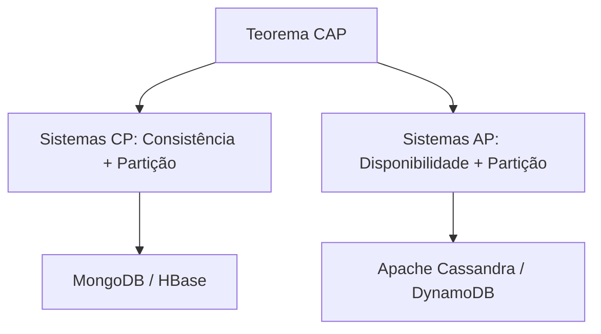

<div style="display: flex; justify-content: space-between; align-items: center; padding: 10px 16px; background: var(--light, #f8fafc); border: 1px solid var(--lightgray, #e2e8f0); border-radius: 10px; margin: 1.5rem 0;">
  <div>⬅️ <b><a href="/pt-br/resource/engenharia-de-computação/6-periodo/banco-de-dados/anotacoes/aula-13-seguranca-visoes-materializadas-e-controle-de-acesso">Aula Anterior</a></b></div>
  <div>🏠 <b><a href="/pt-br/resource/engenharia-de-computação/6-periodo/banco-de-dados">Hub da Disciplina</a></b></div>
  <div>➡️ <b><a href="/pt-br/resource/engenharia-de-computação/6-periodo/banco-de-dados/anotacoes/aula-15-avaliacao-pratica-p2-e-entrega-do-projeto-de-banco-de-dados">Próxima Aula</a></b></div>
</div>

> [!info] 📅 Informações da Aula
> - **Disciplina:** Banco de Dados (CSECBJI.44)
> - **Professor:** Sérgio
> - **Data Realizada:** 01/12/2026
> - **Tópico Principal:** Introdução aos Bancos Não-Relacionais (NoSQL) e Teorema CAP
> - **Status:** Concluída e Revisada

> [!note] 📂 Material Complementar & Slides
> - 📄 **Slides Oficiais:** [[slide-14-banco-de-dados|Acessar Apresentação em PDF]]
> - 🎥 **Short Lecture / Gravação:** [[video-14-banco-de-dados|Assistir Síntese da Aula (Vídeo)]]

---

### 📑 Resumo das Seções
- [📌 1. Anotações do Quadro: Introdução aos Bancos Não-Relacionais (NoSQL) e Teorema CAP](#-anotações-do-quadro-introdução-aos-bancos-não-relacionais-nosql-e-teorema-cap)
- [🧮 2. Formulação & Exemplo Prático Resolvido](#-formulação--exemplo-prático-resolvido)
- [📊 3. Esquema Visual & Fluxograma (Mermaid)](#-esquema-visual--fluxograma-mermaid)
- [🧠 4. Resumo Pessoal & Macetes do Professor](#-resumo-pessoal--macetes-do-professor)
- [📝 5. Dúvidas & Exercícios Recomendados para Casa](#-dúvidas--exercícios-recomendados-para-casa)

---

## 📌 Anotações do Quadro: Introdução aos Bancos Não-Relacionais (NoSQL) e Teorema CAP

### 14.1 O Teorema CAP (Eric Brewer)
Em qualquer sistema distribuído de armazenamento de dados, é impossível garantir simultaneamente as três propriedades:
1. **Consistência (*Consistency*):** Todos os nós enxergam os mesmos dados no mesmo instante (toda leitura retorna a escrita mais recente).
2. **Disponibilidade (*Availability*):** Toda requisição não-falha recebe uma resposta válida (sem garantia de ser a mais recente).
3. **Tolerância a Particionamento (*Partition Tolerance*):** O sistema continua operando mesmo quando há falhas ou atrasos na comunicação de rede entre nós.

Como redes reais sofrem particionamentos inevitáveis ($P$), os sistemas distribuídos devem escolher entre **CP** (Consistência + Tolerância, ex: MongoDB, HBase) ou **AP** (Disponibilidade + Tolerância, ex: Cassandra, DynamoDB).

### 14.2 O Modelo BASE vs ACID
- **Basically Available:** O sistema garante disponibilidade básica.
- **Soft state:** O estado dos dados pode mudar com o tempo mesmo sem novas entradas.
- **Eventual consistency:** Os dados convergirão para um estado consistente no futuro.

### 14.3 Categorias de Bancos de Dados NoSQL
- **Chave-Valor (*Key-Value*):** Redis, AWS DynamoDB (Cache e sessões ultrarrápidas).
- **Documentos (*Document Stores*):** MongoDB, Couchbase (JSON flexível e esquemas dinâmicos).
- **Colunar (*Wide-Column*):** Apache Cassandra, ScyllaDB (Escrita massiva e Big Data).
- **Grafos (*Graph Databases*):** Neo4j, Amazon Neptune (Redes sociais, fraudes e rotas).

---

## 🧮 Formulação & Exemplo Prático Resolvido

### ✏️ Comparação de Modelagem: Relacional vs Documento (JSON) no MongoDB

**Modelagem Relacional (SQL Normalizado):**
Tabela `Usuario` e Tabela `Endereco` com chave estrangeira `usuario_id`.

**Modelagem em Documento NoSQL (MongoDB):**
```json
{
  "_id": "64f1a2b3c4d5e6f7a8b9c0d1",
  "nome": "Pedro Andrade",
  "email": "pedro@iff.edu.br",
  "enderecos": [
    {
      "tipo": "residencial",
      "rua": "Av. 28 de Março, 100",
      "cidade": "Campos dos Goytacazes",
      "estado": "RJ"
    }
  ],
  "preferencias": { "tema": "dark", "notificacoes": true }
}
```

---

## 📊 Esquema Visual & Fluxograma (Mermaid)



---

## 🧠 Resumo Pessoal & Macetes do Professor

| Conceito-Chave | *Takeaway* do Professor | Dicas de Prova / Atenção |
| :--- | :--- | :--- |
| **Quando Usar NoSQL?** | Use NoSQL para esquemas altamente voláteis, escalabilidade horizontal massiva em clusters ou grafos complexos; use SQL para transações financeiras e esquemas com fortes restrições de integridade. | Não use NoSQL apenas por modismo. |
| **Consistência Eventual** | Em sistemas AP, ler imediatamente após uma escrita pode retornar o dado antigo até que a replicação se propague. | Aplicação prática direta |

---

## 📝 Dúvidas & Exercícios Recomendados para Casa

1. Explique por que um sistema distribuído em rede não pode abrir mão da Tolerância a Particionamento ($P$).
2. Diferencie a modelagem de dados de um catálogo de e-commerce em PostgreSQL e em MongoDB.

---

<div style="display: flex; justify-content: space-between; align-items: center; padding: 10px 16px; background: var(--light, #f8fafc); border: 1px solid var(--lightgray, #e2e8f0); border-radius: 10px; margin: 1.5rem 0;">
  <div>⬅️ <b><a href="/pt-br/resource/engenharia-de-computação/6-periodo/banco-de-dados/anotacoes/aula-13-seguranca-visoes-materializadas-e-controle-de-acesso">Aula Anterior</a></b></div>
  <div>🏠 <b><a href="/pt-br/resource/engenharia-de-computação/6-periodo/banco-de-dados">Hub da Disciplina</a></b></div>
  <div>➡️ <b><a href="/pt-br/resource/engenharia-de-computação/6-periodo/banco-de-dados/anotacoes/aula-15-avaliacao-pratica-p2-e-entrega-do-projeto-de-banco-de-dados">Próxima Aula</a></b></div>
</div>
