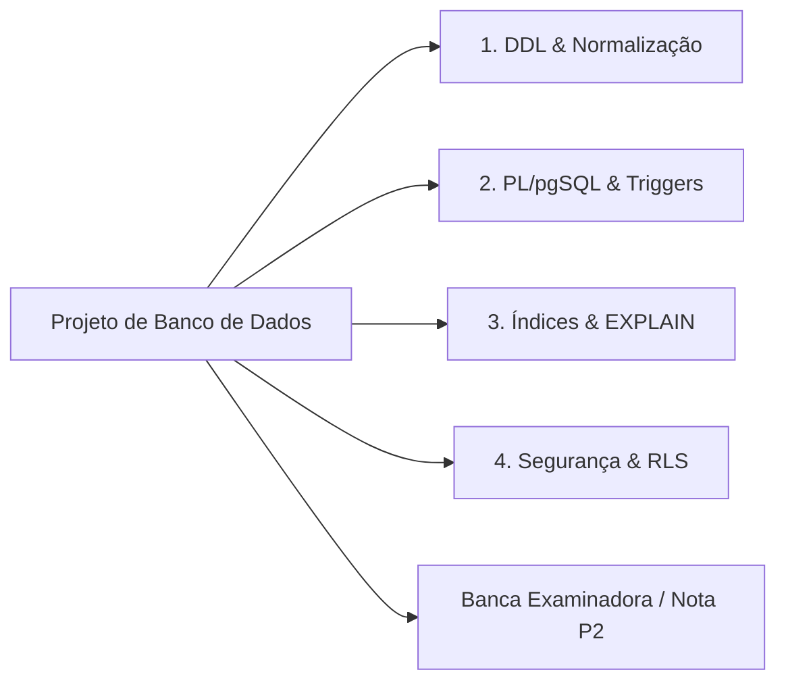

  
⬅️ <b><a href="/pt-br/resource/engenharia-de-computação/6-periodo/banco-de-dados/anotacoes/aula-14-introducao-aos-bancos-nao-relacionais-nosql-e-teorema-cap">Aula Anterior</a></b>

  
🏠 <b><a href="/pt-br/resource/engenharia-de-computação/6-periodo/banco-de-dados">Hub da Disciplina</a></b>

  
➡️ <b><a href="/pt-br/resource/engenharia-de-computação/6-periodo/banco-de-dados/anotacoes/aula-16-prova-final-e-fechamento-das-medias">Próxima Aula</a></b>

> [!info] 📅 Informações da Aula
> - **Disciplina:** Banco de Dados (CSECBJI.44)
> - **Professor:** Sérgio
> - **Data Realizada:** 08/12/2026
> - **Tópico Principal:** Avaliação Prática P2 e Entrega do Projeto de Banco de Dados
> - **Status:** Concluída e Revisada

> [!note] 📂 Material Complementar & Slides
> - 📄 **Slides Oficiais:** [[slide-15-banco-de-dados|Acessar Apresentação em PDF]]
> - 🎥 **Short Lecture / Gravação:** [[video-15-banco-de-dados|Assistir Síntese da Aula (Vídeo)]]

---

### 📑 Resumo das Seções
- [📌 1. Anotações do Quadro: Avaliação Prática P2 e Entrega do Projeto de Banco de Dados](#-anotações-do-quadro-avaliação-prática-p2-e-entrega-do-projeto-de-banco-de-dados)
- [🧮 2. Formulação & Exemplo Prático Resolvido](#-formulação--exemplo-prático-resolvido)
- [📊 3. Esquema Visual & Fluxograma (Mermaid)](#-esquema-visual--fluxograma-mermaid)
- [🧠 4. Resumo Pessoal & Macetes do Professor](#-resumo-pessoal--macetes-do-professor)
- [📝 5. Dúvidas & Exercícios Recomendados para Casa](#-dúvidas--exercícios-recomendados-para-casa)

---

## 📌 Anotações do Quadro: Avaliação Prática P2 e Entrega do Projeto de Banco de Dados

### 15.1 Critérios de Avaliação e Defesa do Projeto Prático
A avaliação P2 consiste na entrega e apresentação do projeto completo de banco de dados desenvolvido pelas equipes para um estudo de caso do mundo real:
1. Esquema relacional em 3FN/BCNF com integridade referencial estrita.
2. Scripts de criação DDL e inserção de dados de teste coerentes.
3. Consultas SQL analíticas com agregação, CTEs e subconsultas.
4. Triggers e Stored Procedures em PL/pgSQL para automação de regras de negócio.
5. Estratégia de indexação justificativa e análise de planos de execução com `EXPLAIN ANALYZE`.
6. Plano de backup e contingência (pg_dump, WAL archiving).

---

## 🧮 Formulação & Exemplo Prático Resolvido

### ✏️ Roteiro de Apresentação Técnica em Laboratório

1. **Demonstração do Diagrama Entidade-Relacionamento:** Justificativa da escolha das chaves e cardinalidades.
2. **Execução do Trigger de Regra de Negócio:** Simulação de uma operação inválida e verificação do erro disparado.
3. **Benchmark de Desempenho:** Comparação do tempo de execução de consulta complexa com e sem índice B+.
4. **Respostas às Perguntas da Banca:** Justificativa das formas normais e níveis de isolamento adotados.

---

## 📊 Esquema Visual & Fluxograma (Mermaid)

---

## 🧠 Resumo Pessoal & Macetes do Professor

| Conceito-Chave | *Takeaway* do Professor | Dicas de Prova / Atenção |
| :--- | :--- | :--- |
| **Dica de Apresentação P2** | Tenha o banco populado com volume suficiente de dados (pelo menos 10.000 tuplas) para que o `EXPLAIN ANALYZE` demonstre o uso real dos índices. | Bancos vazios sempre usam Seq Scan! |
| **Idempotência de Scripts** | Certifique-se de que seu script `.sql` possa ser executado múltiplas vezes sem erros (`DROP TABLE IF EXISTS ... CASCADE`). | Aplicação prática direta |

---

## 📝 Dúvidas & Exercícios Recomendados para Casa

1. Gere o script completo de dump do banco de dados utilizando `pg_dump -Fc -v`.
2. Valide a execução de todos os testes de regressão dos triggers criados.

---

  
⬅️ <b><a href="/pt-br/resource/engenharia-de-computação/6-periodo/banco-de-dados/anotacoes/aula-14-introducao-aos-bancos-nao-relacionais-nosql-e-teorema-cap">Aula Anterior</a></b>

  
🏠 <b><a href="/pt-br/resource/engenharia-de-computação/6-periodo/banco-de-dados">Hub da Disciplina</a></b>

  
➡️ <b><a href="/pt-br/resource/engenharia-de-computação/6-periodo/banco-de-dados/anotacoes/aula-16-prova-final-e-fechamento-das-medias">Próxima Aula</a></b>

