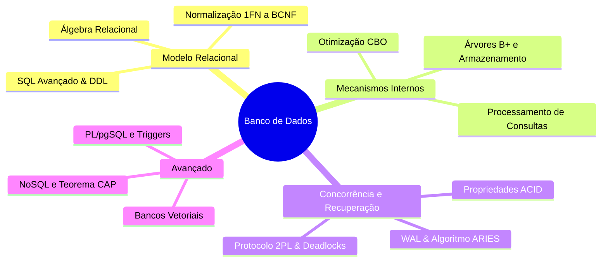

<div style="display: flex; justify-content: space-between; align-items: center; padding: 10px 16px; background: var(--light, #f8fafc); border: 1px solid var(--lightgray, #e2e8f0); border-radius: 10px; margin: 1.5rem 0;">
  <div>⬅️ <b><a href="/pt-br/resource/engenharia-de-computação/6-periodo/banco-de-dados/anotacoes/aula-15-avaliacao-pratica-p2-e-entrega-do-projeto-de-banco-de-dados">Aula Anterior</a></b></div>
  <div>🏠 <b><a href="/pt-br/resource/engenharia-de-computação/6-periodo/banco-de-dados">Hub da Disciplina</a></b></div>
  <div>➡️ <span style="color: gray;">Última Aula</span></div>
</div>

> [!info] 📅 Informações da Aula
> - **Disciplina:** Banco de Dados (CSECBJI.44)
> - **Professor:** Sérgio
> - **Data Realizada:** 15/12/2026
> - **Tópico Principal:** Prova Final e Fechamento das Médias
> - **Status:** Concluída e Revisada

> [!note] 📂 Material Complementar & Slides
> - 📄 **Slides Oficiais:** [[slide-16-banco-de-dados|Acessar Apresentação em PDF]]
> - 🎥 **Short Lecture / Gravação:** [[video-16-banco-de-dados|Assistir Síntese da Aula (Vídeo)]]

---

### 📑 Resumo das Seções
- [📌 1. Anotações do Quadro: Prova Final e Fechamento das Médias](#-anotações-do-quadro-prova-final-e-fechamento-das-médias)
- [🧮 2. Formulação & Exemplo Prático Resolvido](#-formulação--exemplo-prático-resolvido)
- [📊 3. Esquema Visual & Fluxograma (Mermaid)](#-esquema-visual--fluxograma-mermaid)
- [🧠 4. Resumo Pessoal & Macetes do Professor](#-resumo-pessoal--macetes-do-professor)
- [📝 5. Dúvidas & Exercícios Recomendados para Casa](#-dúvidas--exercícios-recomendados-para-casa)

---

## 📌 Anotações do Quadro: Prova Final e Fechamento das Médias

### 16.1 Síntese Conceitual da Engenharia de Bancos de Dados
A disciplina consolida toda a arquitetura de persistência e gerenciamento de dados:
```text
Modelagem Lógica (3FN/BCNF) ──▶ SQL Avançado & PL/pgSQL ──▶ Armazenamento (Árvores B+) ──▶ Transações (ACID, 2PL, ARIES) ──▶ NoSQL
```

### 16.2 Tendências Tecnológicas e Engenharia de Dados
- **Bancos Híbridos (HTAP - Hybrid Transactional/Analytical Processing):** SGBDs capazes de processar transações OLTP e análises OLAP simultaneamente.
- **Bancos NewSQL (CockroachDB, Google Spanner):** Combinam a escalabilidade horizontal NoSQL com transações ACID completas e relógio atômico TrueTime.
- **Bancos Vetoriais (pgvector, Pinecone):** Armazenamento de embeddings para inteligência artificial generativa e busca semântica.

---

## 🧮 Formulação & Exemplo Prático Resolvido

### ✏️ Fechamento das Médias e Próximos Passos Acadêmicos

1. **Revisão das Avaliações:** P1 (Teoria e Normalização) + P2 (Projeto Prático PL/pgSQL) + Listas.
2. **Integração Curricular:** Os conceitos de concorrência e armazenamento servem de alicerce para Sistemas Operacionais, Sistemas Distribuídos e Desenvolvimento Web.

---

## 📊 Esquema Visual & Fluxograma (Mermaid)



---

## 🧠 Resumo Pessoal & Macetes do Professor

| Conceito-Chave | *Takeaway* do Professor | Dicas de Prova / Atenção |
| :--- | :--- | :--- |
| **Conhecimento Permanente** | O domínio profundo de Álgebra Relacional, SQL, índices e propriedades ACID é uma das habilidades mais valorizadas e duradouras da Engenharia de Software e Computação. | Frameworks e ORMs mudam, mas a teoria relacional permanece estável. |
| **Encerramento do Semestre** | Parabéns pela conclusão da disciplina no semestre 2026-2! | Aplicação prática direta |

---

## 📝 Dúvidas & Exercícios Recomendados para Casa

1. Revisão geral dos compêndios teóricos para a Prova Final.
2. Consulte as referências clássicas: Silberschatz (Sistemas de Bancos de Dados) e Elmasri & Navathe.

---

<div style="display: flex; justify-content: space-between; align-items: center; padding: 10px 16px; background: var(--light, #f8fafc); border: 1px solid var(--lightgray, #e2e8f0); border-radius: 10px; margin: 1.5rem 0;">
  <div>⬅️ <b><a href="/pt-br/resource/engenharia-de-computação/6-periodo/banco-de-dados/anotacoes/aula-15-avaliacao-pratica-p2-e-entrega-do-projeto-de-banco-de-dados">Aula Anterior</a></b></div>
  <div>🏠 <b><a href="/pt-br/resource/engenharia-de-computação/6-periodo/banco-de-dados">Hub da Disciplina</a></b></div>
  <div>➡️ <span style="color: gray;">Última Aula</span></div>
</div>
