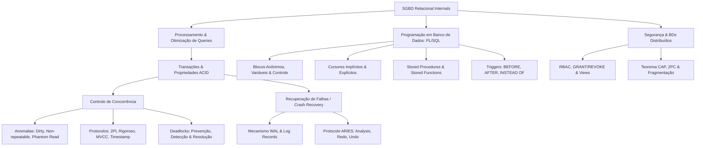
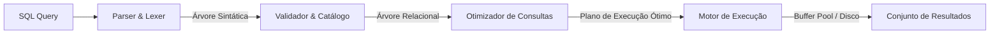
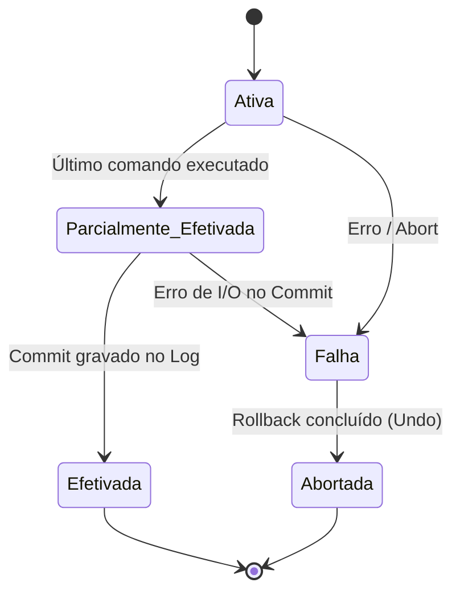
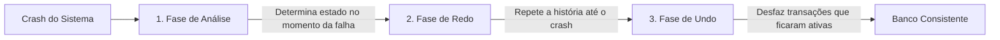

# 🗄️ Short Lecture — Banco de Dados

> [!abstract] 📌 Visão Geral da Disciplina
> * **Código:** `CSECBJI.44` | **Carga Horária:** 60 h/a | **Período:** 6º Período
> * **Pré-requisito:** [[02 - Áreas/Acadêmico/IFF - Engenharia de Computação/05 - Periodo/35 - Modelagem de Dados/Ementa - Modelagem de Dados|Modelagem de Dados (CSECBJI.35)]]
> * **Tranca:** Nenhuma
> * **Ementa Síntese:** Processamento e Otimização de Consultas; Transações e Propriedades ACID; Controle de Concorrência e Serializabilidade; Recuperação de Falhas (Crash Recovery e WAL); Programação em Banco de Dados (PL/SQL, Stored Procedures, Functions e Triggers); Segurança, Visões e Noções de Bancos de Dados Distribuídos.

---

## 🗺️ Mapa Conceitual da Disciplina



---

## ⚡ Módulo 1: Processamento e Otimização de Consultas (Query Engine)

### 1.1 O Pipeline de Execução de uma Query SQL
Quando um comando SQL é submetido ao SGBD, ele passa por 4 etapas fundamentais:



1. **Parser & Lexer:** Validação sintática da declaração SQL.
2. **Validador Semântico:** Consulta ao Catálogo do Sistema (*Data Dictionary*) para verificar a existência de tabelas, colunas e permissões de acesso do usuário.
3. **Otimizador de Consultas (*Query Optimizer*):** Converte a consulta em uma árvore de operadores da **Álgebra Relacional** ($\sigma, \pi, \bowtie, \rho$) e avalia múltiplos planos de execução equivalentes, escolhendo o de menor custo estimado de E/S (*I/O cost*) e CPU.
4. **Motor de Execução:** Executa os operadores físicos (ex: *Index Scan, Sequential Table Scan, Nested Loop Join, Hash Join, Merge Join*).

### 1.2 Heurísticas de Otimização Relacional
- **Empurrar Seleções para Baixo ($\sigma$):** Aplicar filtros o mais cedo possível na árvore para reduzir a cardinalidade das tuplas intermediárias antes dos joins.
- **Empurrar Projeções ($\pi$):** Eliminar colunas não utilizadas para economizar memória nos buffers.
- **Uso de Índices (B+ Tree e Hash):**
  - **B+ Tree:** Excelente para buscas pontuais ($O(\log N)$) e buscas por intervalo (*range scans*). Todas as folhas estão no mesmo nível e encadeadas por ponteiros.
  - **Hash Index:** Acesso direto $O(1)$ para igualdades exatas (`WHERE id = 10`), ineficiente para intervalos.

---

## 🔒 Módulo 2: Transações e as Propriedades ACID

Uma **transação** é uma unidade lógica de trabalho composta por um conjunto de operações de leitura e escrita ($R(x), W(x)$) que deve preservar a integridade da base de dados.



### O Modelo ACID:
| Propriedade | Significado | Como o SGBD Garante |
|---|---|---|
| **A — Atomicidade** | *"Tudo ou Nada"*: Ou todas as operações da transação são confirmadas, ou nenhuma tem efeito. | Módulo de **Recuperação de Falhas** (*Recovery Manager*) via Logs e *Rollback*. |
| **C — Consistência** | A transação leva o banco de um estado válido a outro estado válido, respeitando todas as restrições de integridade. | Mecanismos de restrições de chave (*Primary/Foreign Keys*), *Check constraints* e lógica de negócio. |
| **I — Isolamento** | A execução concorrente de transações produz o mesmo resultado que uma execução sequencial. Transações não interferem umas nas outras. | Módulo de **Controle de Concorrência** (*Locks*, MVCC, Timestamps). |
| **D — Durabilidade** | Uma vez efetivada (*Committed*), as alterações persistem no banco mesmo em caso de falha catastrófica de hardware/energia. | Mecanismo de **Write-Ahead Logging (WAL)** e gravação em disco não volátil. |

---

## 🚦 Módulo 3: Controle de Concorrência e Serializabilidade

### 3.1 Anomalias de Concorrência (Padrão ANSI/ISO SQL)
1. **Dirty Read (Leitura Suja):** $T_2$ lê um dado alterado por $T_1$ antes de $T_1$ comitar; se $T_1$ sofrer rollback, $T_2$ leu um dado fantasma inexistente.
2. **Non-repeatable Read (Leitura Não Repetível):** $T_1$ lê o mesmo registro duas vezes e obtém valores diferentes porque $T_2$ alterou e comitou os dados entre as leituras.
3. **Phantom Read (Leitura Fantasma):** $T_1$ executa uma consulta por intervalo (`WHERE salario > 5000`); $T_2$ insere uma nova tupla nesse intervalo e comita. Ao repetir a consulta, $T_1$ encontra novas tuplas "fantasmas".
4. **Lost Update (Perda de Atualização):** $T_1$ e $T_2$ leem o mesmo dado simultaneamente; $T_1$ grava primeiro e $T_2$ grava em seguida, sobrescrevendo a alteração de $T_1$ sem considerá-la.

| Nível de Isolamento | Leitura Suja | Leitura Não-Repetível | Leitura Fantasma |
|---|---|---|---|
| **Read Uncommitted** | Permite | Permite | Permite |
| **Read Committed** | Previne | Permite | Permite |
| **Repeatable Read** | Previne | Previne | Permite |
| **Serializable** | Previne | Previne | Previne |

### 3.2 Protocolo de Bloqueio em Duas Fases (2PL - Two-Phase Locking)
Garante a **serializabilidade de conflito**:
- **Fase de Crescimento (*Growing Phase*):** A transação pode obter bloqueios (compartilhado $S$ para leitura ou exclusivo $X$ para escrita), mas não pode liberar nenhum.
- **Fase de Encolhimento (*Shrinking Phase*):** A transação pode liberar bloqueios, mas não pode adquirir novos.
- **Strict 2PL (2PL Estrito):** Todos os bloqueios exclusivos ($X$) são mantidos até o fim da transação (*Commit/Abort*), evitando *cascading aborts*.
- **Rigorous 2PL (2PL Rigoroso):** Todos os bloqueios ($S$ e $X$) são mantidos até o fim da transação.

### 3.3 MVCC (Multiversion Concurrency Control)
Utilizado em bancos modernos (PostgreSQL, MySQL InnoDB, Oracle):
- Leitores não bloqueiam escritores; escritores não bloqueiam leitores.
- Cada operação de escrita cria uma nova **versão** da tupla com timestamps/identificadores de transação (`xmin`, `xmax`). Leitores veem uma foto estática (*snapshot*) dos dados válidos no momento do início da transação.

---

## 💥 Módulo 4: Recuperação de Falhas (*Crash Recovery*)

### 4.1 Write-Ahead Logging (WAL)
Princípio pétreo dos SGBDs:
> [!important] Regra de Ouro do WAL
> Todo registro de log associado a uma modificação de dado deve ser gravado no disco permanente **antes** que a própria página de dados modificada seja descarregada do Buffer Pool para o disco (*Flush*). Além disso, o registro de log de `COMMIT` deve estar gravado no disco para confirmar a transação.

### 4.2 O Algoritmo ARIES (Algorithms for Recovery and Isolation Exploiting Semantics)
Em caso de reinicialização após falha do sistema, o ARIES executa 3 fases:



1. **Análise (*Analysis*):** Examina o log a partir do último *Checkpoint* para reconstruir a tabela de transações ativas (*Transaction Table*) e a tabela de páginas sujas (*Dirty Page Table - DPT*).
2. **Redo (*Repetição da História*):** Reaplica todas as alterações gravadas no log até o momento do travamento, restaurando o estado exato da memória no instante da falha.
3. **Undo (*Desfazer*):** Percorre o log em sentido reverso, desfazendo os efeitos de todas as transações que estavam ativas (não comitadas) no momento da falha, gravando registros de compensação (*CLR - Compensation Log Records*).

---

## 💻 Módulo 5: Programação em Banco de Dados (PL/SQL)

### 5.1 Estrutura de um Bloco PL/SQL
```sql
DECLARE
    -- Declaração de variáveis, constantes, tipos e cursores
    v_cliente_id  NUMBER(6) := 105;
    v_total_gasto NUMBER(10, 2);
    v_categoria   VARCHAR2(20);
BEGIN
    -- Seção de execução com lógica procedural e DML
    SELECT SUM(valor_total) 
    INTO v_total_gasto
    FROM pedidos
    WHERE id_cliente = v_cliente_id;

    IF v_total_gasto > 10000 THEN
        v_categoria := 'PLATINUM';
    ELSIF v_total_gasto >= 5000 THEN
        v_categoria := 'GOLD';
    ELSE
        v_categoria := 'STANDARD';
    END IF;

    UPDATE clientes 
    SET status_fidelidade = v_categoria 
    WHERE id = v_cliente_id;

    COMMIT;
EXCEPTION
    WHEN NO_DATA_FOUND THEN
        DBMS_OUTPUT.PUT_LINE('Cliente sem compras registradas.');
    WHEN OTHERS THEN
        ROLLBACK;
        RAISE_APPLICATION_ERROR(-20001, 'Erro ao calcular fidelidade: ' || SQLERRM);
END;
/
```

### 5.2 Stored Procedures & Functions
```sql
-- Criação de Função Determinística com retorno de valor
CREATE OR REPLACE FUNCTION fn_calcular_desconto(
    p_valor_bruto IN NUMBER,
    p_taxa        IN NUMBER
) RETURN NUMBER IS
BEGIN
    IF p_taxa < 0 OR p_taxa > 1 THEN
        RAISE_APPLICATION_ERROR(-20002, 'Taxa de desconto inválida.');
    END IF;
    RETURN p_valor_bruto * (1 - p_taxa);
END fn_calcular_desconto;
/

-- Criação de Procedure com parâmetros IN e OUT
CREATE OR REPLACE PROCEDURE sp_transferir_fundos(
    p_conta_origem  IN NUMBER,
    p_conta_destino IN NUMBER,
    p_valor         IN NUMBER,
    p_sucesso       OUT BOOLEAN
) IS
    v_saldo_origem NUMBER(12, 2);
BEGIN
    p_sucesso := FALSE;
    
    -- Bloqueio pessimista da linha para leitura e atualização
    SELECT saldo INTO v_saldo_origem
    FROM contas
    WHERE id = p_conta_origem
    FOR UPDATE;

    IF v_saldo_origem >= p_valor THEN
        UPDATE contas SET saldo = saldo - p_valor WHERE id = p_conta_origem;
        UPDATE contas SET saldo = saldo + p_valor WHERE id = p_conta_destino;
        COMMIT;
        p_sucesso := TRUE;
    ELSE
        ROLLBACK;
    END IF;
EXCEPTION
    WHEN OTHERS THEN
        ROLLBACK;
        p_sucesso := FALSE;
END sp_transferir_fundos;
/
```

### 5.3 Triggers (Gatilhos de Banco)
```sql
-- Trigger para auditoria automática de alterações de salário
CREATE OR REPLACE TRIGGER trg_auditoria_salario
AFTER UPDATE OF salario ON funcionarios
FOR EACH ROW
WHEN (NEW.salario <> OLD.salario)
BEGIN
    INSERT INTO log_alteracao_salario (
        id_funcionario,
        salario_antigo,
        salario_novo,
        usuario,
        data_modificacao
    ) VALUES (
        :OLD.id,
        :OLD.salario,
        :NEW.salario,
        USER,
        SYSDATE
    );
END trg_auditoria_salario;
/
```

---

## 🌐 Módulo 6: Segurança & Noções de BDs Distribuídos

### 6.1 Segurança e Controle de Acesso (RBAC)
- **Privilégios de Sistema vs de Objeto:**
  ```sql
  -- Controle granular de permissões
  CREATE ROLE role_analista_financeiro;
  GRANT SELECT ON faturas TO role_analista_financeiro;
  GRANT EXECUTE ON sp_relatorio_fechamento TO role_analista_financeiro;
  GRANT role_analista_financeiro TO usuario_pedro;
  ```
- **Visões de Segurança (*Security Views*):** Restringem linhas e colunas sensíveis antes da entrega ao usuário.

### 6.2 Bancos de Dados Distribuídos e o Teorema CAP
- **Fragmentação:**
  - **Horizontal:** Particionamento de tuplas baseado em predicados (`WHERE regiao = 'SUDESTE'`).
  - **Vertical:** Particionamento de colunas baseado em frequência de acesso.
- **Teorema CAP (Eric Brewer):** Um sistema distribuído de dados só pode garantir simultaneamente 2 das 3 propriedades:
  1. **Consistência (Consistency):** Todos os nós veem os mesmos dados no mesmo instante.
  2. **Disponibilidade (Availability):** Toda requisição recebe uma resposta de sucesso ou falha sem garantia de ser a mais recente.
  3. **Tolerância a Partições (Partition Tolerance):** O sistema continua operando mesmo sob perda ou atraso de mensagens entre nós da rede.
- **Protocolo Two-Phase Commit (2PC):** Protocolo de consenso para transações distribuídas (Fase 1: *Prepare/Vote*; Fase 2: *Commit/Abort* global).

---

## 🧪 Resumo Executivo / Cheat Sheet para Provas & Projetos

1. **ACID:** Atomicidade (Log/Undo), Consistência (Regras), Isolamento (Locks/MVCC), Durabilidade (WAL/Redo).
2. **Níveis ANSI:** Read Uncommitted $\rightarrow$ Read Committed $\rightarrow$ Repeatable Read $\rightarrow$ Serializable.
3. **WAL Rule:** Log gravado antes do disco de dados; Commit no log antes do retorno ao cliente.
4. **ARIES:** 3 passos de Crash Recovery = Análise $\rightarrow$ Redo (reprodução fiel) $\rightarrow$ Undo (desfazer ativas).
5. **Triggers:** Executam em resposta a eventos DML (`BEFORE` para validação/ajuste de dados, `AFTER` para logs/auditoria).
6. **B+ Tree:** A estrutura de indexação padrão para SGBDs relacionais (balanceada e encadeada nas folhas).

---

## 🔗 Referências e Conexões no Cofre
* [[02 - Áreas/Acadêmico/IFF - Engenharia de Computação/06 - Periodo/44 - Banco de Dados/Ementa - Banco de Dados|📄 Ementa Oficial de BD]]
* [[02 - Áreas/Acadêmico/IFF - Engenharia de Computação/05 - Periodo/35 - Modelagem de Dados/Ementa - Modelagem de Dados|Modelagem de Dados (CSECBJI.35)]]
* [[02 - Áreas/Acadêmico/IFF - Engenharia de Computação/00 - Documentos/PPC_EngComp_Completo_Ementario|📜 PPC & Ementário Geral]]
* Livros Base:
  * SILBERSCHATZ, A.; KORTH, H. F.; SUDARSHAN, S. *Sistema de Banco de Dados*. 6ª Edição. Elsevier, 2012.
  * DATE, C. J. *Introdução a Sistemas de Banco de Dados*. 8ª Edição. Campus, 2004.
  * HEUSER, Carlos Alberto. *Projeto de Banco de Dados*. 6ª Edição. Bookman, 2008.
