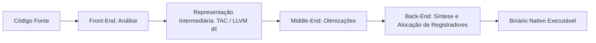

<div style="display: flex; justify-content: space-between; align-items: center; padding: 10px 16px; background: var(--light, #f8fafc); border: 1px solid var(--lightgray, #e2e8f0); border-radius: 10px; margin: 1.5rem 0;">
  <div>⬅️ <span style="color: gray;">Primeira Aula</span></div>
  <div>🏠 <b><a href="/pt-br/resource/engenharia-de-computação/6-periodo/compiladores">Hub da Disciplina</a></b></div>
  <div>➡️ <b><a href="/pt-br/resource/engenharia-de-computação/6-periodo/compiladores/anotacoes/aula-01-estrutura-em-fases-de-um-compilador-e-interpretadores">Próxima Aula</a></b></div>
</div>

> [!info] 📅 Informações da Aula
> - **Disciplina:** Compiladores (CSECBJI.48)
> - **Professor:** Fabrício Barros
> - **Data Realizada:** 28/08/2026
> - **Tópico Principal:** Apresentação da Disciplina, Arquitetura de Tradutores e Ementa
> - **Status:** Concluída e Revisada

> [!note] 📂 Material Complementar & Slides
> - 📄 **Slides Oficiais:** [[slide-00-compiladores|Acessar Apresentação em PDF]]
> - 🎥 **Short Lecture / Gravação:** [[video-00-compiladores|Assistir Síntese da Aula (Vídeo)]]

---

### 📑 Resumo das Seções
- [📌 1. Anotações do Quadro: Apresentação da Disciplina, Arquitetura de Tradutores e Ementa](#-anotações-do-quadro-apresentação-da-disciplina,-arquitetura-de-tradutores-e-ementa)
- [🧮 2. Formulação & Exemplo Prático Resolvido](#-formulação--exemplo-prático-resolvido)
- [📊 3. Esquema Visual & Fluxograma (Mermaid)](#-esquema-visual--fluxograma-mermaid)
- [🧠 4. Resumo Pessoal & Macetes do Professor](#-resumo-pessoal--macetes-do-professor)
- [📝 5. Dúvidas & Exercícios Recomendados para Casa](#-dúvidas--exercícios-recomendados-para-casa)

---

## 📌 Anotações do Quadro: Apresentação da Disciplina, Arquitetura de Tradutores e Ementa

### 1.1 O que é um Compilador e Qual Seu Papel na Engenharia?
Um **compilador** é um sistema de software de alta complexidade responsável por traduzir um programa expresso em uma **linguagem fonte** de alto nível (legível por humanos, rica em abstrações) em um programa semanticamente equivalente em uma **linguagem alvo** (como Assembly x86_64, RISC-V, bytecode JVM ou código de máquina).

No contexto de sistemas modernos e arquiteturas de computação, o compilador atua como a ponte de abstração indispensável entre o desenvolvedor de software e o hardware físico.

```text
Código Fonte (C / Rust / Java) ──[ COMPILADOR ]──▶ Código Objeto / Executável Binário
```

### 1.2 Modelos de Execução: Compilação Tradicional, Interpretação e JIT

| Modelo | Princípio de Funcionamento | Vantagens Principais | Desvantagens / Trade-offs | Exemplos |
| :--- | :--- | :--- | :--- | :--- |
| **AOT (*Ahead-Of-Time*)** | Todo o código é traduzido para binário nativo antes da execução. | Desempenho máximo, otimizações globais profundas. | Compilação custosa, binário acoplado à arquitetura alvo. | C, C++, Rust, Go |
| **Interpretador Puro** | Lê e avalia cada comando/nó da árvore diretamente em tempo de execução. | Portabilidade imediata, REPL interativo, inicialização veloz. | Baixo desempenho computacional (overhead de despacho de instruções). | Python (CPython), Ruby |
| **JIT (*Just-In-Time*)** | Traduz para Bytecode intermediário e compila *hotspots* para código nativo sob demanda. | Equilíbrio entre portabilidade e alta taxa de transferência. | Alto consumo de memória e *warm-up time* inicial. | Java (HotSpot JVM), V8 (Node/Chrome) |

### 1.3 A Separação Arquitetural: Front-End, Middle-End e Back-End
A separação clássica desacopla a análise do código fonte da síntese para a máquina física:
- **Front-End:** Análise Léxica, Análise Sintática, Análise Semântica e Criação da AST.
- **Middle-End:** Otimizações independentes de máquina sobre a Representação Intermediária (IR / TAC).
- **Back-End:** Seleção de instruções de máquina, alocação de registradores físicos e geração de código binário.

---

## 🧮 Formulação & Exemplo Prático Resolvido

### ✏️ Rastreando o Pipeline de Compilação com a Atribuição `posicao = inicial + taxa * 60`

1. **Análise Léxica:** Divide a string em tokens:
   `⟨ID, "posicao"⟩`, `⟨OP_ATRIB, "="⟩`, `⟨ID, "inicial"⟩`, `⟨OP_SOMA, "+"⟩`, `⟨ID, "taxa"⟩`, `⟨OP_MULT, "*"⟩`, `⟨NUM_INT, 60⟩`, `⟨PONTO_VIRGULA, ";"⟩`
2. **Análise Sintática:** Constrói a Árvore de Sintaxe Abstrata (AST) respeitando a precedência de operadores ($* > +$).
3. **Análise Semântica:** Consulta a Tabela de Símbolos, verifica que `taxa` é `float` e promove `60` para `float` através de `inttofloat(60)`.
4. **Geração de Código Intermediário (Three-Address Code - TAC):**
   ```text
   t1 = inttofloat(60)
   t2 = taxa * t1
   t3 = inicial + t2
   posicao = t3
   ```

---

## 📊 Esquema Visual & Fluxograma (Mermaid)



---

## 🧠 Resumo Pessoal & Macetes do Professor

| Conceito-Chave | *Takeaway* do Professor | Dicas de Prova / Atenção |
| :--- | :--- | :--- |
| **Front-End vs Back-End** | Front-end entende a linguagem do programador; Back-end entende a arquitetura do processador. | Nunca misture registradores de hardware na árvore sintática! |
| **JIT Compilers** | Combinam interpretação inicial para agilidade com compilação nativa em tempo real para laços repetitivos. | Atenção ao tempo de warm-up. |

---

## 📝 Dúvidas & Exercícios Recomendados para Casa

1. Diferencie formalmente um Compilador AOT de um Compilador JIT.
2. Desenhe a Árvore de Sintaxe Abstrata (AST) para `area = 3.14159 * raio * raio`.

---

<div style="display: flex; justify-content: space-between; align-items: center; padding: 10px 16px; background: var(--light, #f8fafc); border: 1px solid var(--lightgray, #e2e8f0); border-radius: 10px; margin: 1.5rem 0;">
  <div>⬅️ <span style="color: gray;">Primeira Aula</span></div>
  <div>🏠 <b><a href="/pt-br/resource/engenharia-de-computação/6-periodo/compiladores">Hub da Disciplina</a></b></div>
  <div>➡️ <b><a href="/pt-br/resource/engenharia-de-computação/6-periodo/compiladores/anotacoes/aula-01-estrutura-em-fases-de-um-compilador-e-interpretadores">Próxima Aula</a></b></div>
</div>
