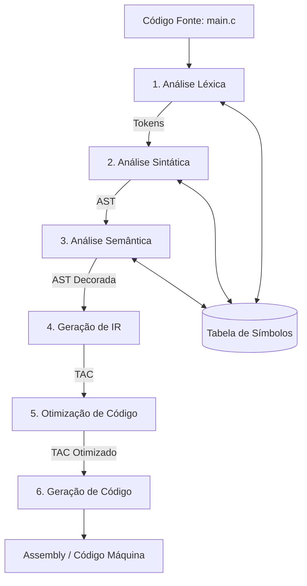

<div style="display: flex; justify-content: space-between; align-items: center; padding: 10px 16px; background: var(--light, #f8fafc); border: 1px solid var(--lightgray, #e2e8f0); border-radius: 10px; margin: 1.5rem 0;">
  <div>⬅️ <b><a href="/pt-br/resource/engenharia-de-computação/6-periodo/compiladores/anotacoes/aula-00-apresentacao-da-disciplina-arquitetura-de-tradutores-e-ementa">Aula Anterior</a></b></div>
  <div>🏠 <b><a href="/pt-br/resource/engenharia-de-computação/6-periodo/compiladores">Hub da Disciplina</a></b></div>
  <div>➡️ <b><a href="/pt-br/resource/engenharia-de-computação/6-periodo/compiladores/anotacoes/aula-02-analise-lexica-expressoes-regulares-tokens-e-automatos-finitos">Próxima Aula</a></b></div>
</div>

> [!info] 📅 Informações da Aula
> - **Disciplina:** Compiladores (CSECBJI.48)
> - **Professor:** Fabrício Barros
> - **Data Realizada:** 04/09/2026
> - **Tópico Principal:** Estrutura em Fases de um Compilador e Interpretadores
> - **Status:** Concluída e Revisada

> [!note] 📂 Material Complementar & Slides
> - 📄 **Slides Oficiais:** [[slide-01-compiladores|Acessar Apresentação em PDF]]
> - 🎥 **Short Lecture / Gravação:** [[video-01-compiladores|Assistir Síntese da Aula (Vídeo)]]

---

### 📑 Resumo das Seções
- [📌 1. Anotações do Quadro: Estrutura em Fases de um Compilador e Interpretadores](#-anotações-do-quadro-estrutura-em-fases-de-um-compilador-e-interpretadores)
- [🧮 2. Formulação & Exemplo Prático Resolvido](#-formulação--exemplo-prático-resolvido)
- [📊 3. Esquema Visual & Fluxograma (Mermaid)](#-esquema-visual--fluxograma-mermaid)
- [🧠 4. Resumo Pessoal & Macetes do Professor](#-resumo-pessoal--macetes-do-professor)
- [📝 5. Dúvidas & Exercícios Recomendados para Casa](#-dúvidas--exercícios-recomendados-para-casa)

---

## 📌 Anotações do Quadro: Estrutura em Fases de um Compilador e Interpretadores

### 1.1 O Pipeline de 6 Fases Canônicas
O processo de compilação é estruturado em fases lógicas que transformam sucessivamente o programa fonte:

1. **Scanner (Léxico):** Converte a sequência contínua de caracteres em um fluxo de tokens tipados e limpa comentários/espaços.
2. **Parser (Sintático):** Verifica a conformidade gramatical (GLC) e organiza os tokens em uma estrutura hierárquica em árvore (AST).
3. **Type Checker (Semântico):** Garante a validade contextual, tipagem estática, regras de escopo e compatibilidade de chamadas.
4. **Gerador de IR:** Traduz a AST em código linear independente de máquina (como Quádruplas TAC ou Triplas).
5. **Otimizador:** Realiza transformações no código intermediário para reduzir tempo de CPU e uso de memória (ex: propagação de constantes, eliminação de código inalcançável).
6. **Gerador de Código Alvo:** Converte o IR otimizado em instruções Assembly específicas da máquina, realizando alocação de registradores físicos e emissão de opcodes.

### 1.2 Estruturas de Suporte Globais
- **Tabela de Símbolos:** Repositório central com identificadores, seus tipos, escopos de visibilidade e offsets de memória.
- **Tratamento de Erros:** Mecanismos de relatório preciso (linha, coluna, mensagem contextual) e recuperação sintática.

---

## 🧮 Formulação & Exemplo Prático Resolvido

### ✏️ Exemplo de Transformação: Da Expressão em C ao Assembly x86_64

Considere o comando:
```c
int delta = b * b - 4 * a * c;
```

**Representação Intermediária (TAC):**
```text
t1 = b * b
t2 = 4 * a
t3 = t2 * c
delta = t1 - t3
```

**Mapeamento para Instruções Assembly (x86_64 simplificado):**
```assembly
mov eax, DWORD PTR [rbp-4]    ; Carrega 'b'
imul eax, eax                 ; t1 = b * b
mov edx, DWORD PTR [rbp-8]    ; Carrega 'a'
shl edx, 2                    ; t2 = 4 * a (otimização por shift)
imul edx, DWORD PTR [rbp-12]  ; t3 = t2 * c
sub eax, edx                  ; delta = t1 - t3
mov DWORD PTR [rbp-16], eax   ; Salva em 'delta'
```

---

## 📊 Esquema Visual & Fluxograma (Mermaid)



---

## 🧠 Resumo Pessoal & Macetes do Professor

| Conceito-Chave | *Takeaway* do Professor | Dicas de Prova / Atenção |
| :--- | :--- | :--- |
| **Fases vs Passes** | Uma fase é uma etapa lógica; um passe é uma leitura completa sobre o programa fonte ou representação intermediária. | Muitos compiladores modernos executam múltiplas fases em um único passe para otimizar I/O. |
| **Ponto de Interrupção Semântico** | Erros sintáticos barram a análise semântica para evitar cascateamento de falsos erros. | Sempre emita mensagens de erro com coordenadas precisas. |

---

## 📝 Dúvidas & Exercícios Recomendados para Casa

1. Descreva as entradas e saídas de cada uma das 6 fases canônicas de um compilador.
2. Para a linha `x = y + z * 2;`, escreva a sequência correspondente em Quádruplas TAC: `(operador, arg1, arg2, resultado)`.

---

<div style="display: flex; justify-content: space-between; align-items: center; padding: 10px 16px; background: var(--light, #f8fafc); border: 1px solid var(--lightgray, #e2e8f0); border-radius: 10px; margin: 1.5rem 0;">
  <div>⬅️ <b><a href="/pt-br/resource/engenharia-de-computação/6-periodo/compiladores/anotacoes/aula-00-apresentacao-da-disciplina-arquitetura-de-tradutores-e-ementa">Aula Anterior</a></b></div>
  <div>🏠 <b><a href="/pt-br/resource/engenharia-de-computação/6-periodo/compiladores">Hub da Disciplina</a></b></div>
  <div>➡️ <b><a href="/pt-br/resource/engenharia-de-computação/6-periodo/compiladores/anotacoes/aula-02-analise-lexica-expressoes-regulares-tokens-e-automatos-finitos">Próxima Aula</a></b></div>
</div>
