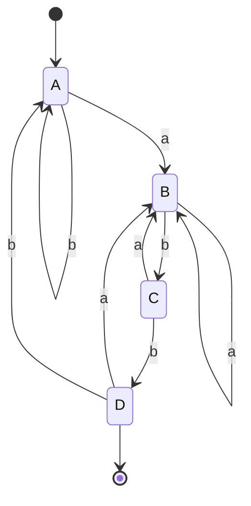

<div style="display: flex; justify-content: space-between; align-items: center; padding: 10px 16px; background: var(--light, #f8fafc); border: 1px solid var(--lightgray, #e2e8f0); border-radius: 10px; margin: 1.5rem 0;">
  <div>⬅️ <b><a href="/pt-br/resource/engenharia-de-computação/6-periodo/compiladores/anotacoes/aula-01-estrutura-em-fases-de-um-compilador-e-interpretadores">Aula Anterior</a></b></div>
  <div>🏠 <b><a href="/pt-br/resource/engenharia-de-computação/6-periodo/compiladores">Hub da Disciplina</a></b></div>
  <div>➡️ <b><a href="/pt-br/resource/engenharia-de-computação/6-periodo/compiladores/anotacoes/aula-03-construcao-e-uso-de-geradores-lexicos-flex-jflex">Próxima Aula</a></b></div>
</div>

> [!info] 📅 Informações da Aula
> - **Disciplina:** Compiladores (CSECBJI.48)
> - **Professor:** Fabrício Barros
> - **Data Realizada:** 11/09/2026
> - **Tópico Principal:** Análise Léxica: Expressões Regulares, Tokens e Autômatos Finitos
> - **Status:** Concluída e Revisada

> [!note] 📂 Material Complementar & Slides
> - 📄 **Slides Oficiais:** [[slide-02-compiladores|Acessar Apresentação em PDF]]
> - 🎥 **Short Lecture / Gravação:** [[video-02-compiladores|Assistir Síntese da Aula (Vídeo)]]

---

### 📑 Resumo das Seções
- [📌 1. Anotações do Quadro: Análise Léxica: Expressões Regulares, Tokens e Autômatos Finitos](#-anotações-do-quadro-análise-léxica-expressões-regulares,-tokens-e-autômatos-finitos)
- [🧮 2. Formulação & Exemplo Prático Resolvido](#-formulação--exemplo-prático-resolvido)
- [📊 3. Esquema Visual & Fluxograma (Mermaid)](#-esquema-visual--fluxograma-mermaid)
- [🧠 4. Resumo Pessoal & Macetes do Professor](#-resumo-pessoal--macetes-do-professor)
- [📝 5. Dúvidas & Exercícios Recomendados para Casa](#-dúvidas--exercícios-recomendados-para-casa)

---

## 📌 Anotações do Quadro: Análise Léxica: Expressões Regulares, Tokens e Autômatos Finitos

### 2.1 Fundamentação Teórica da Análise Léxica
O analisador léxico lê caracteres do arquivo fonte e agrupa-os em **lexemas**, gerando **tokens** representados por `⟨nome_token, valor_atributo⟩`.

As regras léxicas são expressas formalmente por **Expressões Regulares (ER)**:
- **Concatenação:** $r_1 r_2$
- **União (Alternância):** $r_1 \mid r_2$
- **Fecho de Kleene:** $r^*$
- **Fecho Positivo:** $r^+ = r r^*$
- **Opcionalidade:** $r? = (r \mid \epsilon)$

### 2.2 Da Expressão Regular ao Autômato Finito (Pipeline de Implementação)
```text
Expressão Regular (ER) ──[ Thompson ]──▶ AFN com transições ε ──[ Algoritmo dos Subconjuntos ]──▶ AFD ──[ Hopcroft ]──▶ AFD Mínimo
```

1. **Construção de Thompson:** Gera um AFN modular com exatamente um estado inicial e um final para cada operador.
2. **Algoritmo dos Subconjuntos:** Converte o AFN em AFD calculando $\epsilon\text{-closure}(s)$ e $\text{move}(T, a)$.
3. **Minimização de Hopcroft:** Particiona os estados em grupos de equivalência indistinguíveis, reduzindo a tabela de transição ao mínimo absoluto.

---

## 🧮 Formulação & Exemplo Prático Resolvido

### ✏️ Determinização Passo a Passo: Expressão `(a|b)*abb`

**Passo 1: Definição dos Fechos-$\epsilon$**
- $\epsilon\text{-closure}(\text{inicial}) = S_0 = \{0, 1, 2, 4, 7\}$

**Passo 2: Construção da Tabela de Subconjuntos:**
- $\text{move}(S_0, a) = \{3, 8\} \implies S_1 = \epsilon\text{-closure}(\{3, 8\}) = \{1, 2, 3, 4, 6, 7, 8\}$
- $\text{move}(S_0, b) = \{5\} \implies S_2 = \epsilon\text{-closure}(\{5\}) = \{1, 2, 4, 5, 6, 7\}$
- $\text{move}(S_1, a) = \{3, 8\} \implies S_1$
- $\text{move}(S_1, b) = \{5, 9\} \implies S_3 = \epsilon\text{-closure}(\{5, 9\}) = \{1, 2, 4, 5, 6, 7, 9\}$
- $\text{move}(S_3, b) = \{5, 10\} \implies S_4 = \epsilon\text{-closure}(\{5, 10\}) = \{1, 2, 4, 5, 6, 7, 10\}$ (Estado Final!)

**AFD Resultante:**
- Estado $A$: Não-final, transita com $a \to B$, com $b \to A$.
- Estado $B$: Não-final, transita com $a \to B$, com $b \to C$.
- Estado $C$: Não-final, transita com $a \to B$, com $b \to D$.
- Estado $D$: **Final (Token Aceito)**, transita com $a \to B$, com $b \to A$.

---

## 📊 Esquema Visual & Fluxograma (Mermaid)



---

## 🧠 Resumo Pessoal & Macetes do Professor

| Conceito-Chave | *Takeaway* do Professor | Dicas de Prova / Atenção |
| :--- | :--- | :--- |
| **Regra do Casamento Mais Longo (*Longest Match*)** | O scanner sempre tenta consumir o maior prefixo possível que coincida com uma regra válida (ex: `>=` é um único token e não `>` seguido de `=`). | Sempre implemente buffer duplo com sentinela para performance. |
| **Resolução de Ambiguidade** | Se duas regras casarem com o mesmo número de caracteres, a regra declarada primeiro no arquivo tem precedência. | Coloque palavras-chave (`if`, `while`) antes da regra genérica de identificadores (`[a-zA-Z_][a-zA-Z0-9_]*`). |

---

## 📝 Dúvidas & Exercícios Recomendados para Casa

1. Escreva a expressão regular para literais numéricos em hexadecimal com prefixo `0x` ou `0X` (ex: `0x1A3F`, `0XFF`).
2. Construa o AFD mínimo para reconhecer números binários múltiplos de 3.

---

<div style="display: flex; justify-content: space-between; align-items: center; padding: 10px 16px; background: var(--light, #f8fafc); border: 1px solid var(--lightgray, #e2e8f0); border-radius: 10px; margin: 1.5rem 0;">
  <div>⬅️ <b><a href="/pt-br/resource/engenharia-de-computação/6-periodo/compiladores/anotacoes/aula-01-estrutura-em-fases-de-um-compilador-e-interpretadores">Aula Anterior</a></b></div>
  <div>🏠 <b><a href="/pt-br/resource/engenharia-de-computação/6-periodo/compiladores">Hub da Disciplina</a></b></div>
  <div>➡️ <b><a href="/pt-br/resource/engenharia-de-computação/6-periodo/compiladores/anotacoes/aula-03-construcao-e-uso-de-geradores-lexicos-flex-jflex">Próxima Aula</a></b></div>
</div>
