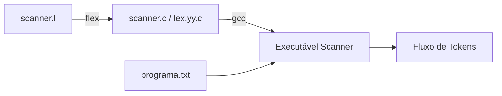

<div style="display: flex; justify-content: space-between; align-items: center; padding: 10px 16px; background: var(--light, #f8fafc); border: 1px solid var(--lightgray, #e2e8f0); border-radius: 10px; margin: 1.5rem 0;">
  <div>⬅️ <b><a href="/pt-br/resource/engenharia-de-computação/6-periodo/compiladores/anotacoes/aula-02-analise-lexica-expressoes-regulares-tokens-e-automatos-finitos">Aula Anterior</a></b></div>
  <div>🏠 <b><a href="/pt-br/resource/engenharia-de-computação/6-periodo/compiladores">Hub da Disciplina</a></b></div>
  <div>➡️ <b><a href="/pt-br/resource/engenharia-de-computação/6-periodo/compiladores/anotacoes/aula-04-gramaticas-livres-de-contexto-glc-e-arvores-de-derivacao">Próxima Aula</a></b></div>
</div>

> [!info] 📅 Informações da Aula
> - **Disciplina:** Compiladores (CSECBJI.48)
> - **Professor:** Fabrício Barros
> - **Data Realizada:** 18/09/2026
> - **Tópico Principal:** Construção e Uso de Geradores Léxicos (Flex / JFlex)
> - **Status:** Concluída e Revisada

> [!note] 📂 Material Complementar & Slides
> - 📄 **Slides Oficiais:** [[slide-03-compiladores|Acessar Apresentação em PDF]]
> - 🎥 **Short Lecture / Gravação:** [[video-03-compiladores|Assistir Síntese da Aula (Vídeo)]]

---

### 📑 Resumo das Seções
- [📌 1. Anotações do Quadro: Construção e Uso de Geradores Léxicos (Flex / JFlex)](#-anotações-do-quadro-construção-e-uso-de-geradores-léxicos-flex-/-jflex)
- [🧮 2. Formulação & Exemplo Prático Resolvido](#-formulação--exemplo-prático-resolvido)
- [📊 3. Esquema Visual & Fluxograma (Mermaid)](#-esquema-visual--fluxograma-mermaid)
- [🧠 4. Resumo Pessoal & Macetes do Professor](#-resumo-pessoal--macetes-do-professor)
- [📝 5. Dúvidas & Exercícios Recomendados para Casa](#-dúvidas--exercícios-recomendados-para-casa)

---

## 📌 Anotações do Quadro: Construção e Uso de Geradores Léxicos (Flex / JFlex)

### 3.1 Anatomia de uma Especificação Flex (`.l`)
O gerador léxico Flex compila um arquivo de especificação formal contendo expressões regulares e ações associadas em código C puro altamente otimizado (`lex.yy.c`):

```text
%{
#include "tokens.h"
int linha_atual = 1;
%}

DIGITO      [0-9]
LETRA       [a-zA-Z_]
ID          {LETRA}({LETRA}|{DIGITO})*
NUM_INT     {DIGITO}+
NUM_FLOAT   {DIGITO}+\.{DIGITO}+

%%
"if"        { return TOKEN_IF; }
"else"      { return TOKEN_ELSE; }
"while"     { return TOKEN_WHILE; }
{NUM_FLOAT} { yylval.fval = atof(yytext); return TOKEN_FLOAT; }
{NUM_INT}   { yylval.ival = atoi(yytext); return TOKEN_INT; }
{ID}        { yylval.sval = strdup(yytext); return TOKEN_ID; }
"+"         { return TOKEN_MAIS; }
"\n"        { linha_atual++; }
[ \t\r]+   { /* Ignora espaços */ }
.           { printf("Erro léxico na linha %d: '%s'\n", linha_atual, yytext); }
%%
int yywrap() { return 1; }
```

### 3.2 Variáveis Globais Canônicas do Flex
- `yytext`: Ponteiro para a cadeia de caracteres do lexema atual casado.
- `yyleng`: Comprimento inteiro do lexema atual em `yytext`.
- `yylex()`: Função principal que avança o scanner e retorna o próximo código de token inteiro.
- `yylval`: União tipada compartilhada com o parser para transmitir atributos semânticos.

---

## 🧮 Formulação & Exemplo Prático Resolvido

### ✏️ Roteiro de Compilação e Teste no Terminal Linux

1. **Geração do código C:**
   ```bash
   flex -o scanner.c scanner.l
   ```
2. **Compilação com GCC:**
   ```bash
   gcc -Wall -O2 -o meu_scanner scanner.c main.c -lfl
   ```
3. **Execução com arquivo de teste:**
   ```bash
   ./meu_scanner < programa_teste.txt
   ```

---

## 📊 Esquema Visual & Fluxograma (Mermaid)



---

## 🧠 Resumo Pessoal & Macetes do Professor

| Conceito-Chave | *Takeaway* do Professor | Dicas de Prova / Atenção |
| :--- | :--- | :--- |
| **strdup() para Identificadores** | `yytext` é um buffer interno sobrescrito a cada chamada de `yylex()`. Sempre use `strdup(yytext)` para persistir o nome de identificadores! | Se esquecer o `strdup`, todas as variáveis na AST apontarão para o mesmo ponteiro sobrescrito. |
| **Condições de Inicialização (*Start Conditions*)** | Use `%x COMENTARIO_BLOCO` para gerenciar estados léxicos complexos como comentários aninhados `/* ... */`. | Permite criar autômatos léxicos compostos. |

---

## 📝 Dúvidas & Exercícios Recomendados para Casa

1. Escreva a especificação Flex para tratar strings literais entre aspas com suporte a sequências de escape como `\n` e `\"`.
2. Implemente o tratamento léxico de comentários de linha única (`//`) e de múltiplas linhas (`/* ... */`).

---

<div style="display: flex; justify-content: space-between; align-items: center; padding: 10px 16px; background: var(--light, #f8fafc); border: 1px solid var(--lightgray, #e2e8f0); border-radius: 10px; margin: 1.5rem 0;">
  <div>⬅️ <b><a href="/pt-br/resource/engenharia-de-computação/6-periodo/compiladores/anotacoes/aula-02-analise-lexica-expressoes-regulares-tokens-e-automatos-finitos">Aula Anterior</a></b></div>
  <div>🏠 <b><a href="/pt-br/resource/engenharia-de-computação/6-periodo/compiladores">Hub da Disciplina</a></b></div>
  <div>➡️ <b><a href="/pt-br/resource/engenharia-de-computação/6-periodo/compiladores/anotacoes/aula-04-gramaticas-livres-de-contexto-glc-e-arvores-de-derivacao">Próxima Aula</a></b></div>
</div>
