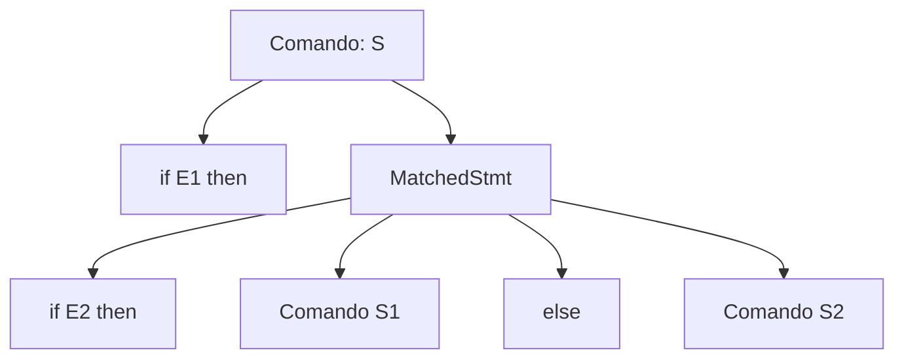

<div style="display: flex; justify-content: space-between; align-items: center; padding: 10px 16px; background: var(--light, #f8fafc); border: 1px solid var(--lightgray, #e2e8f0); border-radius: 10px; margin: 1.5rem 0;">
  <div>⬅️ <b><a href="/pt-br/resource/engenharia-de-computação/6-periodo/compiladores/anotacoes/aula-03-construcao-e-uso-de-geradores-lexicos-flex-jflex">Aula Anterior</a></b></div>
  <div>🏠 <b><a href="/pt-br/resource/engenharia-de-computação/6-periodo/compiladores">Hub da Disciplina</a></b></div>
  <div>➡️ <b><a href="/pt-br/resource/engenharia-de-computação/6-periodo/compiladores/anotacoes/aula-05-analise-sintatica-descendente-ll-1-e-parser-por-descida-recursiva">Próxima Aula</a></b></div>
</div>

> [!info] 📅 Informações da Aula
> - **Disciplina:** Compiladores (CSECBJI.48)
> - **Professor:** Fabrício Barros
> - **Data Realizada:** 25/09/2026
> - **Tópico Principal:** Gramáticas Livres de Contexto (GLC) e Árvores de Derivação
> - **Status:** Concluída e Revisada

> [!note] 📂 Material Complementar & Slides
> - 📄 **Slides Oficiais:** [[slide-04-compiladores|Acessar Apresentação em PDF]]
> - 🎥 **Short Lecture / Gravação:** [[video-04-compiladores|Assistir Síntese da Aula (Vídeo)]]

---

### 📑 Resumo das Seções
- [📌 1. Anotações do Quadro: Gramáticas Livres de Contexto (GLC) e Árvores de Derivação](#-anotações-do-quadro-gramáticas-livres-de-contexto-glc-e-árvores-de-derivação)
- [🧮 2. Formulação & Exemplo Prático Resolvido](#-formulação--exemplo-prático-resolvido)
- [📊 3. Esquema Visual & Fluxograma (Mermaid)](#-esquema-visual--fluxograma-mermaid)
- [🧠 4. Resumo Pessoal & Macetes do Professor](#-resumo-pessoal--macetes-do-professor)
- [📝 5. Dúvidas & Exercícios Recomendados para Casa](#-dúvidas--exercícios-recomendados-para-casa)

---

## 📌 Anotações do Quadro: Gramáticas Livres de Contexto (GLC) e Árvores de Derivação

### 4.1 Definição Formal de Gramática Livre de Contexto (GLC)
Uma GLC é formalmente definida pela 4-tupla $G = (V_N, \Sigma, P, S)$, onde:
1. $V_N$ é o conjunto finito de **símbolos não-terminais** (variáveis sintáticas).
2. $\Sigma$ é o conjunto finito de **símbolos terminais** (tokens gerados pelo scanner), com $V_N \cap \Sigma = \emptyset$.
3. $P$ é o conjunto finito de **regras de produção** da forma $A \to \alpha$, onde $A \in V_N$ e $\alpha \in (V_N \cup \Sigma)^*$.
4. $S \in V_N$ é o **símbolo inicial** da gramática.

### 4.2 Derivações e Ambiguidade
- **Derivação mais à esquerda (*Leftmost*):** O não-terminal mais à esquerda é sempre o primeiro a ser expandido.
- **Derivação mais à direita (*Rightmost*):** O não-terminal mais à direita é sempre o primeiro a ser expandido.
- **Gramática Ambígua:** Uma gramática é dita ambígua se existir pelo menos uma cadeia $\omega \in L(G)$ que possua **duas ou mais árvores de derivação distintas**.

---

## 🧮 Formulação & Exemplo Prático Resolvido

### ✏️ Resolução da Ambiguidade do *Dangling Else*

Gramática original ambígua:
$$S \to \mathbf{if}\; E \;\mathbf{then}\; S \mid \mathbf{if}\; E \;\mathbf{then}\; S \;\mathbf{else}\; S \mid \mathbf{other}$$

Desdobramento em regras não-ambíguas (forçando associação do `else` ao `if` mais interno):
```text
S           → MatchedStmt | UnmatchedStmt
MatchedStmt → if E then MatchedStmt else MatchedStmt
            | other
UnmatchedStmt → if E then S
              | if E then MatchedStmt else UnmatchedStmt
```

---

## 📊 Esquema Visual & Fluxograma (Mermaid)



---

## 🧠 Resumo Pessoal & Macetes do Professor

| Conceito-Chave | *Takeaway* do Professor | Dicas de Prova / Atenção |
| :--- | :--- | :--- |
| **Precedência em Gramáticas** | Operadores com MAIOR precedência ficam MAIS DISTANTES do símbolo inicial na árvore gramatical. | Para fazer `*` ter precedência sobre `+`: $E 	o E + T \mid T$; $T 	o T * F \mid F$; $F 	o \mathbf{id}$. |
| **Associatividade à Esquerda** | Recursão à esquerda ($E 	o E + T$) impõe associatividade à esquerda; recursão à direita ($E 	o T + E$) impõe associatividade à direita. | Aplicação prática direta |

---

## 📝 Dúvidas & Exercícios Recomendados para Casa

1. Mostre que a gramática $E 	o E + E \mid E * E \mid \mathbf{id}$ é ambígua fornecendo duas árvores de derivação para `id + id * id`.
2. Reescreva a gramática aritmética acima tornando-a não-ambígua com associatividade à esquerda.

---

<div style="display: flex; justify-content: space-between; align-items: center; padding: 10px 16px; background: var(--light, #f8fafc); border: 1px solid var(--lightgray, #e2e8f0); border-radius: 10px; margin: 1.5rem 0;">
  <div>⬅️ <b><a href="/pt-br/resource/engenharia-de-computação/6-periodo/compiladores/anotacoes/aula-03-construcao-e-uso-de-geradores-lexicos-flex-jflex">Aula Anterior</a></b></div>
  <div>🏠 <b><a href="/pt-br/resource/engenharia-de-computação/6-periodo/compiladores">Hub da Disciplina</a></b></div>
  <div>➡️ <b><a href="/pt-br/resource/engenharia-de-computação/6-periodo/compiladores/anotacoes/aula-05-analise-sintatica-descendente-ll-1-e-parser-por-descida-recursiva">Próxima Aula</a></b></div>
</div>
