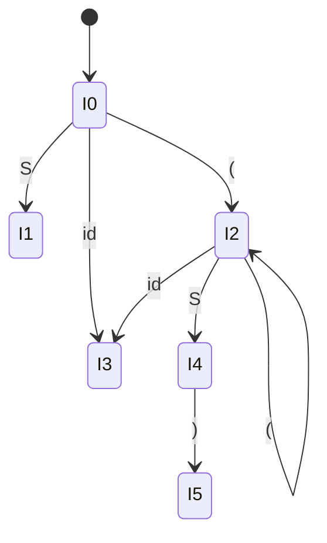

  
⬅️ <b><a href="/pt-br/resource/engenharia-de-computação/6-periodo/compiladores/anotacoes/aula-05-analise-sintatica-descendente-ll-1-e-parser-por-descida-recursiva">Aula Anterior</a></b>

  
🏠 <b><a href="/pt-br/resource/engenharia-de-computação/6-periodo/compiladores">Hub da Disciplina</a></b>

  
➡️ <b><a href="/pt-br/resource/engenharia-de-computação/6-periodo/compiladores/anotacoes/aula-07-avaliacao-teorico-pratica-p1-lexica-e-sintatica">Próxima Aula</a></b>

> [!info] 📅 Informações da Aula
> - **Disciplina:** Compiladores (CSECBJI.48)
> - **Professor:** Fabrício Barros
> - **Data Realizada:** 09/10/2026
> - **Tópico Principal:** Análise Sintática Ascendente: Conceitos LR(0) e Tabelas SLR(1)
> - **Status:** Concluída e Revisada

> [!note] 📂 Material Complementar & Slides
> - 📄 **Slides Oficiais:** [[slide-06-compiladores|Acessar Apresentação em PDF]]
> - 🎥 **Short Lecture / Gravação:** [[video-06-compiladores|Assistir Síntese da Aula (Vídeo)]]

---

### 📑 Resumo das Seções
- [📌 1. Anotações do Quadro: Análise Sintática Ascendente: Conceitos LR(0) e Tabelas SLR(1)](#-anotações-do-quadro-análise-sintática-ascendente-conceitos-lr0-e-tabelas-slr1)
- [🧮 2. Formulação & Exemplo Prático Resolvido](#-formulação--exemplo-prático-resolvido)
- [📊 3. Esquema Visual & Fluxograma (Mermaid)](#-esquema-visual--fluxograma-mermaid)
- [🧠 4. Resumo Pessoal & Macetes do Professor](#-resumo-pessoal--macetes-do-professor)
- [📝 5. Dúvidas & Exercícios Recomendados para Casa](#-dúvidas--exercícios-recomendados-para-casa)

---

## 📌 Anotações do Quadro: Análise Sintática Ascendente: Conceitos LR(0) e Tabelas SLR(1)

### 6.1 Fundamentos da Análise Ascendente (*Bottom-Up*)
Um analisador **LR** (*Left-to-right, Rightmost derivation in reverse*) constrói a árvore sintática a partir das folhas em direção à raiz:
- **Shift (Empilhar):** Transfere o token da entrada para a pilha.
- **Reduce (Reduzir):** Substitui o lado direito de uma produção no topo da pilha pelo não-terminal correspondente.
- **Accept (Aceitar):** Reconhece com sucesso a cadeia quando reduz para $S'$.

### 6.2 Itens LR(0) e Fecho Canônico
Um **item LR(0)** é uma produção com um ponto marcador $(\cdot)$:
- $A \to \cdot X Y Z$ (Espera-se ver uma derivação de $X$)
- $A \to X Y Z \cdot$ (Item completo: pronto para redução)

Funções:
- $\text{CLOSURE}(I)$: Adiciona $B \to \cdot \gamma$ para todo item $A \to \alpha \cdot B \beta \in I$.
- $\text{GOTO}(I, X)$: Conjunto de itens alcançados movendo o ponto sobre $X$.

---

## 🧮 Formulação & Exemplo Prático Resolvido

### ✏️ Construção da Coleção Canônica LR(0) para $S' \to S$; $S \to ( S ) \mid \mathbf{id}$

**Estados do Autômato:**
- $I_0 = \text{CLOSURE}(\{S' \to \cdot S\}) = \{S' \to \cdot S, S \to \cdot ( S ), S \to \cdot \mathbf{id}\}$
- $I_1 = \text{GOTO}(I_0, S) = \{S' \to S \cdot\}$ (Aceitação no $\$$)
- $I_2 = \text{GOTO}(I_0, '(') = \{S \to ( \cdot S ), S \to \cdot ( S ), S \to \cdot \mathbf{id}\}$
- $I_3 = \text{GOTO}(I_0, \mathbf{id}) = \{S \to \mathbf{id} \cdot\}$ (Redução 2)
- $I_4 = \text{GOTO}(I_2, S) = \{S \to ( S \cdot )\}$
- $I_5 = \text{GOTO}(I_4, ')') = \{S \to ( S ) \cdot\}$ (Redução 1)

**Regra de Redução SLR(1):**
A redução $A \to \alpha \cdot$ só entra na tabela $\text{ACTION}[i, a]$ para $a \in \text{FOLLOW}(A)$!

---

## 📊 Esquema Visual & Fluxograma (Mermaid)

---

## 🧠 Resumo Pessoal & Macetes do Professor

| Conceito-Chave | *Takeaway* do Professor | Dicas de Prova / Atenção |
| :--- | :--- | :--- |
| **Conflito Shift/Reduce** | Ocorre quando um estado contém ao mesmo tempo um item de shift e outro de reduce para o mesmo token lookahead. | Comum em ambiguidades de precedência ou if/else. |
| **Conflito Reduce/Reduce** | Ocorre quando dois itens completos distintos querem reduzir no mesmo símbolo lookahead. | Indica erro conceitual grave na modelagem da gramática. |

---

## 📝 Dúvidas & Exercícios Recomendados para Casa

1. Construa a coleção canônica de itens LR(0) para a gramática: $S 	o a S b \mid c$.
2. Monte a tabela SLR(1) para a gramática acima e demonstre que não há conflitos.

---

  
⬅️ <b><a href="/pt-br/resource/engenharia-de-computação/6-periodo/compiladores/anotacoes/aula-05-analise-sintatica-descendente-ll-1-e-parser-por-descida-recursiva">Aula Anterior</a></b>

  
🏠 <b><a href="/pt-br/resource/engenharia-de-computação/6-periodo/compiladores">Hub da Disciplina</a></b>

  
➡️ <b><a href="/pt-br/resource/engenharia-de-computação/6-periodo/compiladores/anotacoes/aula-07-avaliacao-teorico-pratica-p1-lexica-e-sintatica">Próxima Aula</a></b>

