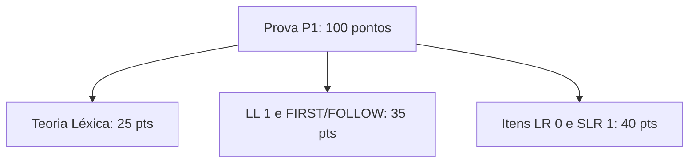

  
⬅️ <b><a href="/pt-br/resource/engenharia-de-computação/6-periodo/compiladores/anotacoes/aula-06-analise-sintatica-ascendente-conceitos-lr-0-e-tabelas-slr-1">Aula Anterior</a></b>

  
🏠 <b><a href="/pt-br/resource/engenharia-de-computação/6-periodo/compiladores">Hub da Disciplina</a></b>

  
➡️ <b><a href="/pt-br/resource/engenharia-de-computação/6-periodo/compiladores/anotacoes/aula-08-analise-sintatica-ascendente-avancada-lr-1-lalr-1-e-bison-yacc">Próxima Aula</a></b>

> [!info] 📅 Informações da Aula
> - **Disciplina:** Compiladores (CSECBJI.48)
> - **Professor:** Fabrício Barros
> - **Data Realizada:** 16/10/2026
> - **Tópico Principal:** Avaliação Teórico-Prática P1 (Léxica e Sintática)
> - **Status:** Concluída e Revisada

> [!note] 📂 Material Complementar & Slides
> - 📄 **Slides Oficiais:** [[slide-07-compiladores|Acessar Apresentação em PDF]]
> - 🎥 **Short Lecture / Gravação:** [[video-07-compiladores|Assistir Síntese da Aula (Vídeo)]]

---

### 📑 Resumo das Seções
- [📌 1. Anotações do Quadro: Avaliação Teórico-Prática P1 (Léxica e Sintática)](#-anotações-do-quadro-avaliação-teórico-prática-p1-léxica-e-sintática)
- [🧮 2. Formulação & Exemplo Prático Resolvido](#-formulação--exemplo-prático-resolvido)
- [📊 3. Esquema Visual & Fluxograma (Mermaid)](#-esquema-visual--fluxograma-mermaid)
- [🧠 4. Resumo Pessoal & Macetes do Professor](#-resumo-pessoal--macetes-do-professor)
- [📝 5. Dúvidas & Exercícios Recomendados para Casa](#-dúvidas--exercícios-recomendados-para-casa)

---

## 📌 Anotações do Quadro: Avaliação Teórico-Prática P1 (Léxica e Sintática)

### 7.1 Síntese Conceitual para Avaliação Parcial P1
A avaliação P1 consolida toda a base de análise do Front-End de compiladores:

1. **Camada Léxica:**
   - Expressões Regulares $\to$ AFN (Thompson) $\to$ AFD (Subconjuntos) $\to$ AFD Mínimo (Hopcroft).
   - Buffer duplo com sentinela, regras de *longest match* e precedência de tokens.
2. **Camada Sintática Top-Down:**
   - Gramáticas Livres de Contexto, eliminação de recursão à esquerda e fatoração.
   - Cálculo de $\text{FIRST}(\alpha)$ e $\text{FOLLOW}(A)$.
   - Construção de Tabelas LL(1) e Parsers por Descida Recursiva.
3. **Camada Sintática Bottom-Up:**
   - Coleções de Itens canônicos LR(0).
   - Construção de Tabelas SLR(1) e diagnóstico de conflitos Shift/Reduce e Reduce/Reduce.

---

## 🧮 Formulação & Exemplo Prático Resolvido

### ✏️ Resolução Comentada de Questão Clássica de Prova

**Enunciado:** Verifique se a gramática $S \to A a \mid b A c$; $A \to d$ é SLR(1).

**Passo 1: Coleção de Itens LR(0)**
- $I_0 = \{S' \to \cdot S, S \to \cdot A a, S \to \cdot b A c, A \to \cdot d\}$
- $I_1 = \text{GOTO}(I_0, S) = \{S' \to S \cdot\}$
- $I_2 = \text{GOTO}(I_0, A) = \{S \to A \cdot a\}$
- $I_3 = \text{GOTO}(I_0, b) = \{S \to b \cdot A c, A \to \cdot d\}$
- $I_4 = \text{GOTO}(I_0, d) = \{A \to d \cdot\}$
- $I_5 = \text{GOTO}(I_2, a) = \{S \to A a \cdot\}$
- $I_6 = \text{GOTO}(I_3, A) = \{S \to b A \cdot c\}$
- $I_7 = \text{GOTO}(I_6, c) = \{S \to b A c \cdot\}$

**Passo 2: Cálculo do FOLLOW(A)**
- $\text{FOLLOW}(A) = \{a, c\}$.

**Passo 3: Análise de Conflitos:**
O item $A \to d \cdot$ no estado $I_4$ reduz nos símbolos $\{a, c\}$. Não há outro item em $I_4$, logo não há conflito. A gramática é estritamente **SLR(1)**!

---

## 📊 Esquema Visual & Fluxograma (Mermaid)

---

## 🧠 Resumo Pessoal & Macetes do Professor

| Conceito-Chave | *Takeaway* do Professor | Dicas de Prova / Atenção |
| :--- | :--- | :--- |
| **Checklist de Prova** | 1. Confira fechamento de parênteses em regex; 2. Coloque $ no FOLLOW do símbolo inicial; 3. Verifique propagação de epsilon no FIRST. | Atenção máxima aos índices de tabela! |
| **Identificação Rápida de Não-LL(1)** | Gramática com recursão à esquerda imediata NUNCA é LL(1)! | Fatore antes de começar a calcular a tabela. |

---

## 📝 Dúvidas & Exercícios Recomendados para Casa

1. Revise todos os exercícios das listas 1 a 6.
2. Refaça a construção da tabela SLR(1) da gramática de expressões aritméticas completas.

---

  
⬅️ <b><a href="/pt-br/resource/engenharia-de-computação/6-periodo/compiladores/anotacoes/aula-06-analise-sintatica-ascendente-conceitos-lr-0-e-tabelas-slr-1">Aula Anterior</a></b>

  
🏠 <b><a href="/pt-br/resource/engenharia-de-computação/6-periodo/compiladores">Hub da Disciplina</a></b>

  
➡️ <b><a href="/pt-br/resource/engenharia-de-computação/6-periodo/compiladores/anotacoes/aula-08-analise-sintatica-ascendente-avancada-lr-1-lalr-1-e-bison-yacc">Próxima Aula</a></b>

